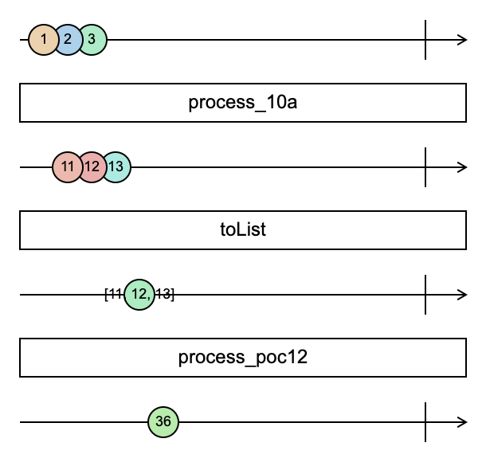

# Introduction

[DiFlow][^name] is an abstraction layer on top of [NextFlow]'s [DSL2]. DiFlow is a set of principles and guidelines for building NextFlow pipelines that allow the developer to declaratively define processing components and the user to declare the pipeline logic in a clean and intuitive way.

[Viash] is a tool that (among other things) allows us to _use_ DiFlow and make it practical, without the burden of maintaining boilerplate or _glue_ code.

[^name]: DiFlow stands for `[NextFlow] D[SL2] I[mprovement] Flow` or maybe also `D[ata] I[ntuitive] Flow`?

[DiFlow]: <https://pointer>
[viash]: <http://data-intuitive.com/viash_docs>
[NextFlow]: <https://www.nextflow.io/>
[DSL2]: <https://www.nextflow.io/docs/latest/dsl2.html>

## Functional Reactive Programming (FRP)

If you're new to Functional Reactive Programming (FRP), here are a few pointers to posts and a video that introduce the concepts:

- An excellent [Medium post](https://itnext.io/demystifying-functional-reactive-programming-67767dbe520b) from Timo Stöttner
- The [introduction](https://gist.github.com/staltz/868e7e9bc2a7b8c1f754) to Reactive Programming you've been missing from André Staltz.
- A very insightful [presentation](https://www.youtube.com/watch?v=fdol03pcvMA) by Staltz where he introduces FRP from first principles (with live coding).

In what follows, we will refer to _streams_ in line with those authors but if you're used to working with [Rx] you would call this an observable.

[Rx]: http://reactivex.io/

## FRP for pipelines

Other initiatives have recognized that FRP is a good fit for pipeline development. Recent research and development also confirms this:

- [Skitter](https://soft.vub.ac.be/~mathsaey/skitter/)
- [Krews](https://github.com/weng-lab/krews)

# NextFlow

## Introduction

For a step-by-step introduction to NextFlow (both the original DSL as well as DSL2), please refer to [this repository](https://github.com/vibbits/nextflow-course) created and maintained by the [VIB](https://vib.be/).

Another very interesting resource is [this cheatsheet](https://github.com/danrlu/Nextflow_cheatsheet) by Daniele Cook. It not only contains a handy cheat sheet, but also some conventions one should know about as well as some pitfalls.

## FRP in NextFlow

The [`Channel`] class used by NextFlow, itself based on the [DataFlow Programming Model] can in fact be regarded as an implementation of a Functional Reactive Programming library. Having said that, NextFlow allows one to mix functional and imperative programming to the point that a developer is able to shoot its own foot.

Furthermore, `Channel`s can not be nested which complicates certain operations on the streams.

[`Channel`]: https://www.nextflow.io/docs/latest/channel.html
[DataFlow Programming Model]: https://en.wikipedia.org/wiki/Dataflow_programming

## NextFlow DSL(2)

[DSL2] is a crucial development in NextFlow because it avoid having to maintain large, monolithic pipeline definitions in one file. With DSL2, developer can spin off functionality in separate files and `import` what is needed.

This also potentially opens up ways to build (reusable) modules that could be used in different projects. That is exactly what a lot of organizations need.

# DiFlow

## The NoPipeline approach

For developing the pipeline, we set out with a few goals in mind:

- Build modules where each modules deals with a specific (computational) task
- Make sure those modules can be reused
- Make sure the module functionality can be tested and validated
- Make sure modules have a consistent API, so that
  a. calling a module is straightforward
  b. including a module in a pipeline is transparent and seamless

Please note that nothing in these requirements has to do with running a pipeline itself. Rather, we consider this a bottom-up system whereby we first focus on a solid foundation before we actually start to tie things together.

That's why we call this the NoPipeline approach, similar to NoSQL where 'No' does not stand for _not_, but rather 'Not Only'. The idea is to focus on the pipeline aspect _after_ the steps are properly defined and tested.

## General Requirements and design principles

### Reproducibility

I originally did not include it as a design principle for the simple reason that I think it's obvious. This should be every researcher's top priority.

### Pipeline Parameters vs Runtime Parameters

We make a strict distinction between parameters that are defined for the _FULL_ pipeline and those that are defined at runtime.

#### Pipeline Parameters

We currently have 4 pipeline parameters: Docker prefix, `ddir`, `rdir` and `pdir`.

#### Runtime Parameters

Runtime parameters differ from pipeline parameters in that they may be different for parallel runs of a process. A few examples:

- Some samples may require different filter threshold than others
- After concatenation, clustering may be run with different cluster parameters
- etc.

In other words, it does not make sense to define those parameters for the full pipeline because they are not static.

### Consistent API

When we started out with the project and chose to use NextFlow as a workflow engine, I kept on thinking that the level of abstraction should have been higher. With DSL1, all you could do was create one long list of NextFlow code, tied together by `Channel`s.

With DSL2, it became feasible to _organise_ stuff in separate NextFlow files and import what is required. But in larger codebases, this is not really a benefit because every modules/workflow may have its own parameters and output. No structure is imposed. `Workflow`s are basically functions taking parameters in and returning values.

I think it makes sense to define an API and to stick to it as much as possible. This makes using the modules/workflows easier...

### Flat Module Structure

We want to avoid having nested modules, but rather support a pool of modules to be mixed and matched.

As a consequence, this allows a very low threshold for including third-party modules: just add it to the collection of modules and import it in the pipeline. In order to facilitate the inclusion of such third-party modules that are developed in their own respective repositories, we added one additional layer in the hierarchy allowing for such a splitting.

### Job Serialization

We avoid requiring the sources of the job available in the runtime environment, i.e., the Docker container. In other words, all code and config is serialized and sent with the _process_.

## An abstract computation step

The module concept inspired us to think of an abstract way to represent a computation step and implement this in NextFlow. We wrote [Portash] to this end. But Portash had its shortcomings. The most important of which was that it did not adhere to separation of concerns: execution definition (what?) where mixed up with execution context (how?/where?). Moreover, dynamic nature of Portash lends itself well to running a tool as a service, but not so much in a batch process.

Nevertheless, we were able to express a generic NextFlow step as pure _configuration_ that is passed to a process at runtime. This allows for some very interesting functionality. Some prototypes were developed, the last one of which could run a single-cell RNA pipeline from mapping to generating an integrated dataset combining different samples.

The run-configuration was provided by means of a Portash YAML spec residing in the module directory. It must be stressed that not requiring the component _code_ to be already available inside the container is a big plus. It means a container contains dependencies, not the actual run script so the latter can be updated more frequently. This is especially useful during component and pipeline development.

Our first implementation had a few disadvantages:

- It contained a mix of what to run and how to run it, but it did not contain information on the container to run in. This had to be configured externally, but then the module is not an independent entity anymore.
- Specifying and overriding YAML content in Groovy is possible, but not something that is intuitive. We worked around that by letting the user specify custom configuration using a Groovy nested `Map`.
- The module functionality was abstracted with a consistent API and the difference between 2 modules was just a few lines of code with a different name or pointer. But still, one had to maintain that and making a similar change in a growing set of module files is a recipe for mistakes.

But overall, the concept of an abstract computation step proved to work, it was just that a few ingredients were still missing it seemed. On the positive side, we showed that it's possible to have an abstract API for (NextFlow) modules that keeps the underlying implementation hidden while improving the readability of the pipeline code.

## Toward implementation

What is needed as information in order to run a computation step in a pipeline?

1. First, we need data or generally speaking, __input__. Components/modules and pipelines should run zero-touch, so input has to be provided at startup time.

2. Secondly, we need to know what to run en how to run it. This is in effect the definition of a modules or pipeline step.

3. Thirdly, in many cases we will require the possibility to change parameters for individual modules in the pipeline, for instance cutoff values for a filter, or the number of clusters for a clustering algorithm. The classical way to do that is via the `params` object.

One might wonder if there is a difference between input and parameters pointing to input is also a kind of parametrization. The reason those are kept apart is that additional validation steps are necessary for the data. Most pipeline systems trace input/output closely whereas parameters are ways to configure the steps in the pipeline.

In terms of FRP, and especially in the DataFlow model, we also have to keep track of the _forks_ in a parallel execution scenario. For instance, if 10 batches of data can be processed in parallel we should give all 10 of them an ID so that individual forks can be distinguished. We will see that those IDs become crucial in most pipelines.

We end up with a model for a stream/channel as follows (conceptually):

```
[ ID, data, config ]
```

were

- `ID` is just a string or any object for that matter that can be compared later. We usually work with strings.
- `data` is a pointer to the (input) data. With NextFlow, this should be a `Path` object, ideally created using the `file()` helper function.
- `config` is a nested `Map` where the first level keys are chosen to be simply an identifier of the pipeline step. Other approaches can be taken here, but that's what we did.

This can be a triplet, or a list with mixed types. In Groovy, both can be used interchangeably.

The output of a pipeline step/mudules adheres to the same structure so that pipeline steps can easily be chained.

# Step by step

Let us illustrate some key features of NextFlow together with how we use them in DiFlow and approach this step by step.

The code blocks below are run with the following version of NextFlow:

``` {sh eval=TRUE, echo=TRUE, comment=""}
nextflow -v
```

## Step 1 - Operate on a _stream_

Let us illustrate the stream-like nature of a NXF `Channel` using a very simple example: computing $1+1$.

``` {sh eval=TRUE, echo=FALSE, results="asis"}
awk -v step=1 -f scripts/extract_steps.awk main.nf
```

This chunk is directly taken from `main.nf`, running it can be done as follows:

``` {sh eval=TRUE, echo=TRUE, comment="", results="hold", collapse=TRUE, prompt=TRUE, cache=TRUE}
nextflow -q run . -entry step1
```

## Step 2 - Operate on a stream in parallel

NextFlow (and streams in general) are supposed to be a good fit for parallel execution. Let's see how this can be done:

``` {sh eval=TRUE, echo=FALSE, results="asis"}
awk -v step=2 -f scripts/extract_steps.awk main.nf
```

Running it can be done using:

``` {sh eval=TRUE, echo=TRUE, comment="", results="hold", collapse=TRUE, prompt=TRUE, cache=TRUE}
nextflow -q run . -entry step2
```

## Step 3 - Operate on a stream using a `process`

In the previous example, we ran 3 parallel executions each time applying the same simple function: adding one. Let us simulate now a more real-life example where parallel executions will not take the same amount of time. We do this by defining a `process` and `workflow` that uses this process. The rest is similar to our example before.

``` {sh eval=TRUE, echo=FALSE, results="asis"}
awk -v step=3 -f scripts/extract_steps.awk main.nf
```

Running it is again the same.

``` {sh eval=TRUE, echo=TRUE, comment="", results="hold", collapse=TRUE, prompt=TRUE, cache=TRUE}
nextflow -q run . -entry step3
```

The result will be a permutation of 2,3 and 4. Try it multiple times to verify for yourself that the order is not guaranteed to be the same. Even though the execution times will not be that much different! In other words, a `Channel` does not guarantee the order, and that's a good thing.

## Step 4 - How `map` is synchronous

An illustrative test is one where we do not use a `process` for the execution, but rather just `map` but such that one of the inputs _takes longer_ to process, i.e.:

``` {sh eval=TRUE, echo=FALSE, results="asis"}
awk -v step=4 -f scripts/extract_steps.awk main.nf
```

Running it:

``` {sh eval=TRUE, echo=TRUE, comment="", results="hold", collapse=TRUE, prompt=TRUE, cache=TRUE}
nextflow -q run . -entry step4
```

The result may be somewhat unexpected, the order is retained even though there's a 2 second delay between the first entry and the rest. The `sleep` in other words blocks all the parallel execution branches.

This is a clear indication of why it's better to use a `process` to execute computations. On the other hand, as long as we _stay_ inside the `map` and don't run a `process`, the order is retained. This opens up possibilities that we will exploit in what follows.

## Step 5 - Introduce an `ID`

If we can not guarantee the order of the different parallel branches, we should introduce a _branch ID_. This may be a label, a sample ID, a batch ID, etc. It's the unit of parallelization.

``` {sh eval=TRUE, echo=FALSE, results="asis"}
awk -v step=5 -f scripts/extract_steps.awk main.nf
```

We can run this code sample in the same way as the previous examples:

``` {sh eval=TRUE, echo=TRUE, comment="", results="hold", collapse=TRUE, prompt=TRUE, cache=TRUE}
nextflow -q run . -entry step5
```

Please note that the function to add 1 remains exactly the same, we only added the `id` as the first element of the tuple in both input and output. As such we keep a handle on which sample is which, by means of the _key_ in the tuple.

Note: Later, we will extend this tuple and add configuration parameters to it... but this was supposed to go step by step.

## Step 6 - Add a process parameter

What if we want to be able to configure the term in the sum? This would require a parameter to be sent with the process invocation. Let's see how this can be done.

``` {sh eval=TRUE, echo=FALSE, results="asis"}
awk -v step=6 -f scripts/extract_steps.awk main.nf
```

The result is:

``` {sh eval=TRUE, echo=TRUE, comment="", results="hold", collapse=TRUE, prompt=TRUE, cache=TRUE}
nextflow -q run . -entry step6
```

This works, but is not very flexible. What if we want to configure the operator as well? What if we want to have branch-specific configuration? We can add a whole list of parameters, but that means that the `process` signature may be different for every `process` that we define. That is not a preferred solution.

## Step 7 - Use a `Map` to store parameters

Let us use a simple `Map` to add 2 configuration parameters:

``` {sh eval=TRUE, echo=FALSE, results="asis"}
awk -v step=7 -f scripts/extract_steps.awk main.nf
```

The result is:

``` {sh eval=TRUE, echo=TRUE, comment="", results="hold", collapse=TRUE, prompt=TRUE, cache=TRUE}
nextflow -q run . -entry step7
```

## Step 8 - Use a `Map` with a process-key

Step 7 provides a way to use a consistent API for a process. Ideally, however, we would like different `process` invocation to be chained rather than to explicitly add the correct configuration all the time. Let us add an additional key to the map, so that a process knows _it's scope_.

``` {sh eval=TRUE, echo=FALSE, results="asis"}
awk -v step=8 -f scripts/extract_steps.awk main.nf
```

Which yields:

``` {sh eval=TRUE, echo=TRUE, comment="", results="hold", collapse=TRUE, prompt=TRUE, cache=TRUE}
nextflow -q run . -entry step8
```

Please note that we used the process name as a key in the map, so that each process can tell what configuration parameter are relevant for its own scope. We call this `Map` a `ConfigMap`.

## Step 9 - Use a `ConfigMap` with a shell script

We used native Groovy code in the `process` examples above. Let us now use a shell script:

``` {sh eval=TRUE, echo=FALSE, results="asis"}
awk -v step=9 -f scripts/extract_steps.awk main.nf
```

Running this (in the same way as before), we get something along these lines:

``` {sh eval=TRUE, echo=TRUE, comment="", results="hold", collapse=TRUE, prompt=TRUE, cache=TRUE}
nextflow -q run . -entry step9
```

This is because the `stdout` qualifier captures the newline at the end of the code block. We could look for ways to circumvent that, but that is not the point here.

What's important to notice here:

1. We can not just retrieve individual entries in `config` in the shell, we have to let Groovy do that.
2. That means we either first retrieve individual values and store them in a variable,
3. or we use the `${...}` notation for that.
4. If we want to use `bash` variables, the `$` symbol has to be escaped.

Obviously, passing config like this requires a lot of typing (especially as additional parameters are introduced) and is error prone.

> A DiFlow module selects the appropriate key from a `ConfigMap` and uses that as its configuration settings. In a sense, we _scope_ the global `ConfigMap` and use it as a local variable within a module. A module could also update the global `ConfigMap` and there may be cases where this is necessary, but care should be taken to update the global state like this.

The scoping done can be seen as a [Functional Lens](https://medium.com/@dtipson/functional-lenses-d1aba9e52254), although it's a poor man's implementation at that. Furthermore, in some FRP frameworks, so-called _reducers_ or _transducers_ are used for transforming state in an application. We did not (yet) consider the further extension in that direction.

## Step 10 - Running a _pipeline_

We used the pipe `|` symbol to combine different steps in a _pipeline_ and we noticed that a `process` can do computations on parallel branches. That's nice, but we have not yet given an example of running 2 processes, one after the other.

There are a few things we have to note before we go to an example:

1. It's not possible to call the same process twice, a strange error occurs in that case[^more].
2. If we want to pipe the output of one process as input of the next, the I/O signature needs to be exactly the same, so the `output` of the `process` should be a triplet as well.

[^more]: It _is_ possible in some cases however to manipulate the `Channel` such that a process is effectively run twice on the same data, but that is a more advanced topic.

``` {sh eval=TRUE, echo=FALSE, results="asis"}
awk -v step=10 -f scripts/extract_steps.awk main.nf
```

The result of this is that first 10 is added and then the same 10 is subtracted again, which results in the same as the original. Please note that the output contains 3 elements, also the `term` passed to the `process`:

``` {sh eval=TRUE, echo=TRUE, comment="", results="hold", collapse=TRUE, prompt=TRUE, cache=TRUE}
nextflow -q run . -entry step10
```

We can configure the second `process` (subtraction) by adding an additional `map` in the mix:

``` {sh eval=TRUE, echo=FALSE, results="asis"}
awk -v step=10a -f scripts/extract_steps.awk main.nf
```

Resulting in:

``` {sh eval=TRUE, echo=TRUE, comment="", results="hold", collapse=TRUE, prompt=TRUE, cache=TRUE}
nextflow -q run . -entry step10a
```

Please note that we define the closure in a different manner here, using the special variable `it`. We could also write (to the same effect):

```groovy
  ...
  | map{ x -> [ x[0], x[1], 5 ] } \
  ...
```

or even

```groovy
  ...
  | map{ id, value, term -> [ id, value, 5 ] } \
  ...
```

## Step 11 - A more generic process

What if we rewrite the previous using some of the techniques introduced earlier. Let us specify the operator as a parameter and try to stick to just 1 `process` definition.

``` {sh eval=TRUE, echo=FALSE, results="asis"}
awk -v step=11 -f scripts/extract_steps.awk main.nf
```

This little workflow definition results in an error, just like we warned before:

``` {sh eval=TRUE, echo=TRUE, comment="", results="hold", collapse=TRUE, prompt=TRUE, cache=TRUE, error=TRUE}
nextflow -q run . -entry step11
```

There is, however, one simple way around this: `include { ... as ...}`. Let us see how this works.

First, we store the `process` in a file `examples/step/step11.nf`:

``` {sh eval=TRUE, echo=FALSE, results="asis"}
echo '```groovy'
cat examples/modules/step11.nf
echo '```'
```

The `workflow` definition becomes:

``` {sh eval=TRUE, echo=FALSE, results="asis"}
awk -v step=11a -f scripts/extract_steps.awk main.nf
```

Running this yields an output similar to this:

``` {sh eval=TRUE, echo=TRUE, comment="", results="hold", collapse=TRUE, prompt=TRUE, cache=TRUE}
nextflow -q run . -entry step11a
```

We made a few minor changes to the workflow code in the meanwhile:

1. Splitting the conversion from an array of items to the triplet is now done explicitly and separate from specifying the configuration for the `process` itself.
2. The `view` now only contains the relevant parts, not the configuration part for the last `process`.

The above example illustrates the `include` functionality of NextFlow DSL2. This was not possible with prior versions.

## Step 12 - Map/reduce in NextFlow

Let's implement a simple map/reduce schema with what we developed above. Until now, we basically covered the mapping stage: starting from 3 independent number, execute a function on each _branch_ individually. Now, we want to calculate the sum at the end (reduce phase).

We do this by adding a `process` to the example in Step 10

``` {sh eval=TRUE, echo=FALSE, results="asis"}
awk -v step=12 -f scripts/extract_steps.awk main.nf
```

Running this yields:

``` {sh eval=TRUE, echo=TRUE, comment="", results="hold", collapse=TRUE, prompt=TRUE, cache=TRUE}
nextflow -q run . -entry step12
```

A few remarks are in order here:

1. We use the `toList` operator on the output of `process_step10a`. This can be regarded as merging the 3 parallel branches into one branch. The result has the signature `Channel[List[Triplet]]`. This `toList` operator only _outputs_ something on the output `Channel` when all incoming branches have finished and the _merge_ can effectively be performed.
2. It's important to note that what is passed through the pipe is still a `Channel`, only the number of _branches_, _nodes_, or whatever you want to call it differs.
3. The long `map{ [ "sum", ... }` line may seem complex at first, but it's really not. We take in `List[Triplet]` and convert this to `Triplet`. The first element of the triplet is just an identifier (`sum`). The last is the configuration map, but we don't need configuration for the sum. As the second element we want to obtain `List[Int]`, where the values are the 2nd element from the original triplets. The Groovy function `collect` on an array is like `map` in many other languages.

The marble diagram can be depicted conceptually as follows, where we note that in effect it's triplets rather than numbers that are contained in the marbles:

{ width=50% }

Please note that though we define the _pipeline_ sequentially, the 3 numbers are first handled in parallel and only combined when calling `toList`. Stated differently, parallelism comes for free when defining workflows like this.

<!--
Marble spec, to be used on swirly.dev to reproduce the figure
-abc-------------|
a := 1
b := 2
c := 3

> process_10a

--def------------|
d := 11
e := 12
f := 13

> toList

-----g-----------|
g := [11, 12, 13]

> process_step12

------g----------|
g := 36
-->

## Step 13 - Files as input/output

Let us tackle a different angle now and start to deal with files as input and output. In order to do this, we will mimic the functionality from earlier and modify it such that a file is used as input and output is also written to a file.

The following combination of `process` and `workflow` definition does exactly the same as before, but now from one or more files containing just a single integer number:

``` {sh eval=TRUE, echo=FALSE, results="asis"}
awk -v step=13 -f scripts/extract_steps.awk main.nf
```

While doing this, we also introduced a way to specify parameters via a configuration file (`nextflow.config`) or from the CLI. In this case `params.input` points to an argument we should provide on the CLI, for instance:

``` {sh eval=TRUE, echo=TRUE, comment="", results="hold", collapse=TRUE, prompt=TRUE, cache=TRUE}
nextflow -q run . -entry step13 --input data/input1.txt
```

Let's dissect what is going on here...

1. We provide the input file `data/input1.txt` as input which gets automatically added to the `params` map as `params.input`.
2. The content of `input1.txt` is used in the simple sum just as before.
3. The output `Channel` contains the known triplet but this time the second entry is not a value, but rather a filename.

Please note that the file is `output.txt` is automatically stored in the (unique) `work` directory. We can take a look inside to verify that the calculation succeeded:

``` {sh eval=TRUE, echo=TRUE, comment="", results="hold", collapse=TRUE, prompt=TRUE, cache=TRUE}
cat $(nextflow log | cut -f 3 | tail -1 | xargs nextflow log)/output.txt
```

It seems the calculation went well, although one might be surprised by two things:

1. The output of the calculation is stored in some randomly generated `work` directory whereas we might want it somewhere more _findable_.
2. The `process` itself defines the value of the output filename, which may seem odd... and it is.

Taking our example a bit further and exploiting the fact that parallelism is natively supported by NextFlow as we've seen before, we can pass multiple input files to the same workflow defined above.

``` {sh eval=TRUE, echo=TRUE, comment="", results="hold", collapse=TRUE, prompt=TRUE, cache=TRUE}
nextflow -q run . -entry step13 --input "data/input?.txt"
```

Please note that we

1. provide the absolute path to the file
2. use a wildcard `*` to select multiple files
3. enclose the path (with wildcard) in double quotes to avoid shell globbing.

In the latter case, we end up with 3 output files, each named `output.txt` in their own respective (unique) `work` directory.

``` {sh eval=TRUE, echo=TRUE, comment="", results="hold", collapse=TRUE, prompt=TRUE, cache=TRUE}
nextflow log | cut -f 3 | tail -1 | xargs nextflow log | xargs ls
```

## Step 14 - _Publishing_ output

Let us tackle one of the pain points of the previous example: output files are hidden in the `work` directory. One might be tempted to specify an output file in the `process` definition as such `file("<somepath>/output.txt")` but when you try this, it will quickly turn out that this does not work in the long run (though it may work for some limited cases).

NextFlow provides a better way to achieve the required functionality: [`publishDir`](https://www.nextflow.io/docs/latest/process.html?highlight=publish#publishdir). Let us illustrate its use with an example again and just adding the `publishDir` directive:

``` {sh eval=TRUE, echo=FALSE, results="asis"}
awk -v step=14 -f scripts/extract_steps.awk main.nf
```

This single addition yields:

``` {sh eval=TRUE, echo=TRUE, comment="", results="hold", collapse=TRUE, prompt=TRUE, cache=TRUE}
nextflow -q run . -entry step14 --input data/input1.txt
```

This example shows us a powerful approach to publishing data. There is a similar drawback as for the output filenames, however, and that is that the `process` defines the output directory explicitly. But there is a different problem as well, which can be observed when running on multiple input files:

``` {sh eval=TRUE, echo=TRUE, comment="", results="hold", collapse=TRUE, prompt=TRUE, cache=TRUE}
nextflow -q run . -entry step14 --input "data/input?.txt"
```

``` {sh eval=TRUE, echo=TRUE, comment="", results="hold", collapse=TRUE, prompt=TRUE, cache=TRUE}
cat output/output.txt
```

What do you think happens here? Yes, sure, we _publish_ the same `output.txt` file three times and each time overwriting the same file. The last one is the one that persists.

## Step 15 - Make output files/paths unique

Let us describe a way to avoid the above issue. There are other approaches to resolve this issue, but let us for the moment look at one that can easily be reused.

``` {sh eval=TRUE, echo=FALSE, results="asis"}
awk -v step=15 -f scripts/extract_steps.awk main.nf
```

This results in the following:

``` {sh eval=TRUE, echo=TRUE, comment="", results="hold", collapse=TRUE, prompt=TRUE, cache=TRUE}
nextflow -q run . -entry step15 --input "data/input?.txt"
```

With the following result:

``` {sh eval=TRUE, echo=TRUE, comment="", results="hold", collapse=TRUE, prompt=TRUE, cache=TRUE}
cat output/input?/output.txt
```


In other words, since (in this case 3) parallel branches each write to the same output location we have to make sure that we add something unique for every of the parallel branches. Another approach is to tweak the name of the output file in the `process`, but for the moment it is still fixed and defined in the `process` itself. Let us take a look at that aspect next.

## Step 16 - Where to put `params`?

We want the output filename to be configurable. That means that we either use the `params` map for this (and take care it is available in modules that are `include`d) or we pass it to the `process` as part of the input. Let us explore both scenarios.

But first, we need to understand a bit better where the contents of `params` comes from. We already covered a few examples where we specify a `params` key on the CLI. There is another way as well, via `nextflow.config`. In it, we can add a scope `params` and add the configuration there.

Let us reconsider the previous example (`step15`) but this time add a `nextflow.config` file like this (please update the `<...>` part according to your situation):

``` {sh eval=TRUE, echo=FALSE, results="asis"}
grep params.input nextflow.config
```

Let us illustrate the effect by means of two examples:

``` {sh eval=TRUE, echo=TRUE, comment="", results="hold", collapse=TRUE, prompt=TRUE, cache=TRUE}
nextflow -q run . -entry step15
```

``` {sh eval=TRUE, echo=TRUE, comment="", results="hold", collapse=TRUE, prompt=TRUE, cache=TRUE}
nextflow -q run . -entry step15 --input data/input1.txt
```

In other words, `params` can be defined in `nextflow.config` but if it appears on the CLI then the latter gets priority. Please be reminded that `params` is a map, the following is equivalent:

```
params {
    input = "/.../diflow/data/*.txt"
}
```

## Step 17 - Add the output file to `params`

In this case, we would add a `output = ...` key to `nextflow.config` or provide `--output ...` on the CLI. This is done in the following example:

``` {sh eval=TRUE, echo=FALSE, results="asis"}
awk -v step=17 -f scripts/extract_steps.awk main.nf
```

The code that is run:

``` {sh eval=TRUE, echo=TRUE, comment="", results="hold", collapse=TRUE, prompt=TRUE, cache=TRUE}
nextflow -q run . -entry step17 --input data/input.txt --output output.txt
```

The result is:

``` {sh eval=TRUE, echo=TRUE, comment="", results="hold", collapse=TRUE, prompt=TRUE, cache=TRUE}
cat output/output.txt
```

We note that the `params.output` occurs in the `output:` triplet as well as in the script code itself. That's quite important, otherwise NextFlow will complain the output file can not be found.

This approach does what it is supposed to do: make the output filename configurable. There are a few drawbacks however:

1. We would have to configure the filename for _every_ process individually. While this can be done (`params.<process>.output` for instance), it requires additional bookkeeping on the side of the pipeline developer.
2. It does not help much because the output filename for every parallel branch again has the same name. In other words, we still have to have the `publishDir`

In all fairness, these issues only arise when you want to _publish_ the output data because in the other case every process _lives_ in its own (unique) `work` directory.

## Step 18 - Add the output filename to the triplet

The other approach to take is to add the output filename to the triplet provided as input to the `process`. This can be done similarly to what we did with the input filename, i.e.:

``` {sh eval=TRUE, echo=FALSE, results="asis"}
awk -v step=18 -f scripts/extract_steps.awk main.nf
```

In order to make a bit more sense of the (gradually growing) configuration map that is sent to the `process`, we tuned the layout a bit. In this case, the output filename that is configured contains an identifier for the input as well. In this way, the output is always unique.

Since we have configured `params.input` in `nextflow.config`, we are able to just run our new _pipeline_:

``` {sh eval=TRUE, echo=TRUE, comment="", results="hold", collapse=TRUE, prompt=TRUE, cache=TRUE}
nextflow -q run . -entry step18
```

``` {sh eval=TRUE, echo=TRUE, comment="", results="hold", collapse=TRUE, prompt=TRUE, cache=TRUE}
ls -1 output/output_from*
```

In other words, this allows to distinguish between parallel branches in the pipeline.

Please note that if we add steps to the _pipeline_, because the output is reported as input for the next `process`, it automatically points to the correct filename even though the next process is not aware of the way the output filename has been specified. That's nice.

## Step 19 - Use a closure

We mentioned that there are 2 ways to pass an output filename to a `process`. There is a third one, using a closure or function to handle the naming for us.

Let us illustrate this with an example again:

``` {sh eval=TRUE, echo=FALSE, results="asis"}
awk -v step=19 -f scripts/extract_steps.awk main.nf
```

The result is as follows:

``` {sh eval=TRUE, echo=TRUE, comment="", results="hold", collapse=TRUE, prompt=TRUE, cache=TRUE}
nextflow -q run . -entry step19
```

We can even add the closure to the configuration map sent to the `process`, but NextFlow complains that this is not serializable so you may miss some features and most importantly it may not work at all times:

```
WARN: Cannot serialize context map. Cause: java.lang.IllegalArgumentException: Unknown workflow parameter definition: map -- Resume will not work on this process
```

This approach may seem like completely over-engineered but for a lot of use-cases it turns out to be a good fit. Although, not in the way we introduced it here. We come back to that later...

> A DiFlow module contains a function definition that takes the input file name as input and _generates_ an output filename.

## Step 20 - The order of events in a stream

We touch upon a point that we have encountered but not really considered in-depth: the order of _things_ in the `Channel` or stream. We've noticed that the order is not predictable and we've discussed that this is to be expected. In general, the duration of a `process` step may depend on the data or the number of resources available at the time of running. Also, the example where we joined the different parallel branches (Step 12 - __REF__) was independent of the order because it just calculated the sum.

Another consequence of the undetermined order of _events_ is the fact that during a join or reduce phase (for instance with `toList`), the resulting order is undetermined and this messes up the caching functionality of NextFlow.

Let us give an example with a reduce process that _does_ depend on the order of _events_. We divide the first element from the _map_ phase by the second one:

``` {sh eval=TRUE, echo=FALSE, results="asis"}
awk -v step=20a -f scripts/extract_steps.awk main.nf
```

If you run this code like this, you get something like this when launching multiple times:

``` {sh eval=TRUE, echo=TRUE, comment="", results="hold", collapse=TRUE, prompt=TRUE, cache=TRUE}
nextflow -q run . -entry step20a -with-docker
```

``` {sh eval=TRUE, echo=TRUE, comment="", results="hold", collapse=TRUE, prompt=TRUE, cache=TRUE}
nextflow -q run . -entry step20a -with-docker
```

As an illustration, I've added the `-with-docker` option.

Luckily, there is a variant of the `toList` channel operator that takes into account sorting: `toSortedList`. There are other operators as well, but we leave it as an exercise to look those up. The `workflow` code above simply becomes:

``` {sh eval=TRUE, echo=FALSE, results="asis"}
awk -v step=20b -f scripts/extract_steps.awk main.nf
```

In this example, we sort (alphabetically) on the id in the triplet.

## Step 21 - Is the _triplet_ really necessary?

A `process` can take multiple input `Channel`s. But then why are struggling with triplets above? Why do we make our life harder than it could be? Let us illustrate this with a little example. We define a process that takes two input `Channel`s, one containing integers and the other with strings. We simply concatenate both in the process definition:

``` {sh eval=TRUE, echo=FALSE, results="asis"}
awk -v step=21 -f scripts/extract_steps.awk main.nf
```

If we run this, we get the following result:

``` {sh eval=TRUE, echo=TRUE, comment="", results="hold", collapse=TRUE, prompt=TRUE, cache=TRUE}
nextflow -q run . -entry step21 -with-docker
```

This seems fine, it is probably what was expected to happen. If we slightly change the workflow and add a `process` step we defined earlier (`add`):

``` {sh eval=TRUE, echo=FALSE, results="asis"}
awk -v step=21a -f scripts/extract_steps.awk main.nf
```

Running this two times should reveal the caveat we want to point out;

``` {sh eval=TRUE, echo=TRUE, comment="", results="hold", collapse=TRUE, prompt=TRUE, cache=TRUE}
nextflow -q run . -entry step21a -with-docker
```

``` {sh eval=TRUE, echo=TRUE, comment="", results="hold", collapse=TRUE, prompt=TRUE, cache=TRUE}
nextflow -q run . -entry step21a -with-docker
```

The result is not deterministic. Imagine you want to combine two input `Channel`s like this, but one of the `Channel`s requires some additional processing first (creating an index or a qc report) then relying on the order of operations not consistent.

In other words, we need to stick to adding an explicit `ID` and add it with the config to the triplet.

## Step 22 - Toward generic processes

Dealing with computational pipelines, and looking at the examples above and beyond, we note that the `input` of a process is always the same: a triplet. The output should at least contain the `ID` and the path to the output file or directory. We want to provide the `ConfigMap` as output as well, so that input and output become consistent and we can easily chain processes.

Going a step further, we might reflect on the nature of the script-part of a `process` definition. It contains one or more commands, each with options. For the sake of the argument, let's say we need to run one command. We already know how we can provide parameters for input and output. We can now also go a step further.

We could, for instance, provide the full command line instruction via the `ConfigMap`:

``` {sh eval=TRUE, echo=FALSE, results="asis"}
awk -v step=22 -f scripts/extract_steps.awk main.nf
```

Such that

``` {sh eval=TRUE, echo=TRUE, comment="", results="hold", collapse=TRUE, prompt=TRUE, cache=TRUE}
nextflow -q run . -entry step22 --input data/input.txt
```

Unsurprisingly, the content of `output22.txt` is the same as that of `input.txt`:

``` {sh eval=TRUE, echo=TRUE, comment="", results="hold", collapse=TRUE, prompt=TRUE, cache=TRUE}
cat output/output22.txt
```

This may seem silly, but let us make a few remarks anyway:

1. The output file name is specified in two places, that is not a good idea
2. The input file name is specified explicitly in the `cli` definition. We could get around by by pointing to `params.input` instead, keeping in mind correct escaping and such. It could work, but would be error prone.
3. One could be tempted (we were) to indeed create 1 generic process handler, but when looking at a pipeline run, one would not be able to distinguish the different processes from each other because the name of the process is used as an identifier.

So, while this may seem like a stupid thing to do, we use a method that is very similar to this in DiFlow. Keeping into account the above points, that is...

In practice, we do not specify the command line like shown above, but rather by specifying the command and options by means of the `ConfigMap` for that specific process. Let us give an example:

```groovy
params {
  ...
  cellranger {
    name = "cellranger"
    container = "mapping/cellranger:4.0.0-1"
    command = "cellranger"
    arguments {
      mode {
        name = "mode"
        otype = "--"
        description = "The run mode"
        value = "count"
        ...
      }
      input {
        name = "input"
        otype = "--"
        description = "Path of folder created by mkfastq or bcl2fastq"
        required = false
        ...
      }
      id {
        name = "id"
        otype = "--"
        description = "Output folder for the count files."
        value = "cr"
        required = false
        ...
      }
      ...
    }
    ...
  }
```

In reality, this is still a simplified version because we also use variables in `nextflow.config` but that is only for convenience.

The above is a representation of the command-line instruction to be provided inside a container (`mapping/cellranger:4.0.0-1`). The command itself is `cellranger` and the different options are listed as keys under `arguments`.

> Every DiFlow module has its own `nextflow.config` that contains a representation of the CLI instruction to run as well as a pointer to the container to be used for running.

We have a function in NextFlow that takes `params.cellranger` and creates the CLI that corresponds to it. Values for `input` and `output` are set during the pipeline run based on the input provided and a closure for generating the output file name. To give an idea of what this CLI rendering looks like, this is what we use in DiFlow:

A `nextflow.config` file with content like above is created for every _module_, i.e., for every processing step in the pipeline. On the level of the pipeline those config files are sourced, i.e.:

```
includeConfig '<...>/nextflow.config'
```

It may seem like a daunting task to create a config file like this for every computational step, and it is. We are not doing this manually as that would be too error-prone and frustrating on top of that. We are just laying out the principles here, later we will see how `viash` can create the `nextflow.config` file for us.

Transforming the relevant section in `nextflow.config` to a command-line instruction is done by a Groovy function that simply parses the `ConfigMap`.

## Step 23 - More than one input

It may appear in the above example that input can only be provided as one variable or file. NextFlow allows you to specify not only wildcards (`*` for instance) but also arrays. This comes in handy when multiple input file reference need to be provided on the CLI. For instance, when doing a mapping step we usually need to provide a reference file. We could add this reference file as a parameter (and take it up in `nextflow.config` but then it would just be seen as a string value. NextFlow can not know then that it has to check for existence of the file prior to starting to run the process[^docker].

How does a DiFlow module know then what file reference is related to what option on the CLI? We would obviously not want to run `CellRanger count` on a reference file as input and use a `fastq` file as reference (as if that would work?!). That means we have to be sure to somehow let the DiFlow module know what file references correspond to what options on the CLI.

There are three possibilities:

1. There is only one input file: in this case we just have to make sure it is passed as a `Path` object to the DIFlow module.

2. There are multiple input files but they correspond to the same option on the CLI. For instance, `cat`'ing multiple files where order is not relevant. In this case, we can simply pass a `List[Path]` to the DiFlow module.

3. There are multiple input files corresponding to the different options on the CLI, for instance CellRanger with input and a reference file. In this case, we pass something like

```groovy
[ "input": "<fastq-dir>", "reference": "<reference-dir>" ]
```

While there may be still other possibilities that we may encounter in the future, these three are covered by the current implementation of DiFlow.

> A DiFlow module contains the necessary logic to parse three types of datastructures as input file references: `Path`, `List[Path]` and `Map[String, List[Path]]`.

__Remark:__ that the easiest way to create a `Path` object with the proper pointers in a NextFlow context is to use the built-in `file()` function. It simply takes a `String` argument pointing to the file (either relative or absolute).

[^docker]: There is more in fact: NextFlow has some logic on how to deal with input files/directories when using Docker. It will mount the volumes that contain input references. If we just add an input file reference as a string variable to the CLI, it will not be visible inside the Docker container at runtime.

There's some more magic going on in the background. For starters, if you specify just either `Path` or `List[Path]`, the DiFlow module will retrieve the appropriate command-line option to associate it with _automagically_. This way, as a pipeline developer you usually should not care about what exact command line option is necessary for your input data to be processed.

## Step 24 - `workflow` instead of `process`

We already have quite some helper functionality that should be provided by a DiFlow module:

- Generating an output file name based on input
- Parsing different types of input file references
- Selecting the proper key from the (large) `ConfigMap` stored in the global `params` `Map`.
- Generating the CLI from `nextflow.config`
- Providing a test case for the module

There is some hidden functionality as well:

- Making sure input and output file references are updated in the `ConfigMap`
- Dealing with per-sample configuration (upcoming feature)

As it turns out, providing all this functionality in a `process` is not the proper way to go, and is even expected not to work. Luckily we can define `workflow`s in NextFlow's DSL2 syntax. Such a `workflow` can be used just like a `process` in the above example as long as we take care that the input/output signatures are aligned with what is expected.

The added benefit of using a `workflow` rather than a `process` is that the underlying `process` can have a different signature. In practice, this is what a DiFlow `process` looks like:

```groovy
process cellranger_process {
  ...
  container "${params.dockerPrefix}${container}"
  publishDir "${params.output}/processed_data/${id}/", mode: 'copy', overwrite: true
  input:
    tuple val(id), path(input), val(output), val(container), val(cli)
  output:
    tuple val("${id}"), path("${output}")
  script:
    """
    export PATH="${moduleDir}:\$PATH"
    $cli
    """
}
```

As can be seen, the `ConfigMap` is not passed to the `process` but instead the information in `params` is used to generate an `output` filename, extract the container image and generate the CLI instruction. Please note that `input` here points to ALL possible input file references as per Step 23.

The `workflow` that points to this `process` is then defined as follows:

```groovy
workflow cellranger {
  take:
    id_input_params_
  main:
    ...
    result_ =  ...
  emit:
    result_
}
```

## Step 25 - Custom scripts

The attentive reader may have noticed the instruction in the `script` section in Step 24. It adds the directory of the current _module_ to the `$PATH`. This allows us to store scripts or binaries with the NextFlow module and still be able to call those, even if NextFlow runs all processes from their own private `work` directory.

## Step 26 - The missing link

Creating and maintaining all the necessary files for a modules, especially with the amount of (duplicate) boilerplate code in each of them may seem like a daunting task. It is... Therefore, we developed a tool that is able to add the boilerplate for us: `viash`.

[`viash`] takes as input a specification of a command/tool, how to run and test it. `viash` can then turn this specification into runnable script, a containerized executable or a NextFlow module.

[`viash`]: To be open-sourced soon!

## Putting it all together

In the end, a _module_ consists of the following:

- `main.nf` contains the code for `workflow` and `process` definition. We duplicate ALL the parsing code (for CLI, input, `ConfigMap`, etc.) in order for a module to be effectively standalone.

- `nextflow.config` contains the `ConfigMap` for this specific module, scoped properly.

- Executables or scripts required to be on the `$PATH` for this module to run inside the container defined in `nextflow.config`.

In what follows, we will point to an example pipeline in [viash_docs](https://github.com/data-intuitive/viash_docs/blob/master/examples/civ6_postgame/main.nf). This repository contains the source files needed to _generate_ the DiFlow modules.

Creating a pipeline from these modules is now a matter of:

### Generate the modules

Using `viash`, it's easy to go from the component definitions under `src/` to proper DiFlow modules:

```sh
viash ns build -p docker --setup
viash ns build -p nextflow
```

The first instruction builds the Docker containers needed for the pipeline to work. The second one builds the NextFlow/DiFlow modules.

Please note that `viash` allows you to also export to native or containerized binaries as well as run unit tests for the components. This, though, is covered elsewhere.

### Pipeline `main.nf`

The pipeline logic is contained in `main.nf`. In order to use the modules defined using DiFlow, they have to be imported. This is the full `main.nf` file for the civ6_postgame pipeline:

```groovy
nextflow.preview.dsl=2

import java.nio.file.Paths

include  plot_map       from  './target/nextflow/civ6_save_renderer/plot_map/main.nf'       params(params)
include  combine_plots  from  './target/nextflow/civ6_save_renderer/combine_plots/main.nf'  params(params)
include  convert_plot   from  './target/nextflow/civ6_save_renderer/convert_plot/main.nf'   params(params)
include  parse_header   from  './target/nextflow/civ6_save_renderer/parse_header/main.nf'   params(params)
include  parse_map      from  './target/nextflow/civ6_save_renderer/parse_map/main.nf'      params(params)
include  rename         from  './src/utils.nf'

workflow {

    if (params.debug == true)
        println(params)

    if (!params.containsKey("input") || params.input == "") {
        exit 1, "ERROR: Please provide a --input parameter pointing to .Civ6Save file(s)"
    }

    def input_ = Channel.fromPath(params.input)

    def listToTriplet = { it -> [ "all", it.collect{ a -> a[1] }, params ] }

    input_ \
        | map{ it -> [ it.baseName , it ] } \
        | map{ it -> [ it[0] , it[1], params ] } \
        | ( parse_header & parse_map ) \
        | join \
        | map{ id, parse_headerOut, params1, parse_mapOut, params2 ->
            [ id, [ "yaml" : parse_headerOut, "tsv": parse_mapOut ], params1 ] } \
        | plot_map \
        | convert_plot \
        | rename \
        | toSortedList{ a,b -> a[0] <=> b[0] }  \
        | map( listToTriplet ) \
        | combine_plots

}
```

Given the steps described above, we estimate that it's possible to understand this pipeline.

### Pipeline `nextflow.config`

This is the config file for the pipeline:

```
includeConfig 'target/nextflow/civ6_save_renderer/plot_map/nextflow.config'
includeConfig 'target/nextflow/civ6_save_renderer/combine_plots/nextflow.config'
includeConfig 'target/nextflow/civ6_save_renderer/convert_plot/nextflow.config'
includeConfig 'target/nextflow/civ6_save_renderer/parse_header/nextflow.config'
includeConfig 'target/nextflow/civ6_save_renderer/parse_map/nextflow.config'

docker {
  runOptions = "-i -v ${baseDir}:${baseDir}"
}
```

### Running the pipeline

```sh
> nextflow run . \
  --input "data/*.Civ6Save" \
  --output "output/" \
  --combine_plots__framerate 1 \
 
N E X T F L O W  ~  version 20.10.0
Launching `./main.nf` [serene_mercator] - revision: 86da0cc3ec
executor >  local (26)
[2c/970402] process > parse_header:parse_header_process (AutoSave_0158) [100%] 5 of 5 ✔
[7d/c19cfa] process > parse_map:parse_map_process (AutoSave_0162)       [100%] 5 of 5 ✔
[06/4b19be] process > plot_map:plot_map_process (AutoSave_0160)         [100%] 5 of 5 ✔
[fc/3f219c] process > convert_plot:convert_plot_process (AutoSave_0162) [100%] 5 of 5 ✔
[f2/c24399] process > rename (AutoSave_0162)                            [100%] 5 of 5 ✔
[fb/43a707] process > combine_plots:combine_plots_process (all)         [100%] 1 of 1 ✔
```

Please note that we use an option `--combine_plots__framerate 1`. This points to an option of the `combine_plots` module that is called `framerate`. In other words, if a module defines an option (corresponding to a CLI option) it can be overridden from the CLI by using the convention `<module_name>__<module option> <value>`[^extra].

[^extra]: See below for more information about this and how this is encoded in `nextflow.config`.

# What is missing from DiFlow?

## Parameter checks

We currently do no checks on variables that are set through the `ConfigMap`.

## Multiple output file references

We make an implicit assumption all of the above that the output of a pipeline step is a single file, or a single directory or a set of files that relate to each other. What we don't cover yet is a component that outputs both the results of analysis and a report, for instance. The reason for this is not technical but rather that it breaks the logical flow of a pipeline definition.

We currently output 1 _type_ of output from a module, and that allows us to easily chain modules. A module that would output 2 types of data would essentially be a fork in the pipeline process. That means that either the next component knows to expect these two outputs as inputs or we have to explicitly deal with the two branches of the fork. But then we can not longer write pipelines like:

```
step1 | step2 | step3
```

There is a simple workaround for this kind of situation: Make two components/modules that each output either of the outputs. This fits in the API of a modules and those can again be chained easily.
Having said that, we are thinking of ways to allow the output of multiple output files because this workaround is not efficient at all.

## Per-sample configuration

When running different samples in parallel, one may sometimes want to have parameters specific to a sample. Filter threshold, for instance, may be different from sample to sample. Implementing this in DiFlow is not hard per se, it is more a matter of coming up with a good way to encode this in `nextflow.config` and the `ConfigMap`.


- - -

# Extras

##  Conditional logic

Let us consider a different topic: high-level pipeline logic. Sometimes, one want to provide the option to run just part of a pipeline, or support branches in the logic depending on a parameter or even a result of a pipeline processing step.

Let us assume a couple of steps in a pipeline, each represented by a `map` to make the code easier to read. The code below splits apart the logic of running a specific step from the one of the pipeline itself.

```groovy
workflow runOrSkip {
    take:
    data_          // Data Channel
    thisProcess    // The map, process or workflow to run
    runOrNot       // Function/closure to check if step needs to run, returns Boolean
    thisStep       // The current step to run or not

    main:

    runStep_ = data_.branch{ it ->
            run: runOrNot(thisStep)
            skip: ! runOrNot(thisStep)
        }

    step_ = runStep_.run \
        | thisProcess \
        | mix(runStep_.skip) \

    emit:
    step_
}

def runOrNot(thisStep) {

    def STEPS = [ "step1", "step2", "step3", "step4", "step5" ]

    def steps = params.steps.split(",")
                    .collect{ it ->
                        (it.contains("-"))
                            ? STEPS[STEPS.indexOf(it.split("-")[0])..STEPS.indexOf(it.split("-")[1])]
                            : it
                    }.flatten()

    return steps.contains(thisStep)
}

workflow stepA2 {

    input_ = Channel.from( [ 1, 2, 3 ] )

    step1_ = runOrSkip(input_, map{ it -> it * 2 }, runOrNot, "step1")
    step2_ = runOrSkip(step1_, map{ it -> it + 5 }, runOrNot, "step2")
    step3_ = runOrSkip(step2_, map{ it -> it / 2 }, runOrNot, "step3")
    step4_ = runOrSkip(step3_, map{ it -> it + 1 }, runOrNot, "step4")
    step5_ = runOrSkip(step4_, map{ it -> it + 5 }, runOrNot, "step5")

    step5_.view{ it }

}
```

The result is exactly what we wanted, a flexible approach to selecting possible steps in a pipeline:

```sh
$ NXF_VER=20.04.1-edge nextflow run . -entry stepA2 -with-docker --steps "step1-step3,step5"
N E X T F L O W  ~  version 20.04.1-edge
Launching `./main.nf` [drunk_becquerel] - revision: 3672a5b1b7
WARN: DSL 2 IS AN EXPERIMENTAL FEATURE UNDER DEVELOPMENT -- SYNTAX MAY CHANGE IN FUTURE RELEASE
8.5
9.5
10.5
```

Please note that we do perform any checks on whether the `steps` parameter is provided or it has the correct format. We leave this as an exercise.

## Variables in `nextflow.config`

CLI arguments and options for specific components/steps in the pipeline are configured in the respective `nextflow.config` files that are imported in the global one. But that also means that we can not override them from the CLI anymore. For instance, it is not possible to add an argument in the style `--component.input.value <value>`. That means that all options would either be fixed for the whole pipeline, or to be configured in `nextflow.config` explicitly. The latter is possible by means of a custom config file that overrides the other settings.

There is, however, an easier approach to this: variables in `nextflow.config`. The functionality is explained [here](https://www.nextflow.io/docs/latest/config.html#config-variables) and is used in DiFlow for allowing us to provide the (scoped) parameter values on the CLI. For instance, this is an excerpt from an existing component's `nextflow.config`:

```groovy
params {
  ...
  cellranger_vdj__id = "cr"
  ...
  cellranger_vdj {
    name = "cellranger_vdj"
    container = "mapping/cellranger_vdj/cellranger_vdj:4.0.0-1"
    command = "cellranger_vdj"
    arguments {
      ...
      id {
        name = "id"
        otype = "--"
        value = "${params.cellranger_vdj__id}"
        ...
      }
      ...
```

If you look at this one parameter for the `cellranger_vdj` component, you notice that directly under `params`, we have the key `cellranger_vdj__id`. In other words, the component name followed by a double underscore and then the parameter name. Since all arguments are named here, we do not have to have to specify `-`'s or `--`'s.

- - -

# Appendix

## Caveats and Tips

### Reasons for an explicit _flow_

In DiFlow, we do not allow multiple input `Channel`s, but rather make the flow of data explicit by means of the available `Channel` operators. There are a few reasons for this:

1. It's easier to use a consistent API for modules, so that we don't need to _know_ how to call a module
2. This makes for cleaner view on what a pipeline does by looking at the pipeline code
3. The asynchronous nature of the computations may cause inconsistencies

Let us illustrate the latter point a bit more in detail. In what follows we define the _same_ process in two scenarios: once where we allow two input process and once where we define the flow explicitly using the `join` operator.

First the process that takes two inputs:

``` {sh eval=TRUE, echo=FALSE, results="asis"}
awk -v step="join_process$" -f scripts/extract_steps.awk main.nf
```

Such that

``` {sh eval=TRUE, echo=TRUE, comment="", results="hold", collapse=TRUE, prompt=TRUE, cache=TRUE}
nextflow -q run . -entry join_process -with-dag figures/join_process.png
```

The second implementation _seems_ to do the same:

``` {sh eval=TRUE, echo=FALSE, results="asis"}
awk -v step="^// join_stream$" -f scripts/extract_steps.awk main.nf
```

Such that

``` {sh eval=TRUE, echo=TRUE, comment="", results="hold", collapse=TRUE, prompt=TRUE, cache=TRUE}
nextflow -q run . -entry join_stream -with-dag figures/join_stream.png
```


### Resources

When you run or export with the `DockerTarget`, resources are automatically added to the running container and stored under `/resources`. In case of the `NativeTarget`, this is not the case and since `NextFlowTarget` uses the `NativeTarget` it's the same there. That does not mean that resources specified in `functionality.yaml` is not available in these cases, we only have to point to them where appropriate.

The following snippet (from `ct/singler`) illustrates this:

```r
par = list(
  input = "input.h5ad",
  output = "output.h5ad",
  reference = "HPCA",
  outputField = "cellType",
  pruningMADS = 3,
  outputFieldPruned = "celltype-pruned",
  reportOutputPath = "report.md"
)
## VIASH END
par$resources_dir <- resources_dir
```

In other words, `resources_dir` is automatically created by `viash` in all current 3 environments.
This means that we can point to the `report.Rmd` file present in the resources like so:

```r
rmarkdown::render(paste0(par$resources_dir, "/", "report.Rmd"), output_file = par$reportOutputPath)
```

### Default values

In functionality, no option should have an empty string as value!

### `target_image`

It makes sense to add the `target_image` attribute in the `docker_platform.yaml` file. This way, the resulting container image is predictable, rather than an autogenerated tag from `viash`.

### Running the Docker setup

We don't have a solution yet for pre-generating the Docker images prior to starting a NXF pipeline. For the moment, we ask the user to run the build script for the Docker targets with the `---setup` option. This only works locally, it would for instance not work on a different (clean) node or in a Kubernetes cluster.

We are working on solutions or workarounds for this. Keep you posted!


## Open issues

1. Multiple files as input for a component:
E.g. the concat component uses multiple files to be joined. At the moment this does not seems to be possible.

2. Use of additional input files into a specific component. 
Some components do not only have input/output but require additional input. How should we map this?

