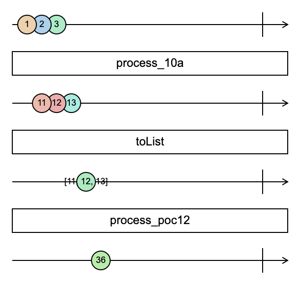

% DiFlow
% Toni Verbeiren, Data Intuitive
% Tuesday - October 06, 2020

# Introduction

[DiFlow] is an abstraction layer on top of [NextFlow]'s [DSL2]. DiFlow is a set of principles and guidelines for building NextFlow pipelines that allow the developer to declaratively define processing components and the user to declare the pipeline logic in a clean and intuitive way.

[Viash] is a tool that (among other things) allows us to _use_ DiFlow and make it practical, without the burden of maintaining boilerplate or _glue_ code.

[DiFlow]: <https://pointer>
[viash]: <http://data-intuitive.com/viash_docs>
[NextFlow]: <https://www.nextflow.io/>
[DSL2]: <https://www.nextflow.io/docs/latest/dsl2.html>

## Functional Reactive Programming (FRP)

If you're new to Functional Reactive Programming (FRP), here are a few pointers to posts and a video that introduce the concepts:

- An excellent [Medium post](https://itnext.io/demystifying-functional-reactive-programming-67767dbe520b) from Timo Stöttner
- The [introduction](https://gist.github.com/staltz/868e7e9bc2a7b8c1f754) to Reactive Programming you've been missing from André Staltz.
- A very insightful [presentation](https://www.youtube.com/watch?v=fdol03pcvMA) by Staltz where he introduces FRP from first principles (with live coding).

In what follows, we will refer to _streams_ in line with those authors but if you're used to working with [Rx] you would call this an observable.

[Rx]: http://reactivex.io/

## FRP for pipelines

Other initiatives have consideren that FRP is a good fit for pipeline development. Recent research and development also confirms this[^vub][^krews].

[^vub]: https://soft.vub.ac.be/~mathsaey/skitter/
[^krews]: https://github.com/weng-lab/krews


# NextFlow

## FRP in NextFlow

The [`Channel`] class used by NextFlow, itself based on the [DataFlow Programming Model] can in fact be regarded as an implementation of a Functional Reactive Programming library. Having said that, NextFlow allows one to to mix functional and imperative programming to the point that a developer is able to shoot its own foot.

Furthermore, `Channel`s can not be nested which complicates certain operations on the streams.

[`Channel`]: https://www.nextflow.io/docs/latest/channel.html
[DataFlow Programming Model]: https://en.wikipedia.org/wiki/Dataflow_programming

## NextFlow DSL(2)

[DSL2] is a crucial development in NextFlow because it avoid having to maintain large, monolithic pipeline definitions in one file. With DSL2, developer can spin off functionality in separate files and `import` what is needed.

This also potentially opens up ways to build (reusable) modules that could be used in different projects. That is exactly what a lot of organizations need.

# DiFlow

## The NoPipeline approach

For developing the pipeline, we set out with a few goals in mind:

- Build modules where each modules deals with a specific (computational) task
- Make sure those modules can be reused
- Make sure the module functionality can be tested and validated
- Make sure modules have a consistent API, so that
  a. calling a module is straightforward
  b. including a module in a pipeline is transparent and seamless

Please note that nothing in these requirements has to do with running a pipeline itself. Rather, we consider this a bottom-up system whereby we first focus on a solid foundation before we actually start to tie things together.

That's why we call this the NoPipeline approach, similar to NoSQL where 'No' does not stand for _not_, but rather 'Not Only'. The idea is to focus on the pipeline aspect _after_ the steps are properly defined and tested.

## General Requirements and design principles

### Reproducibility

I originally did not include it as a design principle for the simple reason that I think it's obvious. This should be every researcher's top priority.

### Pipeline Parameters vs Runtime Parameters

We make a strict distinction between parameters that are defined for the _FULL_ pipeline and those that are defined at runtime.

#### Pipeline Parameters

We currently have 4 pipeline parameters: Docker prefix, `ddir`, `rdir` and `pdir`.

#### Runtime Parameters

Runtime parameters differ from pipeline parameters in that they may be different for parallel runs of a process. A few examples:

- Some samples may require different filter threshold than others
- After concatenation, clustering may be run with different cluster parameters
- etc.

In other words, it does not make sense to define those parameters for the full pipeline because they are not static.

### Consistent API

When we started out with the project and chose to use NextFlow as a workflow engine, I kept on thinking that the level of abstraction should have been higher. With DSL1, all you could do was create one long list of NextFlow code, tied together by `Channel`s.

With DSL2, it became feasible to _organise_ stuff in separate NextFlow files and import what is required. But in larger codebases, this is not really a benefit because every modules/workflow may have its own parameters and output. No structure is imposed. `Workflow`s are basically functions taking parameters in and returning values.

I think it makes sense to define an API and to stick to it as much as possible. This makes using the modules/workflows easier...

### Flat Module Structure

We want to avoid having nested modules, but rather support a pool of modules to be mixed and matched.

As a consequence, this allows a very low threshold for including third-party modules: just add it to the collection of modules and import it in the pipeline. In order to facilitate the inclusion of such third-party modules that are developed in their own respective repositories, we added one additional layer in the hierarchy allowing for such a splitting.

### Job Serialization

We avoid requiring the sources of the job available in the runtime environment, i.e., the Docker container. In other words, all code and config is serialized and sent with the _process_.

## An abstract computation step

The module concept inspired us to think of an abstract way to represent a computation step and implement this in NextFlow. We wrote [Portash] to this end. But Portash had its shortcomings. The most important of which was that it did not adhere to separation of concerns: execution definition (what?) where mixed up with execution context (how?/where?). Moreover, dynamic nature of Portash lends itself well to running a tool as a service, but not so much in a batch process.

Nevertheless, we were able to express a generic NextFlow step as pure _configuration_ that is passed to a process at runtime. This allows for some very interesting functionality. Some prototypes were developed, the last one of which could run a single-cell RNA pipeline from mapping to generating an integrated dataset combining different samples.

The run-configuration was provided by means of a Portash YAML spec residing in the module directory. It must be stressed that not requiring the component _code_ to be already available inside the container is a big plus. It means a container contains dependencies, not the actual run script so the latter can be updated more frequently. This is especially useful during component and pipeline development.

Our first implementation had a few disadvantages:

- It contained a mix of what to run and how to run it, but it did not contain information on the container to run in. This had to be configured externally, but then the module is not an independent entity anymore.
- Specifying and overriding YAML content in Groovy is possible, but not something that is intuitive. We worked around that by letting the user specify custom configuration using a Groovy nested `Map`.
- The module functionality was abstracted with a consistent API and the difference between 2 modules was just a few lines of code with a different name or pointer. But still, one had to maintain that and making a similar change in a growing set of module files is a recipe for mistakes.

But overall, the concept of an abstract computation step proved to work, it was just that a few ingredients were still missing it seemed. On the positive side, we showed that it's possible to have an abstract API for (NextFlow) modules that keeps the underlying implementation hidden while improving the readability of the pipeline code.

## Toward implementation

What is needed as information in order to run a computation step in a pipeline?

1. First, we need data or generally speaking, __input__. Components/modules and pipelines should run zero-touch, so input has to be provided at startup time.

2. Secondly, we need to know what to run en how to run it. This is in effect the definition of a modules or pipeline step.

3. Thirdly, in many cases we will require the possibility to change parameters for individual modules in the pipeline, for instance cutoff values for a filter, or the number of clusters for a clustering algorithm. The classical way to do that is via the `params` object.

One might wonder if there is a difference between input and parameters pointing to input is also a kind of parametrization. The reason those are kept apart is that additional validation steps are necessary for the data. Most pipeline systems trace input/output closely whereas parameters are ways to configure the steps in the pipeline.

In terms of FRP, and especially in the DataFlow model, we also have to keep track of the _forks_ in a parallel execution scenario. For instance, if 10 batches of data can be processed in parallel we should give all 10 of them an ID so that individual forks can be distinguished. We will see that those IDs become crucial in most pipelines.

We end up with a model for a stream/channel as follows (conceptually):

```
[ ID, data, config ]
```

were

- `ID` is just a string or any object for that matter that can be compared later. We usually work with strings.
- `data` is a pointer to the (input) data. With NextFlow, this should be a `Path` object, ideally created using the `file()` helper function.
- `config` is a nested `Map` where the first level keys are chosen to be simply an identifier of the pipeline step. Other approaches can be taken here, but that's what we did.

This can be a triplet, or a list with mixed types. In Groovy, both can be used interchangeably.

The output of a pipeline step/mudules adheres to the same structure so that pipeline steps can easily be chained.

# Step by step

Let us illustrate some key features of NextFlow together with how we use them in DiFlow.

## POC1

Let us illustrate the stream-like nature of a NXF `Channel` using a very simple example: computing $1+1$.

```groovy
workflow poc1 {

    Channel.from(1) \
        | map{ it + 1 } \
        | view{ it }

}
```

This chunk is directly taken from `main.nf`, running it can be done as follows:

```sh
nextflow run . -entry poc1
```

## POC2

NextFlow (and streams in general) are supposed to be a good fit for parallel execution. Let's see how this can be done:

```groovy
workflow poc2 {

    Channel.from( [ 1, 2, 3 ] ) \
        | map{ it + 1 } \
        | view{ it }

}
```

Running it can be done using:

```sh
nextflow run . -entry poc3
```

## POC3

In the previous example, we ran 3 parallel executions each time applying the same simple function: adding one. Let us simulate now a more real-life example where parallel executions will not take the same amount of time. We do this by defining a `process` and `workflow` that uses this process. The rest is similar to our example before.

```groovy
process add {

    input:
        val(input)
    output:
        val(output)
    exec:
        output = input + 1

}

workflow poc3 {

    Channel.from( [ 1, 2, 3 ] ) \
        | add \
        | view{ it }

}
```

Running it is again the same.

```sh
nextflow run . -entry poc3
```

The result will be a permutation of 2,3 and 4. Try it multiple times to verify for yourself that the order is not guaranteed to be the same. Even though the execution times will not be that much different! In other words, a `Channel` does not guarantee the order, and that's a good thing.

## POC4

An illustrative test is one where we do not use a `process` for the execution, but rather just `map` but such that one of the inputs _takes longer_ to process, i.e.:

```groovy
def waitAndReturn(it) { sleep(2000); return it }

workflow poc4 {

    Channel.from( [ 1, 2, 3 ] ) \
        | map{ (it == 2) ? waitAndReturn(it) : it } \
        | map{ it + 1 } \
        | view{ it }

}
```

Running it:

```sh
nextflow run . -entry poc4
```

The result may be somewhat unexpected, the order is retained there's just a 2 second delay between the first entry and the rest. The `sleep` in other words blocks all the parallel execution branches.

This is a clear indication of why it's better to use a `process` to execute computations. On the other hand, as long as we _stay_ inside the `map` and don't run a `process`, the order is the same. This opens up some possibilities that we will exploit in what follows.

## POC5

If we can not guarantee the order of the different parallel branches, we should introduce a _branch ID_. This may be a label, a sample ID, a batch ID, etc. It's the unit of parallelization.

```
process addTuple {

    input:
        tuple val(id), val(input)
    output:
        tuple val("${id}"), val(output)
    exec:
        output = input + 1

}

workflow poc5 {

    Channel.from( [ 1, 2, 3 ] ) \
        | map{ el -> [ el.toString(), el ]} \
        | addTuple \
        | view{ it }

}
```

We can ran this code sample in the same way as the previous examples.

Please note that the function to add 1 remains exactly the same, we only added the `id` as the first element of the tuple in both input and output. As such we keep a handle on which sample is which, by means of the _key_ in the tuple.

Note: Later, we will extend this tuple and add configuration parameters to it... but this was supposed to go step by step.

## POC6

What if we want to be able to configure the term in the sum? This would require a parameter to be sent with the process invocation. Let's see how this can be done.

```groovy

process addTupleWithParameter {

input:
    tuple val(id), val(input), val(term)
output:
    tuple val("${id}"), val(output)
exec:
    output = input + term

}

workflow poc6 {

    Channel.from( [ 1, 2, 3 ] ) \
        | map{ el -> [ el.toString(), el, 10 ]} \
        | addTupleWithParameter \
        | view{ it }

}
```

This works, but is not very flexible. What if we want to configure the operator as well? What if we want to have branch-specific configuration? We can add a whole list of parameters, but that means that the `process` signature may be different for every `process` that we define. That is not a preferred solution.

## POC7

Let us use a simple hash to add 2 configuration parameters.

```groovy
process addTupleWithHash {

    input:
        tuple val(id), val(input), val(config)
    output:
        tuple val("${id}"), val(output)
    exec:
        output = (config.operator == "+") ? input + config.term : input - config.term

}

workflow poc7 {

    Channel.from( [ 1, 2, 3 ] ) \
        | map{ el -> [ el.toString(), el, [ "operator" : "-", "term" : 10 ]  ]} \
        | addTupleWithHash \
        | view{ it }

}
```


## POC8

POC7 offers us a way to use a consistent API for a process. Ideally, however, we would like different `process` invocation to be chained rather than to explicitly add the correct configuration all the time. Let us add an additional key to the map, so that a process knows _it's scope_.

```groovy
process addTupleWithProcessHash {

    input:
        tuple val(id), val(input), val(config)
    output:
        tuple val("${id}"), val(output)
    exec:
        def thisConf = config.addTupleWithProcessHash
        output = (thisConf.operator == "+") ? input + thisConf.term : input - thisConf.term

}

workflow poc8 {

    Channel.from( [ 1, 2, 3 ] ) \
        | map{ el -> [ el.toString(), el, [ "addTupleWithProcessHash" : [ "operator" : "-", "term" : 10 ] ] ] } \
        | addTupleWithProcessHash \
        | view{ it }

}
```

Please note that we used the process name as a key in the map, so that each process can tell what configuration parameter are relevant for its own scope.

## POC9

We used native Groovy code in the `process` examples above. Let us now use a shell script:

```groovy
workflow poc8 {

    Channel.from( [ 1, 2, 3 ] ) \
        | map{ el -> [ el.toString(), el, [ "addTupleWithProcessHash" : [ "operator" : "-", "term" : 10 ] ] ] } \
        | addTupleWithProcessHash \
        | view{ it }

}

process addTupleWithProcessHashScript {

    input:
        tuple val(id), val(input), val(config)
    output:
        tuple val("${id}"), stdout
    script:
        def thisConf = config.addTupleWithProcessHashScript
        def operator = thisConf.operator
        def term = thisConf.term
        """
        echo \$( expr $input $operator ${thisConf.term} )
        """

}
```

Running this (in the same way as before), we get something along these lines:

```
[3, -7
]
[1, -9
]
[2, -8
]
```

This is because the `stdout` qualifier captures the newline at the end of the code block. We could look for ways to circumvent that, but that is not the point here.

What's important to notice here:

1. We can not just retrieve individual entries in `config` in the shell, we have to let Groovy do that.
2. That means we either first retrieve individual values and store them in a variable,
3. or we use the `${...}` notation for that.
4. If we want to use `bash` variables, the `$` symbol has to be escaped.

Obviously, passing config like this requires a lot of typing (especially as additional parameters are introduced) and is error prone.

## POC10

We used the pipe `|` symbol to combine different steps in a _pipeline_ and we noticed that a `process` can do computations on parallel branches. That's nice, but we have not yet given an example of running 2 processes, one after the other.

There are a few things we have to note before we go to an example:

1. It's not possible to call the same process twice, a strange error occurs in that case[^more].
2. If we want to pipe the output of one process as input of the next, the I/O signature needs to be exactly the same, so the `output` of the `process` should be a triplet as well.

[^more]: It _is_ possible in some cases however to manipulate the `Channel` such that a process is effectively run twice on the same data, but that is a more advanced topic.

```groovy
process process_poc10a {

    input:
        tuple val(id), val(input), val(term)
    output:
        tuple val("${id}"), val(output), val("${term}")
    exec:
        output = input.toInteger() + term.toInteger()

}

process process_poc10b {

    input:
        tuple val(id), val(input), val(term)
    output:
        tuple val("${id}"), val(output), val("${term}")
    exec:
        output = input.toInteger() - term.toInteger()

}

workflow poc10 {

    Channel.from( [ 1, 2, 3 ] ) \
        | map{ el -> [ el.toString(), el, 10 ] } \
        | process_poc10a \
        | process_poc10b \
        | view{ it }

}
```

The result of this is that first 10 is added and then the same 10 is subtracted again, which results in the same as the original. Please note that the output contains 3 elements, also the `term` passed to the `process`:

```
[3, 3, 10]
[1, 1, 10]
[2, 2, 10]
```

We can configure the second `process` (subtraction) by adding an additional `map` in the mix:

```groovy
workflow poc10 {

    Channel.from( [ 1, 2, 3 ] ) \
        | map{ el -> [ el.toString(), el, 10 ] } \
        | process_poc10a \
        | map{ [ it[0], it[1], 5 ] } \
        | process_poc10b \
        | view{ it }

}
```

Please note that we define the closure in a different manner here, using the special variable `it`. We could also write (to the same effect):

```groovy
        ...
        | map{ x -> [ x[0], x[1], 5 ] } \
        ...
```

or even

```groovy
        ...
        | map{ id, value, term -> [ id, value, 5 ] } \
        ...
```

## POC11

What if we rewrite the previous using some of the techniques introduced earlier. Let us specify the operator as a parameter and try to stick to just 1 `process` definition.

```groovy
process process_poc11 {

    input:
        tuple val(id), val(input), val(config)
    output:
        tuple val("${id}"), val(output), val("${config}")
    exec:
        if (config.operator == "+")
           output = input.toInteger() + config.term.toInteger()
        else
           output = input.toInteger() - config.term.toInteger()

}

workflow poc11 {

    Channel.from( [ 1, 2, 3 ] ) \
        | map{ el -> [ el.toString(), el, [ "term" : 10, "operator" : "+" ] ] } \
        | process_poc11 \
        | map{ id, value, term -> [ el.toString(), el, [ "term" : 11, "operator" : "-" ] ] } \
        | process_poc11 \
        | view{ it }

}
```

This little workflow definition results in an error, just like we warned before:

```sh
$ nextflow run . -entry poc11
N E X T F L O W  ~  version 19.10.0
Launching `./main.nf` [distracted_hilbert] - revision: 1445a8ce0c
WARN: DSL 2 IS AN EXPERIMENTAL FEATURE UNDER DEVELOPMENT -- SYNTAX MAY CHANGE IN FUTURE RELEASE
assert processConfig==null
       |
       ['echo':false, 'cacheable':true, 'shell':['/bin/bash', '-ue'], 'validExitStatus':[0], 'maxRetries':0, 'maxErrors':-1, 'errorStrategy':TERMINATE]

 -- Check script 'main.nf' at line: 209 or see '.nextflow.log' file for more details
```

There is, however, one simple way around this: `include ... as ..`. Let us see how this works.

First, we store the `process` in a file `examples/poc/poc11.nf`:

```groovy
process process_poc11 {

    input:
        tuple val(id), val(input), val(config)
    output:
        tuple val("${id}"), val(output), val("${config}")
    exec:
        if (config.operator == "+")
           output = input.toInteger() + config.term.toInteger()
        else
           output = input.toInteger() - config.term.toInteger()

}
```

The `workflow` definition becomes:

```groovy
include process_poc11 as process_poc11a from './examples/poc/poc11.nf'
include process_poc11 as process_poc11b from './examples/poc/poc11.nf'

workflow poc11 {

    Channel.from( [ 1, 2, 3 ] ) \
        | map{ el -> [ el.toString(), el, [ : ] ] } \
        | map{ id, value, config -> [ id, value, [ "term" : 5, "operator" : "+" ] ] } \
        | process_poc11a \
        | map{ id, value, config -> [ id, value, [ "term" : 11, "operator" : "-" ] ] } \
        | process_poc11b \
        | view{ [ it[0], it[1] ] }

}
```

Running this yields an output similar to this:

```sh
$ nextflow run . -entry poc11
N E X T F L O W  ~  version 19.10.0
Launching `./main.nf` [sharp_gilbert] - revision: ee0b54f3d9
WARN: DSL 2 IS AN EXPERIMENTAL FEATURE UNDER DEVELOPMENT -- SYNTAX MAY CHANGE IN FUTURE RELEASE
executor >  local (6)
[e3/aabcbc] process > poc11:process_poc11a (3) [100%] 3 of 3
[3e/ec7d8f] process > poc11:process_poc11b (3) [100%] 3 of 3
[2, -4]
[1, -5]
[3, -3]
```

We made a few minor changes to the workflow code in the meanwhile:

1. Splitting the conversion from an array of items to the triplet is now done explicitly and separate from the specifying the configuration for the `process` itself.
2. The `view` now only contains the relevant parts, not the configuration part for the last `process`.

The above example illustrates the `include` functionality of NextFlow DSL2. This was not possible with prior versions.

## POC12

Let's implement a simple map/reduce schema with what we developed above. Until now, we basically covered the mapping stage: starting from 3 independent number, execute a function on each _branch_ individually. Now, we want to calculate the sum at the end (reduce phase).

We do this by adding a `process` to the example in POC10

```groovy
process process_poc12 {

    input:
        tuple val(id), val(input), val(term)
    output:
        tuple val("${id}"), val(output), val("${term}")
    exec:
        output = input.sum()

}

workflow poc12 {

    Channel.from( [ 1, 2, 3 ] ) \
        | map{ el -> [ el.toString(), el, 10 ] } \
        | process_poc10a \
        | toList \
        | map{ [ "sum", it.collect{ id, value, config -> value }, [ : ] ] } \
        | process_poc12 \
        | view{ [ it[0], it[1] ] }

}
```

A few remarks are in order here:

1. We use the `toList` operator on the output of `process_poc10a`. This can be regarded as merging the 3 parallel branches into one branch. The result has the signature `Channel[List[Triplet]]`. This `toList` operator only _outputs_ something on the output `Channel` when all incoming branches have finished and the _merge_ can effectively be performed.
2. It's important to note that what is passed through the pipe is still a `Channel`, only the number of _branches_, _nodes_, or whatever you want to call it differs.
3. The long `map{ [ "sum", ... }` line may seem complex at first, but it's really not. We take in `List[Triplet]` and convert this to `Triplet`. The first element of the triplet is just an identifier (`sum`). The last is the configuration map, but we don't need configuration for the sum. As the second element we want to obtain `List[Int]`, where the values are the 2nd element from the original triplets. The Groovy function `collect` on an array is like `map` in many other languages.

The marble diagram can be depicted conceptually as follows, where we note that in effect it's triplets rather than numbers that are contained in the marbles:

{ width=30% }

Please note that though we define the _pipeline_ sequentially, the 3 numbers are first handled in parallel and only combined when calling `toList`. Stated differently, parallelism comes for free when defining workflows like this.

<!--
Marble spec, to be used on swirly.dev to reproduce the figure
-abc-------------|
a := 1
b := 2
c := 3

> process_10a

--def------------|
d := 11
e := 12
f := 13

> toList

-----g-----------|
g := [11, 12, 13]

> process_poc12

------g----------|
g := 36
-->

## POC13

Let us tackle a different angle now and start to deal with files as input and output. In order to do this, we will mimic the functionality from earlier and modify it such that a file is used as input and output is also written to a file.

The following combination of `process` and `workflow` definition does exactly the same as before, but now from one or more files containing just a single integer number:

```groovy
process process_poc13 {

    input:
        tuple val(id), file(input), val(config)
    output:
        tuple val("${id}"), file("output.txt"), val("${config}")
    script:
        """
        a=`cat $input`
        let result="\$a + ${config.term}"
        echo "\$result" > output.txt
        """

}

workflow poc13 {

    Channel.fromPath( params.input ) \
        | map{ el -> [ el.baseName.toString(), el, [ "operator" : "-", "term" : 10 ]  ]} \
        | process_poc13 \
        | view{ [ it[0], it[1] ] }

}
```

While doing this, we also introduced a way to specify parameters via a configuration file (`nextflow.config`) or from the CLI. In this case `params.input` points to an argument we should provide on the CLI, for instance:

```sh
$ nextflow run . -entry poc13 --input data/input1.txt
N E X T F L O W  ~  version 19.10.0
Launching `./main.nf` [gigantic_noether] - revision: 94d747c151
WARN: DSL 2 IS AN EXPERIMENTAL FEATURE UNDER DEVELOPMENT -- SYNTAX MAY CHANGE IN FUTURE RELEASE
executor >  local (1)
[b1/57daf8] process > poc13:process_poc13 (1) [100%] 1 of 1
[input1, <...>/diflow/work/b1/57daf8f6a8ce6c1bc78f91c37cb466/output.txt]
```

Let's dissect a bit what is going one here...

1. We provide the input file `data/input1.txt` as input which gets automatically added to the `params` map as `params.input`.
2. The content of `input1.txt` is used in the simple sum just as before.
3. The output `Channel` contains the known triplet but this time the second entry is not a value, but rather a filename.

Please note that the file is `output.txt` is automatically stored in the unique `work` directory. We can take a look inside to verify that the calculation succeeded:

```sh
$ cat work/b1/57daf8f6a8ce6c1bc78f91c37cb466/output.txt
11
```

It seems the calculation went well, although one might be surprised by two things:

1. The output of the calculation is stored in some randomly generated `work` directory whereas we might want it somewhere more _findable_.
2. The `process` itself defines the value of the output filename, which may seem odd... and it is.

Taking our example a bit further and exploiting the fact that parallelism is natively supported by NextFlow as we've seen before, we can pass multiple input files to the same workflow defined above.

```sh
$ nextflow run . -entry poc13 --input "$PWD/data/input*.txt"
N E X T F L O W  ~  version 19.10.0
Launching `./main.nf` [peaceful_spence] - revision: 94d747c151
WARN: DSL 2 IS AN EXPERIMENTAL FEATURE UNDER DEVELOPMENT -- SYNTAX MAY CHANGE IN FUTURE RELEASE
executor >  local (3)
[1c/a214c2] process > poc13:process_poc13 (1) [100%] 3 of 3
[input2, <...>/diflow/work/a6/7dee09b191837e67afa1139b20d525/output.txt]
[input3, <...>/diflow/work/97/5261eeb055375d0779b1ee2645502c/output.txt]
[input1, <...>/diflow/work/1c/a214c221285fc4b4e9ad65cc5c5b98/output.txt]
```

Please note that we

1. provide the absolute path to the file
2. use a wildcard `*` to select multiple files
3. enclose the path (with wildcard) in double quotes to avoid shell globbing.

In the latter case, we end up with 3 output files, each named `output.txt` in their own respective (unique) `work` directory.

## POC14

Let us tackle one of the pain points of the previous example: output files are hidden in the `work` directory. One might be tempted to specify an output file in the `process` definition as such `file("<somepath>/output.txt")` but when you try this, it will quickly turn out that this does not work in the long run (though it may work for some limited cases).

NextFlow provides a better way to achieve the required functionality: [`publishDir`](https://www.nextflow.io/docs/latest/process.html?highlight=publish#publishdir). Let us illustrate its use with an example again and just adding the `publishDir` directive:

```groovy
process process_poc14 {

    publishDir "output/"

    input:
        tuple val(id), file(input), val(config)
    output:
        tuple val("${id}"), file("output.txt"), val("${config}")
    script:
        """
        a=`cat $input`
        let result="\$a + ${config.term}"
        echo "\$result" > output.txt
        """

}

workflow poc14 {

    Channel.fromPath( params.input ) \
        | map{ el -> [ el.baseName.toString(), el, [ "operator" : "-", "term" : 10 ]  ]} \
        | process_poc14 \
        | view{ [ it[0], it[1] ] }

}
```

This single addition yields:

```sh
$ nextflow run . -entry poc14 --input data/input1.txt
N E X T F L O W  ~  version 19.10.0
Launching `./main.nf` [tiny_jones] - revision: 630950ba4c
WARN: DSL 2 IS AN EXPERIMENTAL FEATURE UNDER DEVELOPMENT -- SYNTAX MAY CHANGE IN FUTURE RELEASE
executor >  local (1)
[2b/be1b41] process > poc14:process_poc14 (1) [100%] 1 of 1
[input1, <...>/diflow/work/2b/be1b41b70db8a855bfb8f17a300796/output.txt]

$ cat output/output.txt
11
```

This example shows us a powerful approach to publishing data during our at the end of a pipeline. There is a similar drawback as for the output filenames, however, and that is that the `process` defines the output directory explicitly. But there is a different problem as well which can be observed when running on multiple input files:

```sh
$ nextflow run . -entry poc14 --input "$PWD/data/input*.txt"
N E X T F L O W  ~  version 19.10.0
Launching `./main.nf` [exotic_thompson] - revision: 630950ba4c
WARN: DSL 2 IS AN EXPERIMENTAL FEATURE UNDER DEVELOPMENT -- SYNTAX MAY CHANGE IN FUTURE RELEASE
executor >  local (3)
[3b/007268] process > poc14:process_poc14 (1) [100%] 3 of 3
[input3, <...>/diflow/work/82/7ec0f8d6106b1d4d61a2cb64797e74/output.txt]
[input2, <...>/diflow/work/53/e25634a6bdd1613837a07cc7234617/output.txt]
[input1, <...>/diflow/work/3b/0072687d416807b80cdca62aa7ab41/output.txt]

$ cat output/output.txt
11
```

What do you think happens here? Yes, sure, we _publish_ the same `output.txt` file three times and each time overwriting the same file. The last one is the one that persists.


## POC15

Let us describe a way to avoid the above issue. There are other approaches to resolve this issue, but let us for the moment look at one that can easily be reused.

```groovy
process process_poc15 {

    publishdir "output/${config.id}"

    input:
        tuple val(id), file(input), val(config)
    output:
        tuple val("${id}"), file("output.txt"), val("${config}")
    script:
        """
        a=`cat $input`
        let result="\$a + ${config.term}"
        echo "\$result" > output.txt
        """

}

workflow poc15 {

    channel.frompath( params.input ) \
        | map{ el -> [ el.basename.tostring(), el, [ "id": el.basename, "operator" : "-", "term" : 10 ]  ]} \
        | process_poc15 \
        | view{ [ it[0], it[1] ] }

}
```

This results in the following:

```sh
$ nextflow run . -entry poc15 --input "$PWD/data/input*.txt"
N E X T F L O W  ~  version 19.10.0
Launching `./main.nf` [berserk_gutenberg] - revision: 474b7b0a5b
WARN: DSL 2 IS AN EXPERIMENTAL FEATURE UNDER DEVELOPMENT -- SYNTAX MAY CHANGE IN FUTURE RELEASE
executor >  local (3)
[5f/15f0a5] process > poc15:process_poc15 (3) [100%] 3 of 3
[input2, <...>/diflow/work/eb/30b10c68b03542373b340e08b2fb88/output.txt]
[input1, <...>/diflow/work/d6/cdd3aa71eab634c017f0eb6e44713c/output.txt]
[input3, <...>/diflow/work/5f/15f0a5ed44810731197fcb5f9893e7/output.txt]

$ cat output/input*/output.txt
11
12
13
```

In other words, since (in this case 3) parallel branches each write to the same output location we have to make sure that we add something unique for every of the parallel branches. Another approach is to tweak the name of the output file in the `process`, but for the moment it is still fixed and defined in the `process` itself. Let us take a look at that aspect next.

## POC16

We want the output filename to be configurable. That means that we either use the `params` map for this (and take care it is available in modules that are `include`d) or we pass it to the `process` as part of the input. Let us explore both scenarios.

But first, we need to understand a bit better where the contents of `params` comes from. We already covered a few examples where we specify a `params` key on the CLI. There is another way as well, via `nextflow.config`. In it, we can add a scope `params` and add configuration there.

Let us reconsider the previous example (`poc15`) but this time add a `nextflow.config` file like this (please update the `<...>` part according to your situation):

```
params.input = "<...>/diflow/data/*.txt"
```

Let us illustrate the effect by means of two examples:

```sh
> nextflow run . -entry poc15
N E X T F L O W  ~  version 19.10.0
Launching `./main.nf` [elated_poincare] - revision: 474b7b0a5b
WARN: DSL 2 IS AN EXPERIMENTAL FEATURE UNDER DEVELOPMENT -- SYNTAX MAY CHANGE IN FUTURE RELEASE
executor >  local (3)
[45/12e2ed] process > poc15:process_poc15 (1) [100%] 3 of 3
[input2, <...>/diflow/work/62/102c68dde4382be33f028affec2245/output.txt]
[input3, <...>/diflow/work/f9/b6beedb0d82c3a8b9068bf02d41a2f/output.txt]
[input1, <...>/diflow/work/45/12e2ed9f6eb96905d1c213c00a8ea2/output.txt]

> nextflow run . -entry poc15 --input data/input1.txt
N E X T F L O W  ~  version 19.10.0
Launching `./main.nf` [pedantic_ritchie] - revision: 474b7b0a5b
WARN: DSL 2 IS AN EXPERIMENTAL FEATURE UNDER DEVELOPMENT -- SYNTAX MAY CHANGE IN FUTURE RELEASE
executor >  local (1)
[b7/4462c7] process > poc15:process_poc15 (1) [100%] 1 of 1
[input1, <...>/diflow/work/b7/4462c7dcd558c5c1824eb1831d3ca5/output.txt]
```

In other words, `params` can be defined in `nextflow.config` but if it appears on the CLI then the latter gets priority. Please be reminded that `params` is a map, the following is equivalent:

```
params {
    input = "<...>/diflow/data/*.txt"
}
```

### POC16 - Add the output file to `params`

In this case, we would add a `output = ...` key to `nextflow.config` or provide `--output ...` on the CLI. This is done in the following example:

```groovy
process process_poc16 {

    publishDir "output/${config.id}"

    input:
        tuple val(id), file(input), val(config)
    output:
        tuple val("${id}"), file(params.output), val("${config}")
    script:
        """
        a=`cat $input`
        let result="\$a + ${config.term}"
        echo "\$result" > ${params.output}
        """

}

workflow poc16 {

    Channel.fromPath( params.input ) \
        | map{ el -> [ el.baseName.toString(), el, [ "id": el.baseName, "operator" : "-", "term" : 10 ]  ]} \
        | process_poc16 \
        | view{ [ it[0], it[1] ] }

}

```

The result is

```sh
> nextflow run . -entry poc16 --input data/input1.txt --output output1.txt
N E X T F L O W  ~  version 19.10.0
Launching `./main.nf` [drunk_jang] - revision: e6935c0bab
WARN: DSL 2 IS AN EXPERIMENTAL FEATURE UNDER DEVELOPMENT -- SYNTAX MAY CHANGE IN FUTURE RELEASE
executor >  local (1)
[61/158709] process > poc16:process_poc16 (1) [100%] 1 of 1
[input1, <...>/diflow/work/61/1587094bd416db4d108b2bd0aff340/output1.txt]

> cat output/input1/output1.txt
11
```

We note that the `params.output` occurs in the `output:` triplet as well as in the script code itself. That's quite important, otherwise NextFlow will complain the output file can not be found.

This approach does what it is supposed to do: make the output filename configurable. There are a few drawbacks however:

1. We would have to configure the filename for _every_ process individually. While this can be done (`params.<process>.output` for instance), it requires additional bookkeeping on the side of the pipeline developer.
2. It does not help much because the output filename for every parallel branch again has the same name. In other words, we still have to have the `publishDir`

In all fairness, these issues only arise when you want to _publish_ the output data because in the other case every process lives in its own `work` directory.

### POC17 - Add the output filename to the triplet

The other approach to take is to add the output filename to the triplet provided as input to the `process`. This can be done similarly to what we did with the input filename, i.e.:

```groovy
process process_poc17 {

    publishDir "output"

    input:
        tuple val(id), file(input), val(config)
    output:
        tuple val("${id}"), file("${config.output}"), val("${config}")
    script:
        """
        a=`cat $input`
        let result="\$a + ${config.term}"
        echo "\$result" > ${config.output}
        """

}

workflow poc17 {

    Channel.fromPath( params.input ) \
        | map{ el -> [
            el.baseName.toString(),
            el,
            [
                "output" : "output_from_${el.baseName}.txt",
                "id": el.baseName,
                "operator" : "-",
                "term" : 10
            ]
          ]} \
        | process_poc17 \
        | view{ [ it[0], it[1] ] }

}
```

In order to make a bit more sense of the (gradually growing) configuration map that is sent to the `process`, we tuned the layout a bit. In this case, the output filename that is configured contains an identifier for the input as well. In this way, the output is always unique.

Since we have configured `params.input` in `nextflow.config`, we are able to just run our new _pipeline_:

```sh
$ nextflow run . -entry poc17
N E X T F L O W  ~  version 19.10.0
Launching `./main.nf` [modest_kilby] - revision: 8c97318d5a
WARN: DSL 2 IS AN EXPERIMENTAL FEATURE UNDER DEVELOPMENT -- SYNTAX MAY CHANGE IN FUTURE RELEASE
executor >  local (3)
[30/9658c3] process > poc17:process_poc17 (1) [100%] 3 of 3
[input3, <...>/diflow/work/bb/a820f42cc1f099d9308f14c11da797/output_from_input3.txt]
[input2, <...>/diflow/work/81/32f59c31bc0a355828397994f5a5d0/output_from_input2.txt]
[input1, <...>/diflow/work/30/9658c3eb08ceabc6f0fb3e07449dec/output_from_input1.txt]

$ ls -1 output/
output_from_input1.txt
output_from_input2.txt
output_from_input3.txt
```

In other words, this allows to distinguish between parallel branches in the pipeline. 

Please note that if we add steps to the _pipeline_, because the output is reported as input for the next `process`, it automatically points to the correct filename even though the next process is not aware of the way the output filename has been specified. That's nice.


### POC18 - Use a closure

We mentioned that there are 2 ways to pass an output filename to a `process`. There is a third one, using a closure or function to handle the naming for us.

Let us illustrate this with an example again:

```groovy
def out_from_in = { it -> it.baseName + "-out.txt" }

process process_poc18 {

    publishDir "output"

    input:
        tuple val(id), file(input), val(config)
    output:
        tuple val("${id}"), file("${out}"), val("${config}")
    script:
        out = out_from_in(input)
        """
        a=`cat $input`
        let result="\$a + ${config.term}"
        echo "\$result" > ${out}
        """

}

workflow poc18 {

    Channel.fromPath( params.input ) \
        | map{ el -> [
            el.baseName.toString(),
            el,
            [
                "id": el.baseName,
                "operator" : "-",
                "term" : 10
            ]
          ]} \
        | process_poc18 \
        | view{ [ it[0], it[1] ] }

}
```

The result is as follows:

```sh
$ nextflow run . -entry poc18
N E X T F L O W  ~  version 19.10.0
Launching `./main.nf` [gigantic_shockley] - revision: 696b9c6ef1
WARN: DSL 2 IS AN EXPERIMENTAL FEATURE UNDER DEVELOPMENT -- SYNTAX MAY CHANGE IN FUTURE RELEASE
executor >  local (3)
[e6/3f62e5] process > poc18:process_poc18 (1) [100%] 3 of 3
[input2, <...>/diflow/work/d4/8c78167d730ebe7e8150e899d792c8/input2-out.txt]
[input3, <...>/diflow/work/c0/20bbad0e0ca811634aed8673a63726/input3-out.txt]
[input1, <...>/diflow/work/e6/3f62e5749072fa636836da95574f3c/input1-out.txt]
```

We can even add the closure to the configuration map sent to the `process`, but NextFlow complains that this is not serializable so you may miss some features and most importantly it may not work at all times:

```
WARN: Cannot serialize context map. Cause: java.lang.IllegalArgumentException: Unknown workflow parameter definition: map -- Resume will not work on this process
```

This approach may seem like completely over-engineered but for a lot of use-cases it turns out to be a good fit. Although, not in the way we introduced it here. We come back to that later...

## POC20

We touch upon a point that we have encountered but not really considered in-depth: the order of _things_ in the `Channel` or stream. We've noticed that the order is not predictable and we've discussed that this is to be expected. In general, the duration of a `process` step may depend on the data or the number of resources available at the time of running. Also, the example where we joined the different parallel branches (POC12 - __REF__) was independent of the order because it just calculated the sum.

Another consequence of the undetermined order of _events_ is the fact that during a join or reduce phase (for instance with `toList`), the resulting order is undetermined and this messes up the caching functionality of NextFlow.

Let us give an example with a reduce process that _does_ depend on the order of _events_. We divide the first element from the _map_ phase by the second one:

```groovy
process process_poc20 {

    input:
        tuple val(id), val(input), val(term)
    output:
        tuple val("${id}"), val(output), val("${term}")
    exec:
        output = input[0] / input[1]

}

workflow poc20 {

    Channel.from( [ 1, 2 ] ) \
        | map{ el -> [ el.toString(), el, 10 ] } \
        | process_poc10a \
        | toList \
        | map{ [ "sum", it.collect{ id, value, config -> value }, [ : ] ] } \
        | process_poc20 \
        | view{ [ it[0], it[1] ] }

}
```

If you run this code like this, you get something like this when launching multiple times:

```sh
$ nextflow run . -entry poc20 -with-docker
N E X T F L O W  ~  version 19.10.0
Launching `./main.nf` [awesome_bernard] - revision: f2b9ccb088
WARN: DSL 2 IS AN EXPERIMENTAL FEATURE UNDER DEVELOPMENT -- SYNTAX MAY CHANGE IN FUTURE RELEASE
executor >  local (3)
[e4/7ca36c] process > poc20:process_poc10a (2) [100%] 2 of 2
[03/2027f4] process > poc20:process_poc20      [100%] 1 of 1
[sum, 0.9166666667]

$ nextflow run . -entry poc20 -with-docker
N E X T F L O W  ~  version 19.10.0
Launching `./main.nf` [hopeful_majorana] - revision: f2b9ccb088
WARN: DSL 2 IS AN EXPERIMENTAL FEATURE UNDER DEVELOPMENT -- SYNTAX MAY CHANGE IN FUTURE RELEASE
executor >  local (3)
[ad/8ad0ca] process > poc20:process_poc10a (1) [100%] 2 of 2
[85/9fb964] process > poc20:process_poc20      [100%] 1 of 1
[sum, 1.0909090909]
```

Luckily, there is a variant of the `toList` channel operator that takes into account sorting: `toSortedList`. There are other operators as well, but we leave it as an exercise to look those up. The `workflow` code above simply becomes:

```groovy
workflow poc20 {

    Channel.from( [ 1, 2 ] ) \
        | map{ el -> [ el.toString(), el, 10 ] } \
        | process_poc10a \
        | toSortedList{ a,b -> a[0] <=> b[0] } \
        | map{ [ "sum", it.collect{ id, value, config -> value }, [ : ] ] } \
        | process_poc20 \
        | view{ [ it[0], it[1] ] }

}
```

In this example, we sort (alphabetically) on the id in the triplet.

## POC21

Let us consider a different example: running a CLI tool inside the `script` block that takes arguments. We will assume (at least for now) that the tool is in the `$PATH` of the execution environment. Since we are not (yet) running inside a container, we make the switch to Docker first.


- - -

# Appendix

## Caveats and Tips

### 

### Resources

When you run or export with the `DockerTarget`, resources are automatically added to the running container and stored under `/resources`. In case of the `NativeTarget`, this is not the case and since `NextFlowTarget` uses the `NativeTarget` it's the same there. That does not mean that resources specified in `functionality.yaml` is not available in these cases, we only have to point to them where appropriate.

The following snippet (from `ct/singler`) illustrates this:

```r
par = list(
  input = "input.h5ad",
  output = "output.h5ad",
  reference = "HPCA",
  outputField = "cellType",
  pruningMADS = 3,
  outputFieldPruned = "celltype-pruned",
  reportOutputPath = "report.md"
)
## VIASH END
par$resources_dir <- resources_dir
```

In other words, `resources_dir` is automatically created by `viash` in all current 3 environments.
This means that we can point to the `report.Rmd` file present in the resources like so:

```r
rmarkdown::render(paste0(par$resources_dir, "/", "report.Rmd"), output_file = par$reportOutputPath)
```

### Default values

In functionality, no option should have an empty string as value!

### `target_image`

It makes sense to add the `target_image` attribute in the `docker_platform.yaml` file. This way, the resulting container image is predictable, rather than an autogenerated tag from `viash`.

### Running the Docker setup

We don't have a solution yet for pre-generating the Docker images prior to starting a NXF pipeline. For the moment, we ask the user to run the build script for the Docker targets with the `---setup` option. This only works locally, it would for instance not work on a different (clean) node or in a Kubernetes cluster.

We are working on solutions or workarounds for this. Keep you posted!


## Open issues

1. Multiple files as input for a component:
E.g. the concat component uses multiple files to be joined. At the moment this does not seems to be possible.

2. Use of additional input files into a specific component. 
Some components do not only have input/output but require additional input. How should we map this?

