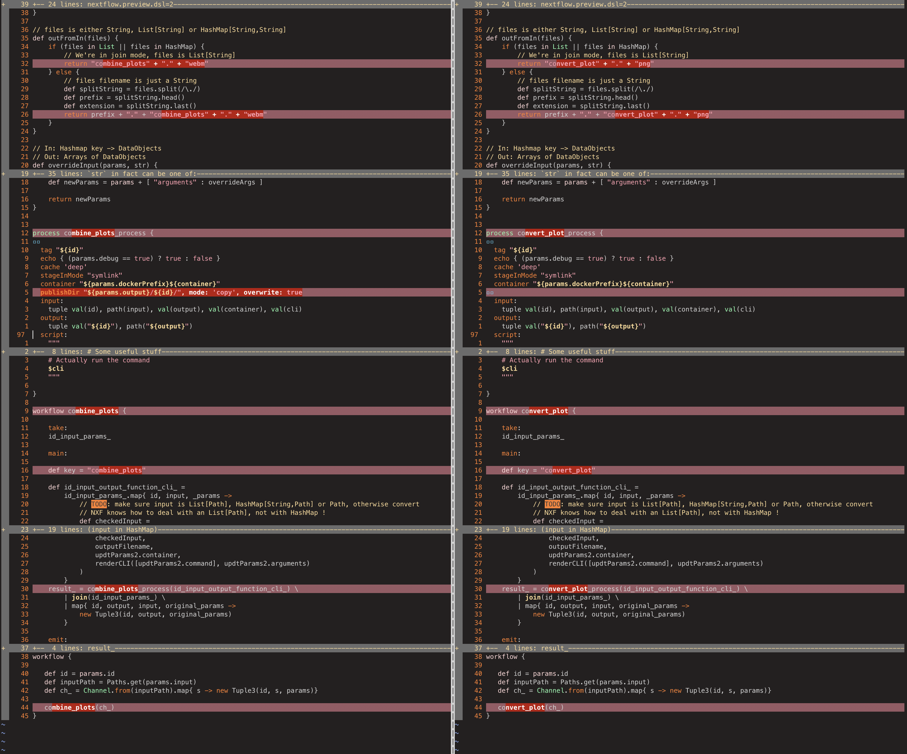
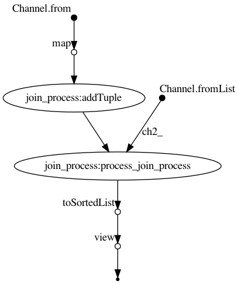
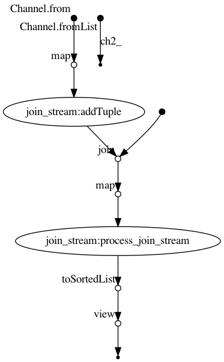

# Putting it all together

- - -

## A module `combine_plots`

- - -

```
combine_plots/
  main.nf
  nextflow.config
  [script(s)]
```

- - -

`nextflow.config`:

```groovy
params {
  combine_plots__input = "/path/to/my/dir"
  combine_plots__output = "output.webm"
  combine_plots__framerate = "4"
  id = ""
  dockerPrefix = ""
  input = ""
  output = ""
  combine_plots {
    name = "combine_plots"
    container = "jrottenberg/ffmpeg:latest"
    command = "combine_plots"
    # ...
    arguments {
      input {
        name = "input"
        otype = "--"
        description = "A list of images."
        value = "${params.combine_plots__input}"
        required = true
        type = "file"
        # ...
      }
      output {
        name = "output"
        otype = "--"
        description = "A path to output the movie to."
        value = "${params.combine_plots__output}"
        required = true
        type = "file"
        # ...
      }
      framerate {
        name = "framerate"
        otype = "--"
        description = "Number of frames per second."
        value = "${params.combine_plots__framerate}"
        required = false
        type = "integer"
        # ...
      }
    }
  }
}

```

- - -

`main.nf`:

```groovy
nextflow.preview.dsl=2
import java.nio.file.Paths

// ... checks

def renderCLI(command, arguments) {
  // ... based on nextflow.config, render CLI
}

// files is either String, List[String] or HashMap[String,String]
def outFromIn(files) {
  // ... derive output from input filename
}

// In: Hashmap key -> DataObjects
// Out: Arrays of DataObjects
def overrideInput(params, str) {
  // ... internal consistency
}

def overrideOutput(params, str) {
  // ... internal consistency
}

process combine_plots_process {
  // ...
  container "${params.dockerPrefix}${container}"
  publishDir "${params.output}/${id}/", mode: 'copy', overwrite: true
  input:
    tuple val(id), path(input), val(output), val(container), val(cli)
  output:
    tuple val("${id}"), path("${output}")
  script:
    """
    # ...
    $cli
    """
}

workflow combine_plots {
    take:
      id_input_params_
    main:
      def key = "combine_plots"
      // ... workflow logic
    emit:
    result_
}

workflow {
  // ... Testing procedure(s)
}
```

- - -

{.plain}

- - -

## Boilerplate?

- - -

We don't write these files ourselves, they are generated!

`combine_plots/config.vsh.yaml`:

```yaml
functionality:
  name: combine_plots
  namespace: civ6_save_renderer
  description: Combine multiple images into a movie using ffmpeg.
  arguments:
    - name: "--input"
      alternatives: [-i]
      type: file
      required: true
      default: "/path/to/my/dir"
      must_exist: true
      multiple: true
      description: A list of images.
    - name: "--output"
      alternatives: [-o]
      type: file
      required: true
      default: "output.webm"
      direction: output
      description: A path to output the movie to.
    - name: "--framerate"
      alternatives: [-f]
      type: integer
      default: 4
      description: Number of frames per second.
  resources:
    - type: bash_script
      path: script.sh
platforms:
  - type: docker
    image: jrottenberg/ffmpeg
  - type: nextflow
    image: jrottenberg/ffmpeg
    publish: true
  - type: native
```

- - -

`combine_plots/script.sh`:

```sh
#!/bin/bash

# render movie
inputs=`echo $par_input | sed 's#:# -i #g'`
ffmpeg -framerate $par_framerate -f image2 -i $inputs -c:v libvpx-vp9 -pix_fmt yuva420p -y $par_output
```

- - -

### Viash

- - -

## A Pipeline: `civ6_postgame`

<https://github.com/data-intuitive/viash_docs/tree/master/examples/civ6_postgame>

- - -

Original `bash` script:

```sh
#!/bin/bash

# run beforehand:
# viash ns build -P docker --setup
# viash ns build -P nextflow

BIN=target/docker/civ6_save_renderer
input_dir="data"
output_dir="output"

mkdir -p "$output_dir"

function msg {
  echo -e "\033[32m>>>>>>> $1\e[0m"
}

for save_file in $input_dir/*.Civ6Save; do
  file_basename=$(basename $save_file)
  yaml_file="$output_dir/${file_basename/Civ6Save/yaml}"
  tsv_file="$output_dir/${file_basename/Civ6Save/tsv}"
  pdf_file="$output_dir/${file_basename/Civ6Save/pdf}"
  png_file="$output_dir/${file_basename/Civ6Save/png}"

  if [ ! -f "$yaml_file" ]; then
    msg "parse header '$save_file'"
    $BIN/parse_header/parse_header -i "$save_file" -o "$yaml_file"
  fi

  if [ ! -f "$tsv_file" ]; then
    msg "parse map '$save_file'"
    $BIN/parse_map/parse_map -i "$save_file" -o "$tsv_file"
  fi

  if [ ! -f "$pdf_file" ]; then
    msg "plot map '$save_file'"
    $BIN/plot_map/plot_map -y "$yaml_file" -t "$tsv_file" -o "$pdf_file"
  fi

  if [ ! -f "$png_file" ]; then
    msg "convert plot '$save_file'"
    $BIN/convert_plot/convert_plot -i "$pdf_file" -o "$png_file"
  fi
done

png_inputs=`find "$output_dir" -name "*.png" | sed "s#.*#&:#" | tr -d '\n' | sed 's#:$#\n#'`

msg "combine plots"
$BIN/combine_plots/combine_plots -i "$png_inputs" -o "$output_dir/movie.webm" --framerate 1
```

- - -

`nextflow.config`

```groovy
includeConfig 'target/nextflow/civ6_save_renderer/plot_map/nextflow.config'
includeConfig 'target/nextflow/civ6_save_renderer/combine_plots/nextflow.config'
includeConfig 'target/nextflow/civ6_save_renderer/convert_plot/nextflow.config'
includeConfig 'target/nextflow/civ6_save_renderer/parse_header/nextflow.config'
includeConfig 'target/nextflow/civ6_save_renderer/parse_map/nextflow.config'

docker {
  runOptions = "-i -v ${baseDir}:${baseDir}"
}
```

- - -

`main.nf`

``` {.groovy}
nextflow.preview.dsl=2

import java.nio.file.Paths

include  plot_map       from  './target/nextflow/civ6_save_renderer/plot_map/main.nf'       params(params)
include  combine_plots  from  './target/nextflow/civ6_save_renderer/combine_plots/main.nf'  params(params)
include  convert_plot   from  './target/nextflow/civ6_save_renderer/convert_plot/main.nf'   params(params)
include  parse_header   from  './target/nextflow/civ6_save_renderer/parse_header/main.nf'   params(params)
include  parse_map      from  './target/nextflow/civ6_save_renderer/parse_map/main.nf'      params(params)
include  rename         from  './src/utils.nf'

workflow {

    if (params.debug == true)
        println(params)

    if (!params.containsKey("input") || params.input == "") {
        exit 1, "ERROR: Please provide a --input parameter pointing to .Civ6Save file(s)"
    }

    def input_ = Channel.fromPath(params.input)

    def listToTriplet = { it -> [ "all", it.collect{ a -> a[1] }, params ] }

    input_ \
        | map{ it -> [ it.baseName , it ] } \
        | map{ it -> [ it[0] , it[1], params ] } \
        | ( parse_header & parse_map ) \
        | join \
        | map{ id, parse_headerOut, params1, parse_mapOut, params2 ->
            [ id, [ "yaml" : parse_headerOut, "tsv": parse_mapOut ], params1 ] } \
        | plot_map \
        | convert_plot \
        | rename \
        | toSortedList{ a,b -> a[0] <=> b[0] }  \
        | map( listToTriplet ) \
        | combine_plots

}
```

- - -

Running the pipeline

```sh
viash ns build -p docker --setup
viash ns build -p nextflow
```

```sh
nextflow run . \
  --input "data/*.Civ6Save" \
  --output "output/" \
  --combine_plots__framerate 1
```

- - -

`<asciinema-player font-size='medium' preload='preload' src='data:application/json;base64,eyJ2ZXJzaW9uIjogMiwgIndpZHRoIjogMjUyLCAiaGVpZ2h0IjogNzEsICJ0aW1lc3RhbXAiOiAxNjA3NjQwMDIzLCAiZW52IjogeyJTSEVMTCI6ICIvYmluL3pzaCIsICJURVJNIjogInh0ZXJtLWNvbG9yIn19ClswLjA0ODM1MiwgIm8iLCAiXHUwMDFiW21cdTAwMWJbNDltXHUwMDFiWzM5bVx1MDAxYlttXHUwMDFiW21cdTAwMWJbMW1cdTAwMWJbN20lXHUwMDFiW21cdTAwMWJbMW1cdTAwMWJbbSAgICAgICAgICAgICAgICAgICAgICAgICAgICAgICAgICAgICAgICAgICAgICAgICAgICAgICAgICAgICAgICAgICAgICAgICAgICAgICAgICAgICAgICAgICAgICAgICAgICAgICAgICAgICAgICAgICAgICAgICAgICAgICAgICAgICAgICAgICAgICAgICAgICAgICAgICAgICAgICAgICAgICAgICAgICAgICAgICAgICAgICAgICAgICAgICAgICAgICAgICAgICAgICAgICAgICAgICAgICAgICAgICAgICAgICAgICAgICAgICAgICAgICAgICAgXHJcdTAwMWJbbVx1MDAxYls0OW1cdTAwMWJbMzltXHUwMDFiW21cdTAwMWJbbVx1MDAxYltLXHJcblxyXG5cdTAwMWJbMkFcdTAwMWI3XHUwMDFiW21cdTAwMWJbNDltXHUwMDFiWzM5bVx1MDAxYl0xMzM7QVx1MDAwN1x1MDAxYlszOW3ila3ilIBcdTAwMWJbbVx1MDAxYls0OW1cdTAwMWJbMzltIFx1MDAxYlttXHUwMDFiWzQ5bVx1MDAxYlszOW1cdTAwMWJbMW1cdTAwMWJbMzltflx1MDAxYlttXHUwMDFiWzQ5bVx1MDAxYlszOW0vY29kZS9cdTAwMWJbMW1cdTAwMWJbMzltdmlhc2hfZG9jc1x1MDAxYlttXHUwMDFiWzQ5bVx1MDAxYlszOW0vZXhhbXBsZXMvXHUwMDFiWzFtXHUwMDFiWzM5bWNpdjZfcG9zdGdhbWVcdTAwMWJbbVx1MDAxYls0OW1cdTAwMWJbMzltXHUwMDFiW21cdTAwMWJbNDltXHUwMDFiWzM5bSBcdTAwMWJbbVx1MDAxYls0OW1cdTAwMWJbMzlt7oKwXHUwMDFiW21cdTAwMWJbNDltXHUwMDFiWzM5bSAgICAgICAgICAgICAgICAgICAgICAgICAgICAgICAgICAgICAgICAgICAgICAgICAgICAgICAgICAgICAgICAgICAgICAgICAgICAgICAgICAgICAgICAgICAgICAgICAgICAgICAgICAgICAgICAgICAgICAgICAgICAgICAgICAgICAgICAgICAgICAgICAgICAgICAgICAgICAgICAgICAgICAgICAgICAgICAgICAgICAgICAgICAgICAgICAgICAgICAgICBcdTAwMWJbbVx1MDAxYls0OW1cdTAwMWJbMzlt7oKyXHUwMDFiW21cdTAwMWJbNDltXHUwMDFiWzM5bSBcdTAwMWJbbVx1MDAxYls0OW1cdTAwMWJbMzlt4pyUXHUwMDFiW21cdTAwMWJbNDltXHUwMDFiWzM5bSBcdTAwMWJbbVx1MDAxYls0OW1cdTAwMWJbMzltXHJcblx1MDAxYlszOW3ilbDilIBcdTAwMWJbbVx1MDAxYls0OW1cdTAwMWJbMzltXHUwMDFiW21cdTAwMWJbNDltXHUwMDFiWzM5bSBcdTAwMWJbbVx1MDAxYls0OW1cdTAwMWJbMzltXHUwMDFiXTEzMztCXHUwMDA3Il0KWzAuNzQzNTYzLCAibyIsICJcdTAwMWI4XHUwMDFiW21cdTAwMWJbNDltXHUwMDFiWzM5bVx1MDAxYlttXHUwMDFiW21cdTAwMWJbSiJdClswLjc0Njc4NSwgIm8iLCAiXHUwMDFiXTEzMzc7UmVtb3RlSG9zdD10b25pQFRvbmlzLU1hY0Jvb2stUHJvXHUwMDA3XHUwMDFiXTEzMzc7Q3VycmVudERpcj0vVXNlcnMvdG9uaS9jb2RlL3ZpYXNoX2RvY3MvZXhhbXBsZXMvY2l2Nl9wb3N0Z2FtZVx1MDAwN1x1MDAxYl0xMzM3O1NoZWxsSW50ZWdyYXRpb25WZXJzaW9uPTEwO3NoZWxsPXpzaFx1MDAwN1x1MDAxYl0yO3RvbmlAVG9uaXMtTWFjQm9vay1Qcm86fi9jb2RlL3ZpYXNoX2RvY3MvZXhhbXBsZXMvY2l2Nl9wb3N0Z2FtZVx1MDAwN1x1MDAxYl0xOy4uY2l2Nl9wb3N0Z2FtZVx1MDAwN1x1MDAxYl0xMzM7RDswXHUwMDA3XHUwMDFiXTEzMzc7UmVtb3RlSG9zdD10b25pQFRvbmlzLU1hY0Jvb2stUHJvXHUwMDA3XHUwMDFiXTEzMzc7Q3VycmVudERpcj0vVXNlcnMvdG9uaS9jb2RlL3ZpYXNoX2RvY3MvZXhhbXBsZXMvY2l2Nl9wb3N0Z2FtZVx1MDAwNyJdClswLjc0NzA4NSwgIm8iLCAiXHUwMDFiW21cdTAwMWJbNDltXHUwMDFiWzM5bVx1MDAxYlttXHUwMDFiW21cdTAwMWJbMW1cdTAwMWJbN20lXHUwMDFiW21cdTAwMWJbMW1cdTAwMWJbbSAgICAgICAgICAgICAgICAgICAgICAgICAgICAgICAgICAgICAgICAgICAgICAgICAgICAgICAgICAgICAgICAgICAgICAgICAgICAgICAgICAgICAgICAgICAgICAgICAgICAgICAgICAgICAgICAgICAgICAgICAgICAgICAgICAgICAgICAgICAgICAgICAgICAgICAgICAgICAgICAgICAgICAgICAgICAgICAgICAgICAgICAgICAgICAgICAgICAgICAgICAgICAgICAgICAgICAgICAgICAgICAgICAgICAgICAgICAgICAgICAgICAgICAgICAgXHJcdTAwMWJbbVx1MDAxYls0OW1cdTAwMWJbMzltXHUwMDFiW21cdTAwMWJbbVx1MDAxYltLIl0KWzAuNzUwMzU1LCAibyIsICJcclx1MDAxYlttXHUwMDFiW21cdTAwMWJbbVx1MDAxYltKXHUwMDFiW21cdTAwMWJbNDltXHUwMDFiWzM5bVx1MDAxYl0xMzM7QVx1MDAwN1x1MDAxYlszOW3ila3ilIBcdTAwMWJbbVx1MDAxYls0OW1cdTAwMWJbMzltIFx1MDAxYlttXHUwMDFiWzQ5bVx1MDAxYlszOW1cdTAwMWJbMW1cdTAwMWJbMzltflx1MDAxYlttXHUwMDFiWzQ5bVx1MDAxYlszOW0vY29kZS9cdTAwMWJbMW1cdTAwMWJbMzltdmlhc2hfZG9jc1x1MDAxYlttXHUwMDFiWzQ5bVx1MDAxYlszOW0vZXhhbXBsZXMvXHUwMDFiWzFtXHUwMDFiWzM5bWNpdjZfcG9zdGdhbWVcdTAwMWJbbVx1MDAxYls0OW1cdTAwMWJbMzltXHUwMDFiW21cdTAwMWJbNDltXHUwMDFiWzM5bSBcdTAwMWJbbVx1MDAxYls0OW1cdTAwMWJbMzBtXHUwMDFiWzM5be6CvVx1MDAxYlttXHUwMDFiWzQ5bVx1MDAxYlszMG0gXHUwMDFiWzM5bW9uIFx1MDAxYlttXHUwMDFiWzQ5bVx1MDAxYlszMG1cdTAwMWJbMzltXHUwMDFiWzM5bW1hc3Rlclx1MDAxYlttXHUwMDFiWzQ5bVx1MDAxYlszMG0gXHUwMDFiW21cdTAwMWJbMzBtXHUwMDFiWzQ5bVx1MDAxYlszOW3ugrBcdTAwMWJbbVx1MDAxYls0OW1cdTAwMWJbMzltICAgICAgICAgICAgICAgICAgICAgICAgICAgICAgICAgICAgICAgICAgICAgICAgICAgICAgICAgICAgICAgICAgICAgICAgICAgICAgICAgICAgICAgICAgICAgICAgICAgICAgICAgICAgICAgICAgICAgICAgICAgICAgICAgICAgICAgICAgICAgICAgICAgICAgICAgICAgICAgICAgICAgICAgICAgICAgICAgICBcdTAwMWJbbVx1MDAxYls0OW1cdTAwMWJbMzlt7oKyXHUwMDFiW21cdTAwMWJbNDltXHUwMDFiWzM5bSBcdTAwMWJbbVx1MDAxYls0OW1cdTAwMWJbMzlt4pyUXHUwMDFiW21cdTAwMWJbNDltXHUwMDFiWzM5bSBcdTAwMWJbbVx1MDAxYls0OW1cdTAwMWJbMzltXHUwMDFiWzM5be6CvVx1MDAxYlttXHUwMDFiWzQ5bVx1MDAxYlszOW0gXHUwMDFiWzM5bWF0IFx1MDAxYlttXHUwMDFiWzQ5bVx1MDAxYlszOW1hd3NcdTAwMWJbbVx1MDAxYls0OW1cdTAwMWJbMzltIOKOiFx1MDAxYlttXHUwMDFiWzQ5bVx1MDAxYlszOW1cdTAwMWJbbVx1MDAxYls0OW1cdTAwMWJbMzltIFx1MDAxYlttXHUwMDFiWzQ5bVx1MDAxYlszOW1cclxuXHUwMDFiWzM5beKVsOKUgFx1MDAxYlttXHUwMDFiWzQ5bVx1MDAxYlszOW1cdTAwMWJbbVx1MDAxYls0OW1cdTAwMWJbMzltIFx1MDAxYlttXHUwMDFiWzQ5bVx1MDAxYlszOW1cdTAwMWJdMTMzO0JcdTAwMDdcdTAwMWJbSyJdClswLjc1ODYwOSwgIm8iLCAiXHUwMDFiWz8xaFx1MDAxYj1cdTAwMWJbPzIwMDRoIl0KWzAuNzcwOTM3LCAibyIsICJcclxyXHUwMDFiW0FcdTAwMWJbbVx1MDAxYlttXHUwMDFiW21cdTAwMWJbSlx1MDAxYlttXHUwMDFiWzQ5bVx1MDAxYlszOW1cdTAwMWJdMTMzO0FcdTAwMDdcdTAwMWJbMzlt4pWt4pSAXHUwMDFiW21cdTAwMWJbNDltXHUwMDFiWzM5bSBcdTAwMWJbbVx1MDAxYls0OW1cdTAwMWJbMzltXHUwMDFiWzFtXHUwMDFiWzM5bX5cdTAwMWJbbVx1MDAxYls0OW1cdTAwMWJbMzltL2NvZGUvXHUwMDFiWzFtXHUwMDFiWzM5bXZpYXNoX2RvY3NcdTAwMWJbbVx1MDAxYls0OW1cdTAwMWJbMzltL2V4YW1wbGVzL1x1MDAxYlsxbVx1MDAxYlszOW1jaXY2X3Bvc3RnYW1lXHUwMDFiW21cdTAwMWJbNDltXHUwMDFiWzM5bVx1MDAxYlttXHUwMDFiWzQ5bVx1MDAxYlszOW0gXHUwMDFiW21cdTAwMWJbNDltXHUwMDFiWzM5bVx1MDAxYlszOW3ugr1cdTAwMWJbbVx1MDAxYls0OW1cdTAwMWJbMzltIFx1MDAxYlszOW1vbiBcdTAwMWJbbVx1MDAxYls0OW1cdTAwMWJbMzltXHUwMDFiWzM5bVx1MDAxYlszOW1tYXN0ZXIgXHUwMDFiWzM5bSExIFx1MDAxYlszOW0/MTFcdTAwMWJbbVx1MDAxYls0OW1cdTAwMWJbMzltIFx1MDAxYlttXHUwMDFiWzQ5bVx1MDAxYlszOW3ugrBcdTAwMWJbbVx1MDAxYls0OW1cdTAwMWJbMzltICAgICAgICAgICAgICAgICAgICAgICAgICAgICAgICAgICAgICAgICAgICAgICAgICAgICAgICAgICAgICAgICAgICAgICAgICAgICAgICAgICAgICAgICAgICAgICAgICAgICAgICAgICAgICAgICAgICAgICAgICAgICAgICAgICAgICAgICAgICAgICAgICAgICAgICAgICAgICAgICAgICAgICAgICAgIFx1MDAxYlttXHUwMDFiWzQ5bVx1MDAxYlszOW3ugrJcdTAwMWJbbVx1MDAxYls0OW1cdTAwMWJbMzltIFx1MDAxYlttXHUwMDFiWzQ5bVx1MDAxYlszOW3inJRcdTAwMWJbbVx1MDAxYls0OW1cdTAwMWJbMzltIFx1MDAxYlttXHUwMDFiWzQ5bVx1MDAxYlszOW1cdTAwMWJbMzlt7oK9XHUwMDFiW21cdTAwMWJbNDltXHUwMDFiWzM5bSBcdTAwMWJbMzltYXQgXHUwMDFiW21cdTAwMWJbNDltXHUwMDFiWzM5bWF3c1x1MDAxYlttXHUwMDFiWzQ5bVx1MDAxYlszOW0g4o6IXHUwMDFiW21cdTAwMWJbNDltXHUwMDFiWzM5bVx1MDAxYlttXHUwMDFiWzQ5bVx1MDAxYlszOW0gXHUwMDFiW21cdTAwMWJbNDltXHUwMDFiWzM5bVxyXG5cdTAwMWJbMzlt4pWw4pSAXHUwMDFiW21cdTAwMWJbNDltXHUwMDFiWzM5bVx1MDAxYlttXHUwMDFiWzQ5bVx1MDAxYlszOW0gXHUwMDFiW21cdTAwMWJbNDltXHUwMDFiWzM5bVx1MDAxYl0xMzM7Qlx1MDAwN1x1MDAxYltLIl0KWzEuMTQ5NzIsICJvIiwgIm4iXQpbMS4xNTE1NTYsICJvIiwgIlxibmUiXQpbMS4xNTMwNTIsICJvIiwgIngiXQpbMS4xNTQ1ODIsICJvIiwgInQiXQpbMS4xNTU4MTYsICJvIiwgImYiXQpbMS4xNTYzNTYsICJvIiwgImwiXQpbMS4xNTcxMTcsICJvIiwgIm8iXQpbMS4xNTc3NTksICJvIiwgInciXQpbMS4xNTg5NzksICJvIiwgIiAiXQpbMS4xNTk2MSwgIm8iLCAiciJdClsxLjE2MDIzNiwgIm8iLCAidSJdClsxLjE2MDg4MiwgIm8iLCAibiJdClsxLjE2MjAzMywgIm8iLCAiICJdClsxLjE2MjY3MywgIm8iLCAiLiJdClsxLjE2MzgzNCwgIm8iLCAiICJdClsxLjE2NTAxNiwgIm8iLCAiXFwiXQpbMS4xNjYyNiwgIm8iLCAiXHJcclxuXHUwMDFiW0tcdTAwMWJbMUMiXQpbMS4xNjc0NDUsICJvIiwgIlx1MDAxYlsxQyJdClsxLjE2ODI4MSwgIm8iLCAiLSJdClsxLjE2ODg5MywgIm8iLCAiLSJdClsxLjE2OTcyNSwgIm8iLCAiaSJdClsxLjE3MDQ1NywgIm8iLCAibiJdClsxLjE3MDk5OSwgIm8iLCAicCJdClsxLjE3MTYxOCwgIm8iLCAidSJdClsxLjE3MjI0LCAibyIsICJ0Il0KWzEuMTczNDgxLCAibyIsICIgIl0KWzEuMTc0NjEsICJvIiwgIlwiIl0KWzEuMTc1MjQzLCAibyIsICJkIl0KWzEuMTc1ODY3LCAibyIsICJhIl0KWzEuMTc2NDg3LCAibyIsICJ0Il0KWzEuMTc3MTg1LCAibyIsICJhIl0KWzEuMTc3Nzg4LCAibyIsICIvIl0KWzEuMTc4NDM1LCAibyIsICIqIl0KWzEuMTc5MTY3LCAibyIsICIuIl0KWzEuMTc5NjY2LCAibyIsICJDIl0KWzEuMTgwMjkyLCAibyIsICJpIl0KWzEuMTgwOTA1LCAibyIsICJ2Il0KWzEuMTgxNTMyLCAibyIsICI2Il0KWzEuMTgyMTQzLCAibyIsICJTIl0KWzEuMTgyNzk3LCAibyIsICJhIl0KWzEuMTgzNDY1LCAibyIsICJ2Il0KWzEuMTg0MjAxLCAibyIsICJlIl0KWzEuMTg0ODk5LCAibyIsICJcIiJdClsxLjE4NjI2MywgIm8iLCAiICJdClsxLjE4NzQ1MSwgIm8iLCAiXFwiXQpbMS4xODg3MTgsICJvIiwgIlxyXHJcblx1MDAxYltLXHUwMDFiWzFDIl0KWzEuMTg5ODgxLCAibyIsICJcdTAwMWJbMUMiXQpbMS4xOTA2MDEsICJvIiwgIi0iXQpbMS4xOTEzMTIsICJvIiwgIi0iXQpbMS4xOTE5OTcsICJvIiwgIm8iXQpbMS4xOTI2MzcsICJvIiwgInUiXQpbMS4xOTMyNTksICJvIiwgInQiXQpbMS4xOTM4OTEsICJvIiwgInAiXQpbMS4xOTQ2OTksICJvIiwgInUiXQpbMS4xOTY0ODgsICJvIiwgInQiXQpbMS4xOTkzNTksICJvIiwgIiAiXQpbMS4yMDIzMTUsICJvIiwgIlwiIl0KWzEuMjA0MjI5LCAibyIsICJvIl0KWzEuMjA0ODkyLCAibyIsICJ1Il0KWzEuMjA1NTI1LCAibyIsICJ0Il0KWzEuMjA2MTUsICJvIiwgInAiXQpbMS4yMDY3NzcsICJvIiwgInUiXQpbMS4yMDc0MTgsICJvIiwgInQiXQpbMS4yMDgwNjQsICJvIiwgIi8iXQpbMS4yMDg3NTEsICJvIiwgIlwiIl0KWzEuMjEwMDg1LCAibyIsICIgIl0KWzEuMjExMjUyLCAibyIsICJcXCJdClsxLjIxMjU0MiwgIm8iLCAiXHJcclxuXHUwMDFiW0tcdTAwMWJbMUMiXQpbMS4yMTc3NjMsICJvIiwgIlx1MDAxYlsxQyJdClsxLjIxODQ0NSwgIm8iLCAiLSJdClsxLjIxOTA4LCAibyIsICItIl0KWzEuMjE5NjkzLCAibyIsICJjIl0KWzEuMjIwMzM5LCAibyIsICJvIl0KWzEuMjIwOTY4LCAibyIsICJtIl0KWzEuMjIxNTg3LCAibyIsICJiIl0KWzEuMjIyMjUyLCAibyIsICJpIl0KWzEuMjIyOTQ3LCAibyIsICJuIl0KWzEuMjIzNTM5LCAibyIsICJlIl0KWzEuMjI0MTgxLCAibyIsICJfIl0KWzEuMjI0OTE5LCAibyIsICJwIl0KWzEuMjI1NTMzLCAibyIsICJsIl0KWzEuMjI2MjA0LCAibyIsICJvIl0KWzEuMjI2ODI5LCAibyIsICJ0Il0KWzEuMjI3NDIyLCAibyIsICJzIl0KWzEuMjI4MDM2LCAibyIsICJfIl0KWzEuMjI4NjU4LCAibyIsICJfIl0KWzEuMjI5Mjg5LCAibyIsICJmIl0KWzEuMjI5OTA0LCAibyIsICJyIl0KWzEuMjMwNTI1LCAibyIsICJhIl0KWzEuMjMxMTUxLCAibyIsICJtIl0KWzEuMjMxNzY0LCAibyIsICJlIl0KWzEuMjMyMzk1LCAibyIsICJyIl0KWzEuMjMzMDIyLCAibyIsICJhIl0KWzEuMjMzNjQ1LCAibyIsICJ0Il0KWzEuMjM0MjU3LCAibyIsICJlIl0KWzEuMjM1NDU1LCAibyIsICIgIl0KWzEuMjM2MDk5LCAibyIsICIxIl0KWzEuMjM2NDQ3LCAibyIsICJcdTAwMWJbM0FcdTAwMWJbMjdEXHUwMDFiWzdtblx1MDAxYls3bWVcdTAwMWJbN214XHUwMDFiWzdtdFx1MDAxYls3bWZcdTAwMWJbN21sXHUwMDFiWzdtb1x1MDAxYls3bXdcdTAwMWJbN20gXHUwMDFiWzdtclx1MDAxYls3bXVcdTAwMWJbN21uXHUwMDFiWzdtIFx1MDAxYls3bS5cdTAwMWJbN20gXHUwMDFiWzdtXFxcdTAwMWJbMUJcdTAwMWJbbVxyXHUwMDFiWzdtIFx1MDAxYls3bSBcdTAwMWJbN20tXHUwMDFiWzdtLVx1MDAxYls3bWlcdTAwMWJbN21uXHUwMDFiWzdtcFx1MDAxYls3bXVcdTAwMWJbN210XHUwMDFiWzdtIFx1MDAxYls3bVwiXHUwMDFiWzdtZFx1MDAxYls3bWFcdTAwMWJbN210XHUwMDFiWzdtYVx1MDAxYls3bS9cdTAwMWJbN20qXHUwMDFiWzdtLlx1MDAxYls3bUNcdTAwMWJbN21pXHUwMDFiWzdtdlx1MDAxYls3bTZcdTAwMWJbN21TXHUwMDFiWzdtYVx1MDAxYls3bXZcdTAwMWJbN21lXHUwMDFiWzdtXCJcdTAwMWJbN20gXHUwMDFiWzdtXFxcdTAwMWJbMUJcdTAwMWJbbVxyXHUwMDFiWzdtIFx1MDAxYls3bSBcdTAwMWJbN20tXHUwMDFiWzdtLVx1MDAxYls3bW9cdTAwMWJbN211XHUwMDFiWzdtdFx1MDAxYls3bXBcdTAwMWJbN211XHUwMDFiWzdtdFx1MDAxYls3bSBcdTAwMWJbN21cIlx1MDAxYls3bW9cdTAwMWJbN211XHUwMDFiWzdtdFx1MDAxYls3bXBcdTAwMWJbN211XHUwMDFiWzdtdFx1MDAxYls3bS9cdTAwMWJbN21cIlx1MDAxYls3bSBcdTAwMWJbN21cXFx1MDAxYlsxQlx1MDAxYlttXHJcdTAwMWJbN20gXHUwMDFiWzdtIFx1MDAxYls3bS1cdTAwMWJbN20tXHUwMDFiWzdtY1x1MDAxYls3bW9cdTAwMWJbN21tXHUwMDFiWzdtYlx1MDAxYls3bWlcdTAwMWJbN21uXHUwMDFiWzdtZVx1MDAxYls3bV9cdTAwMWJbN21wXHUwMDFiWzdtbFx1MDAxYls3bW9cdTAwMWJbN210XHUwMDFiWzdtc1x1MDAxYls3bV9cdTAwMWJbN21fXHUwMDFiWzdtZlx1MDAxYls3bXJcdTAwMWJbN21hXHUwMDFiWzdtbVx1MDAxYls3bWVcdTAwMWJbN21yXHUwMDFiWzdtYVx1MDAxYls3bXRcdTAwMWJbN21lXHUwMDFiWzdtIFx1MDAxYls3bTFcdTAwMWJbbVxyXHJcblx1MDAxYltLIl0KWzIuMjYzNzM2LCAibyIsICJcdTAwMWJbNEFcdTAwMWJbM0NcdTAwMWJbbW5cdTAwMWJbbWVcdTAwMWJbbXhcdTAwMWJbbXRcdTAwMWJbbWZcdTAwMWJbbWxcdTAwMWJbbW9cdTAwMWJbbXdcdTAwMWJbbSBcdTAwMWJbbXJcdTAwMWJbbXVcdTAwMWJbbW5cdTAwMWJbbSBcdTAwMWJbbS5cdTAwMWJbbSBcdTAwMWJbbVxcXHUwMDFiWzFCXHJcdTAwMWJbbSBcdTAwMWJbbSBcdTAwMWJbbS1cdTAwMWJbbS1cdTAwMWJbbWlcdTAwMWJbbW5cdTAwMWJbbXBcdTAwMWJbbXVcdTAwMWJbbXRcdTAwMWJbbSBcdTAwMWJbbVwiXHUwMDFiW21kXHUwMDFiW21hXHUwMDFiW210XHUwMDFiW21hXHUwMDFiW20vXHUwMDFiW20qXHUwMDFiW20uXHUwMDFiW21DXHUwMDFiW21pXHUwMDFiW212XHUwMDFiW202XHUwMDFiW21TXHUwMDFiW21hXHUwMDFiW212XHUwMDFiW21lXHUwMDFiW21cIlx1MDAxYlttIFx1MDAxYlttXFxcdTAwMWJbMUJcclx1MDAxYlttIFx1MDAxYlttIFx1MDAxYlttLVx1MDAxYlttLVx1MDAxYlttb1x1MDAxYlttdVx1MDAxYlttdFx1MDAxYlttcFx1MDAxYlttdVx1MDAxYlttdFx1MDAxYlttIFx1MDAxYlttXCJcdTAwMWJbbW9cdTAwMWJbbXVcdTAwMWJbbXRcdTAwMWJbbXBcdTAwMWJbbXVcdTAwMWJbbXRcdTAwMWJbbS9cdTAwMWJbbVwiXHUwMDFiW20gXHUwMDFiW21cXFx1MDAxYlsxQlxyXHUwMDFiW20gXHUwMDFiW20gXHUwMDFiW20tXHUwMDFiW20tXHUwMDFiW21jXHUwMDFiW21vXHUwMDFiW21tXHUwMDFiW21iXHUwMDFiW21pXHUwMDFiW21uXHUwMDFiW21lXHUwMDFiW21fXHUwMDFiW21wXHUwMDFiW21sXHUwMDFiW21vXHUwMDFiW210XHUwMDFiW21zXHUwMDFiW21fXHUwMDFiW21fXHUwMDFiW21mXHUwMDFiW21yXHUwMDFiW21hXHUwMDFiW21tXHUwMDFiW21lXHUwMDFiW21yXHUwMDFiW21hXHUwMDFiW210XHUwMDFiW21lXHUwMDFiW20gXHUwMDFiW20xXHUwMDFiWzFCXHJcdTAwMWJbSyJdClsyLjI2NTI3LCAibyIsICJcclxuXHUwMDFiW0EiXQpbMi4yNjU1MSwgIm8iLCAiXHUwMDFiWz8yMDA0bFx1MDAxYls0QVxyXHUwMDFiW0FcdTAwMWJbbVx1MDAxYlttXHUwMDFiW21cdTAwMWJbSlx1MDAxYl0xMzM7QVx1MDAwN1x1MDAxYlttXHUwMDFiWzQ5bVx1MDAxYlttXHUwMDFiW21cdTAwMWJbMzlt4p2vXHUwMDFiW21cdTAwMWJbNDltXHUwMDFiWzM5bVx1MDAxYlttXHUwMDFiW20gXHUwMDFiXTEzMztCXHUwMDA3bmV4dGZsb3cgcnVuIC4gXFxcdTAwMWJbS1xyXHJcbiAgLS1pbnB1dCBcImRhdGEvKi5DaXY2U2F2ZVwiIFxcXHUwMDFiW0tcclxyXG4gIC0tb3V0cHV0IFwib3V0cHV0L1wiIFxcXHUwMDFiW0tcclxyXG4gIC0tY29tYmluZV9wbG90c19fZnJhbWVyYXRlIDFcdTAwMWJbS1xyXHJcblx1MDAxYltLIl0KWzIuMjY1NjcxLCAibyIsICJcdTAwMWJbPzFsXHUwMDFiPiJdClsyLjI2NTc4OSwgIm8iLCAiXHUwMDFiW0tcclxyXG4iXQpbMi4yNjcyMTksICJvIiwgIlx1MDAxYl0yO25leHRmbG93IHJ1biAuIC0taW5wdXQgXCJkYXRhLyouQ2l2NlNhdmVcIiAtLW91dHB1dCBcIm91dHB1dC9cIiAgMVx1MDAwN1x1MDAxYl0xO25leHRmbG93XHUwMDA3Il0KWzIuMjY3NDM0LCAibyIsICJcdTAwMWJdMTMzO0M7XHUwMDA3Il0KWzMuOTk4MTkzLCAibyIsICJOIEUgWCBUIEYgTCBPIFcgIH4gIHZlcnNpb24gMjAuMTAuMFxyXG4iXQpbNS4yMTQ4MjYsICJvIiwgIkxhdW5jaGluZyBgLi9tYWluLm5mYCBbd2lzZV9tb250YWxjaW5pXSAtIHJldmlzaW9uOiA4NmRhMGNjM2VjXHJcbiJdCls2LjMyMjA3NiwgIm8iLCAiXHUwMDFiWzMzbVdBUk46IERTTCAyIElTIEFOIEVYUEVSSU1FTlRBTCBGRUFUVVJFIFVOREVSIERFVkVMT1BNRU5UIC0tIFNZTlRBWCBNQVkgQ0hBTkdFIElOIEZVVFVSRSBSRUxFQVNFXHUwMDFiWzM5bVx1MDAxYltLXHJcbiJdCls2LjY5NDkwNywgIm8iLCAiXHUwMDFiWzMzbVdBUk46IFVud3JhcHBlZCBtb2R1bGUgaW5jbHVzaW9uIGlzIGRlcHJlY2F0ZWQgLS0gUmVwbGFjZSBgaW5jbHVkZSBwbG90X21hcCBmcm9tICcuL01PRFVMRS9QQVRIJ2Agd2l0aCBgaW5jbHVkZSB7IHBsb3RfbWFwICJdCls2LjY5NTEyNiwgIm8iLCAifSBmcm9tICcuL01PRFVMRS9QQVRIJ2BcdTAwMWJbMzltXHUwMDFiW0tcclxuIl0KWzcuMTY2OTU4LCAibyIsICJcdTAwMWJbMzNtV0FSTjogVW53cmFwcGVkIG1vZHVsZSBpbmNsdXNpb24gaXMgZGVwcmVjYXRlZCAtLSBSZXBsYWNlIGBpbmNsdWRlIGNvbWJpbmVfcGxvdHMgZnJvbSAnLi9NT0RVTEUvUEFUSCdgIHdpdGggYGluY2x1ZGUgeyBjb21iaW5lX3Bsb3RzIH0gZnJvbSAnLi9NT0RVTEUvUEFUSCdgXHUwMDFiWzM5bVx1MDAxYltLXHJcbiJdCls3LjUzNTA2LCAibyIsICJcdTAwMWJbMzNtV0FSTjogVW53cmFwcGVkIG1vZHVsZSBpbmNsdXNpb24gaXMgZGVwcmVjYXRlZCAtLSBSZXBsYWNlIGBpbmNsdWRlIGNvbnZlcnRfcGxvdCBmcm9tICcuL01PRFVMRS9QQVRIJ2Agd2l0aCBgaW5jbHVkZSB7IGNvbnZlcnRfcGxvdCB9IGZyb20gJy4vTU9EVUxFL1BBVEgnYFx1MDAxYlszOW1cdTAwMWJbS1xyXG4iXQpbNy42NzU3MzEsICJvIiwgIlx1MDAxYlszM21XQVJOOiBVbndyYXBwZWQgbW9kdWxlIGluY2x1c2lvbiBpcyBkZXByZWNhdGVkIC0tIFJlcGxhY2UgYGluY2x1ZGUgcGFyc2VfaGVhZGVyIGZyb20gJy4vTU9EVUxFL1BBVEgnYCB3aXRoIGBpbmNsdWRlIHsgcGFyc2VfaGVhZGVyIH0gZnJvbSAnLi9NT0RVTEUvUEFUSCdgXHUwMDFiWzM5bVx1MDAxYltLXHJcbiJdCls3LjgyNjgwNCwgIm8iLCAiXHUwMDFiWzMzbVdBUk46IFVud3JhcHBlZCBtb2R1bGUgaW5jbHVzaW9uIGlzIGRlcHJlY2F0ZWQgLS0gUmVwbGFjZSBgaW5jbHVkZSBwYXJzZV9tYXAgZnJvbSAnLi9NT0RVTEUvUEFUSCdgIHdpdGggYGluY2x1ZGUgeyBwYXJzZV9tYSJdCls3LjgyNzAxOCwgIm8iLCAicCB9IGZyb20gJy4vTU9EVUxFL1BBVEgnYFx1MDAxYlszOW1cdTAwMWJbS1xyXG4iXQpbNy45Njc0ODUsICJvIiwgIlx1MDAxYlszM21XQVJOOiBVbndyYXBwZWQgbW9kdWxlIGluY2x1c2lvbiBpcyBkZXByZWNhdGVkIC0tIFJlcGxhY2UgYGluY2x1ZGUgcmVuYW1lIGZyb20gJy4vTU9EVUxFL1BBVEgnYCB3aXRoIGBpbmNsdWRlIHsgcmVuYW1lIH0gZnJvbSAnLi9NT0RVTEUvUEFUSCdgXHUwMDFiWzM5bVx1MDAxYltLXHJcbiJdCls4LjA0MjM1NiwgIm8iLCAiXHUwMDFiWzMzbVdBUk46IEFjY2VzcyB0byB1bmRlZmluZWQgcGFyYW1ldGVyIGBkZWJ1Z2AgLS0gSW5pdGlhbGlzZSBpdCB0byBhIGRlZmF1bHQgdmFsdWUgZWcuIGBwYXJhbXMuZGVidWcgPSBzb21lX3ZhbHVlYFx1MDAxYlszOW1cdTAwMWJbS1xyXG4iXQpbOC42NTY1NTEsICJvIiwgIlstICAgICAgICBdIHByb2Nlc3MgPiBwYXJzZV9oZWFkZXI6cGFyc2VfaGVhZGVyX3Byb2Nlc3MgICAtXHUwMDFiW0tcclxuWy0gICAgICAgIF0gcHJvY2VzcyA+IHBhcnNlX21hcDpwYXJzZV9tYXBfcHJvY2VzcyAgICAgICAgIC1cdTAwMWJbS1xyXG4iXQpbOC42NTY4MDMsICJvIiwgIlstICAgICAgICBdIHByb2Nlc3MgPiBwbG90X21hcDpwbG90X21hcF9wcm9jZXNzICAgICAgICAgICAtXHUwMDFiW0tcclxuWy0gICAgICAgIF0gcHJvY2VzcyA+IGNvbnZlcnRfcGxvdDpjb252ZXJ0X3Bsb3RfcHJvY2VzcyAgIC1cdTAwMWJbS1xyXG5bLSAgICAgICAgXSBwcm9jZXNzID4gcmVuYW1lICAgICAgICAgICAgICAgICAgICAgICAgICAgICAgLVx1MDAxYltLXHJcblstICAgICAgICBdIHByb2Nlc3MgPiBjb21iaW5lX3Bsb3RzOmNvbWJpbmVfcGxvdHNfcHJvY2VzcyAtXHUwMDFiW0tcclxuIl0KWzkuMDYxNjg4LCAibyIsICJcdTAwMWJbN0FcclxuIl0KWzkuMDYyNDQ5LCAibyIsICJleGVjdXRvciA+ICBsb2NhbCAoMTApXHUwMDFiW0tcclxuW2YyL2RhNTc2OF0gcHJvY2VzcyA+IHBhcnNlX2hlYWRlcjpwYXJzZV9oZWFkZXJfcHJvY2VzcyAoQXV0b1NhdmVfMDE2MCkgWyAgMCVdIDAgb2YgNVx1MDAxYltLXHJcbiJdCls5LjA2MjYzMywgIm8iLCAiWzc0Lzk0MWEwNl0gcHJvY2VzcyA+IHBhcnNlX21hcDpwYXJzZV9tYXBfcHJvY2VzcyAoQXV0b1NhdmVfMDE2MikgICAgICAgWyAgMCVdIDAgb2YgNVx1MDAxYltLXHJcblstICAgICAgICBdIHByb2Nlc3MgPiBwbG90X21hcDpwbG90X21hcF9wcm9jZXNzICAgICAgICAgICAgICAgICAgICAgICAgIC1cdTAwMWJbS1xyXG5bLSAgICAgICAgXSBwcm9jZXNzID4gY29udmVydF9wbG90OmNvbnZlcnRfcGxvdF9wcm9jZXNzICAgICAgICAgICAgICAgICAtXHUwMDFiW0tcclxuWy0gICAgICAgIF0gcHJvY2VzcyA+IHJlbmFtZSAgICAgICAgICAgICAgICAgICAgICAgICAgICAgICAgICAgICAgICAgICAgLVx1MDAxYltLXHJcblstICAgICAgICBdIHByb2Nlc3MgPiBjb21iaW5lX3Bsb3RzOmNvbWJpbmVfcGxvdHNfcHJvY2VzcyAgICAgICAgICAgICAgIC1cdTAwMWJbS1xyXG4iXQpbOS4yNjgxNzIsICJvIiwgIlx1MDAxYls4QVxyXG4iXQpbOS4yNjg5MzIsICJvIiwgImV4ZWN1dG9yID4gIGxvY2FsICgxMClcdTAwMWJbS1xyXG4iXQpbOS4yNjkxMTIsICJvIiwgIltmMi9kYTU3NjhdIHByb2Nlc3MgPiBwYXJzZV9oZWFkZXI6cGFyc2VfaGVhZGVyX3Byb2Nlc3MgKEF1dG9TYXZlXzAxNjApIFsgIDAlXSAwIG9mIDVcdTAwMWJbS1xyXG5bNzQvOTQxYTA2XSBwcm9jZXNzID4gcGFyc2VfbWFwOnBhcnNlX21hcF9wcm9jZXNzIChBdXRvU2F2ZV8wMTYyKSAgICAgICBbICAwJV0gMCBvZiA1XHUwMDFiW0tcclxuWy0gICAgICAgIF0gcHJvY2VzcyA+IHBsb3RfbWFwOnBsb3RfbWFwX3Byb2Nlc3MgICAgICAgICAgICAgICAgICAgICAgICAgLVx1MDAxYltLXHJcblstICAgICAgICBdIHByb2Nlc3MgPiBjb252ZXJ0X3Bsb3Q6Y29udmVydF9wbG90X3Byb2Nlc3MgICAgICAgICAgICAgICAgIC1cdTAwMWJbS1xyXG5bLSAgICAgICAgXSBwcm9jZXNzID4gcmVuYW1lICAgICAgICAgICAgICAgICAgICAgICAgICAgICAgICAgICAgICAgICAgICAtXHUwMDFiW0tcclxuWy0gICAgICAgIF0gcHJvY2VzcyA+IGNvbWJpbmVfcGxvdHM6Y29tYmluZV9wbG90c19wcm9jZXNzICAgICAgICAgICAgICAgLVx1MDAxYltLXHJcbiJdClsxMy43MzQ0NDUsICJvIiwgIlx1MDAxYls4QVxyXG4iXQpbMTMuNzU4OTYyLCAibyIsICJleGVjdXRvciA+ICBsb2NhbCAoMTApXHUwMDFiW0tcclxuWzAxL2QyYTc3OF0gcHJvY2VzcyA+IHBhcnNlX2hlYWRlcjpwYXJzZV9oZWFkZXJfcHJvY2VzcyAoQXV0b1NhdmVfMDE2MikgWyAyMCVdIDEgb2YgNVx1MDAxYltLXHJcbls3NC85NDFhMDZdIHByb2Nlc3MgPiBwYXJzZV9tYXA6cGFyc2VfbWFwX3Byb2Nlc3MgKEF1dG9TYXZlXzAxNjIpICAgICAgIFsgIDAlXSAwIG9mIDVcdTAwMWJbS1xyXG5bLSAgICAgICAgXSBwcm9jZXNzID4gcGxvdF9tYXA6cGxvdF9tYXBfcHJvY2VzcyAgICAgICAgICAgICAgICAgICAgICAgICAtXHUwMDFiW0tcclxuIl0KWzEzLjc1OTIxNSwgIm8iLCAiWy0gICAgICAgIF0gcHJvY2VzcyA+IGNvbnZlcnRfcGxvdDpjb252ZXJ0X3Bsb3RfcHJvY2VzcyAgICAgICAgICAgICAgICAgLVx1MDAxYltLXHJcblstICAgICAgICBdIHByb2Nlc3MgPiByZW5hbWUgICAgICAgICAgICAgICAgICAgICAgICAgICAgICAgICAgICAgICAgICAgIC1cdTAwMWJbS1xyXG5bLSAgICAgICAgXSBwcm9jZXNzID4gY29tYmluZV9wbG90czpjb21iaW5lX3Bsb3RzX3Byb2Nlc3MgICAgICAgICAgICAgICAtXHUwMDFiW0tcclxuIl0KWzEzLjk2MTY0MiwgIm8iLCAiXHUwMDFiWzhBXHJcbiJdClsxMy45NjIwOTQsICJvIiwgImV4ZWN1dG9yID4gIGxvY2FsICgxMClcdTAwMWJbS1xyXG5bMDEvZDJhNzc4XSBwcm9jZXNzID4gcGFyc2VfaGVhZGVyOnBhcnNlX2hlYWRlcl9wcm9jZXNzIChBdXRvU2F2ZV8wMTYyKSBbIDIwJV0gMSBvZiA1XHUwMDFiW0tcclxuIl0KWzEzLjk2MjI2NSwgIm8iLCAiWzZhLzNhZDA2OF0gcHJvY2VzcyA+IHBhcnNlX21hcDpwYXJzZV9tYXBfcHJvY2VzcyAoQXV0b1NhdmVfMDE2MSkgICAgICAgWyAyMCVdIDEgb2YgNVx1MDAxYltLXHJcblstICAgICAgICBdIHByb2Nlc3MgPiBwbG90X21hcDpwbG90X21hcF9wcm9jZXNzICAgICAgICAgICAgICAgICAgICAgICAgIC1cdTAwMWJbS1xyXG5bLSAgICAgICAgXSBwcm9jZXNzID4gY29udmVydF9wbG90OmNvbnZlcnRfcGxvdF9wcm9jZXNzICAgICAgICAgICAgICAgICAtXHUwMDFiW0tcclxuWy0gICAgICAgIF0gcHJvY2VzcyA+IHJlbmFtZSAgICAgICAgICAgICAgICAgICAgICAgICAgICAgICAgICAgICAgICAgICAgLVx1MDAxYltLXHJcblstICAgICAgICBdIHByb2Nlc3MgPiBjb21iaW5lX3Bsb3RzOmNvbWJpbmVfcGxvdHNfcHJvY2VzcyAgICAgICAgICAgICAgIC1cdTAwMWJbS1xyXG4iXQpbMTQuMzcxMzczLCAibyIsICJcdTAwMWJbOEFcclxuIl0KWzE0LjM3MTk0OSwgIm8iLCAiZXhlY3V0b3IgPiAgbG9jYWwgKDEwKVx1MDAxYltLXHJcblswMS9kMmE3NzhdIHByb2Nlc3MgPiBwYXJzZV9oZWFkZXI6cGFyc2VfaGVhZGVyX3Byb2Nlc3MgKEF1dG9TYXZlXzAxNjIpIFsgMjAlXSAxIG9mIDVcdTAwMWJbS1xyXG4iXQpbMTQuMzcyMTM1LCAibyIsICJbZjYvMmEwM2JjXSBwcm9jZXNzID4gcGFyc2VfbWFwOnBhcnNlX21hcF9wcm9jZXNzIChBdXRvU2F2ZV8wMTU4KSAgICAgICBbIDQwJV0gMiBvZiA1XHUwMDFiW0tcclxuWy0gICAgICAgIF0gcHJvY2VzcyA+IHBsb3RfbWFwOnBsb3RfbWFwX3Byb2Nlc3MgICAgICAgICAgICAgICAgICAgICAgICAgLVx1MDAxYltLXHJcblstICAgICAgICBdIHByb2Nlc3MgPiBjb252ZXJ0X3Bsb3Q6Y29udmVydF9wbG90X3Byb2Nlc3MgICAgICAgICAgICAgICAgIC1cdTAwMWJbS1xyXG5bLSAgICAgICAgXSBwcm9jZXNzID4gcmVuYW1lICAgICAgICAgICAgICAgICAgICAgICAgICAgICAgICAgICAgICAgICAgICAtXHUwMDFiW0tcclxuWy0gICAgICAgIF0gcHJvY2VzcyA+IGNvbWJpbmVfcGxvdHM6Y29tYmluZV9wbG90c19wcm9jZXNzICAgICAgICAgICAgICAgLVx1MDAxYltLXHJcbiJdClsxNC41Nzc0NiwgIm8iLCAiXHUwMDFiWzhBXHJcbiJdClsxNC41Nzc5NTksICJvIiwgImV4ZWN1dG9yID4gIGxvY2FsICgxMSlcdTAwMWJbS1xyXG5bZjIvZGE1NzY4XSBwcm9jZXNzID4gcGFyc2VfaGVhZGVyOnBhcnNlX2hlYWRlcl9wcm9jZXNzIChBdXRvU2F2ZV8wMTYwKSBbIDQwJV0gMiBvZiA1XHUwMDFiW0tcclxuWzc0Lzk0MWEwNl0gcHJvY2VzcyA+IHBhcnNlX21hcDpwYXJzZV9tYXBfcHJvY2VzcyAoQXV0b1NhdmVfMDE2MikgICAgICAgWyA2MCVdIDMgb2YgNVx1MDAxYltLXHJcbiJdClsxNC41NzgxNTMsICJvIiwgIlsyZC85ZjZhNWJdIHByb2Nlc3MgPiBwbG90X21hcDpwbG90X21hcF9wcm9jZXNzIChBdXRvU2F2ZV8wMTYyKSAgICAgICAgIFsgIDAlXSAwIG9mIDFcdTAwMWJbS1xyXG5bLSAgICAgICAgXSBwcm9jZXNzID4gY29udmVydF9wbG90OmNvbnZlcnRfcGxvdF9wcm9jZXNzICAgICAgICAgICAgICAgICAtXHUwMDFiW0tcclxuWy0gICAgICAgIF0gcHJvY2VzcyA+IHJlbmFtZSAgICAgICAgICAgICAgICAgICAgICAgICAgICAgICAgICAgICAgICAgICAgLVx1MDAxYltLXHJcblstICAgICAgICBdIHByb2Nlc3MgPiBjb21iaW5lX3Bsb3RzOmNvbWJpbmVfcGxvdHNfcHJvY2VzcyAgICAgICAgICAgICAgIC1cdTAwMWJbS1xyXG4iXQpbMTQuOTg3NDk1LCAibyIsICJcdTAwMWJbOEFcclxuIl0KWzE1LjAwMzY5OSwgIm8iLCAiZXhlY3V0b3IgPiAgbG9jYWwgKDEzKVx1MDAxYltLXHJcbltjZS9jYjRkNTBdIHByb2Nlc3MgPiBwYXJzZV9oZWFkZXI6cGFyc2VfaGVhZGVyX3Byb2Nlc3MgKEF1dG9TYXZlXzAxNTgpIFsgODAlXSA0IG9mIDVcdTAwMWJbS1xyXG5bNTQvMDExNjgwXSBwcm9jZXNzID4gcGFyc2VfbWFwOnBhcnNlX21hcF9wcm9jZXNzIChBdXRvU2F2ZV8wMTU5KSAgICAgICBbIDgwJV0gNCBvZiA1XHUwMDFiW0tcclxuIl0KWzE1LjAwMzkzNCwgIm8iLCAiWzgxLzQyOTY1Nl0gcHJvY2VzcyA+IHBsb3RfbWFwOnBsb3RfbWFwX3Byb2Nlc3MgKEF1dG9TYXZlXzAxNTgpICAgICAgICAgWyAgMCVdIDAgb2YgM1x1MDAxYltLXHJcblstICAgICAgICBdIHByb2Nlc3MgPiBjb252ZXJ0X3Bsb3Q6Y29udmVydF9wbG90X3Byb2Nlc3MgICAgICAgICAgICAgICAgIC1cdTAwMWJbS1xyXG5bLSAgICAgICAgXSBwcm9jZXNzID4gcmVuYW1lICAgICAgICAgICAgICAgICAgICAgICAgICAgICAgICAgICAgICAgICAgICAtXHUwMDFiW0tcclxuWy0gICAgICAgIF0gcHJvY2VzcyA+IGNvbWJpbmVfcGxvdHM6Y29tYmluZV9wbG90c19wcm9jZXNzICAgICAgICAgICAgICAgLVx1MDAxYltLXHJcbiJdClsxNS4yMDgyMjYsICJvIiwgIlx1MDAxYls4QVxyXG4iXQpbMTUuMjExMjY4LCAibyIsICJleGVjdXRvciA+ICBsb2NhbCAoMTUpXHUwMDFiW0tcclxuWzU3LzZhMjI4OF0gcHJvY2VzcyA+IHBhcnNlX2hlYWRlcjpwYXJzZV9oZWFkZXJfcHJvY2VzcyAoQXV0b1NhdmVfMDE1OSkgWzEwMCVdIDUgb2YgNSDinJRcdTAwMWJbS1xyXG4iXQpbMTUuMjExNTA3LCAibyIsICJbZTgvNjg1YWFjXSBwcm9jZXNzID4gcGFyc2VfbWFwOnBhcnNlX21hcF9wcm9jZXNzIChBdXRvU2F2ZV8wMTYwKSAgICAgICBbMTAwJV0gNSBvZiA1IOKclFx1MDAxYltLXHJcbltlNC81ZDQ5NTZdIHByb2Nlc3MgPiBwbG90X21hcDpwbG90X21hcF9wcm9jZXNzIChBdXRvU2F2ZV8wMTU5KSAgICAgICAgIFsgIDAlXSAwIG9mIDVcdTAwMWJbS1xyXG5bLSAgICAgICAgXSBwcm9jZXNzID4gY29udmVydF9wbG90OmNvbnZlcnRfcGxvdF9wcm9jZXNzICAgICAgICAgICAgICAgICAtXHUwMDFiW0tcclxuWy0gICAgICAgIF0gcHJvY2VzcyA+IHJlbmFtZSAgICAgICAgICAgICAgICAgICAgICAgICAgICAgICAgICAgICAgICAgICAgLVx1MDAxYltLXHJcblstICAgICAgICBdIHByb2Nlc3MgPiBjb21iaW5lX3Bsb3RzOmNvbWJpbmVfcGxvdHNfcHJvY2VzcyAgICAgICAgICAgICAgIC1cdTAwMWJbS1xyXG4iXQpbMjUuMTc1MjE3LCAibyIsICJcdTAwMWJbOEFcclxuIl0KWzI1LjE5MDMyLCAibyIsICJleGVjdXRvciA+ICBsb2NhbCAoMTYpXHUwMDFiW0tcclxuWzU3LzZhMjI4OF0gcHJvY2VzcyA+IHBhcnNlX2hlYWRlcjpwYXJzZV9oZWFkZXJfcHJvY2VzcyAoQXV0b1NhdmVfMDE1OSkgWzEwMCVdIDUgb2YgNSDinJRcdTAwMWJbS1xyXG5bZTgvNjg1YWFjXSBwcm9jZXNzID4gcGFyc2VfbWFwOnBhcnNlX21hcF9wcm9jZXNzIChBdXRvU2F2ZV8wMTYwKSAgICAgICBbMTAwJV0gNSBvZiA1IOKclFx1MDAxYltLXHJcbls4MS80Mjk2NTZdIHByb2Nlc3MgPiBwbG90X21hcDpwbG90X21hcF9wcm9jZXNzIChBdXRvU2F2ZV8wMTU4KSAgICAgICAgIFsgMjAlXSAxIG9mIDVcdTAwMWJbS1xyXG5bMmMvMmYwNjE3XSBwcm9jZXNzID4gY29udmVydF9wbG90OmNvbnZlcnRfcGxvdF9wcm9jZXNzIChBdXRvU2F2ZV8wMTU4KSBbICAwJV0gMCBvZiAxXHUwMDFiW0tcclxuIl0KWzI1LjE5MDU1NSwgIm8iLCAiWy0gICAgICAgIF0gcHJvY2VzcyA+IHJlbmFtZSAgICAgICAgICAgICAgICAgICAgICAgICAgICAgICAgICAgICAgICAgICAgLVx1MDAxYltLXHJcblstICAgICAgICBdIHByb2Nlc3MgPiBjb21iaW5lX3Bsb3RzOmNvbWJpbmVfcGxvdHNfcHJvY2VzcyAgICAgICAgICAgICAgIC1cdTAwMWJbS1xyXG4iXQpbMjYuODIxODI3LCAibyIsICJcdTAwMWJbOEFcclxuIl0KWzI2LjgzODEyNSwgIm8iLCAiZXhlY3V0b3IgPiAgbG9jYWwgKDE3KVx1MDAxYltLXHJcbls1Ny82YTIyODhdIHByb2Nlc3MgPiBwYXJzZV9oZWFkZXI6cGFyc2VfaGVhZGVyX3Byb2Nlc3MgKEF1dG9TYXZlXzAxNTkpIFsxMDAlXSA1IG9mIDUg4pyUXHUwMDFiW0tcclxuW2U4LzY4NWFhY10gcHJvY2VzcyA+IHBhcnNlX21hcDpwYXJzZV9tYXBfcHJvY2VzcyAoQXV0b1NhdmVfMDE2MCkgICAgICAgWzEwMCVdIDUgb2YgNSDinJRcdTAwMWJbS1xyXG5bZTUvOTc5NjI3XSBwcm9jZXNzID4gcGxvdF9tYXA6cGxvdF9tYXBfcHJvY2VzcyAoQXV0b1NhdmVfMDE2MCkgICAgICAgICBbIDQwJV0gMiBvZiA1XHUwMDFiW0tcclxuW2M4LzQ1MmFiOF0gcHJvY2VzcyA+IGNvbnZlcnRfcGxvdDpjb252ZXJ0X3Bsb3RfcHJvY2VzcyAoQXV0b1NhdmVfMDE2MCkgWyAgMCVdIDAgb2YgMlx1MDAxYltLXHJcblstICAgICAgICBdIHByb2Nlc3MgPiByZW5hbWUgICAgICAgICAgICAgICAgICAgICAgICAgICAgICAgICAgICAgICAgICAgIC1cdTAwMWJbS1xyXG5bLSAgICAgICAgXSBwcm9jZXNzID4gY29tYmluZV9wbG90czpjb21iaW5lX3Bsb3RzX3Byb2Nlc3MgICAgICAgICAgICAgICAtXHUwMDFiW0tcclxuIl0KWzI3LjA0MjU3NiwgIm8iLCAiXHUwMDFiWzhBXHJcbiJdClsyNy4wNDMxMjMsICJvIiwgImV4ZWN1dG9yID4gIGxvY2FsICgxOClcdTAwMWJbS1xyXG5bNTcvNmEyMjg4XSBwcm9jZXNzID4gcGFyc2VfaGVhZGVyOnBhcnNlX2hlYWRlcl9wcm9jZXNzIChBdXRvU2F2ZV8wMTU5KSBbMTAwJV0gNSBvZiA1IOKclFx1MDAxYltLXHJcbltlOC82ODVhYWNdIHByb2Nlc3MgPiBwYXJzZV9tYXA6cGFyc2VfbWFwX3Byb2Nlc3MgKEF1dG9TYXZlXzAxNjApICAgICAgIFsxMDAlXSA1IG9mIDUg4pyUXHUwMDFiW0tcclxuIl0KWzI3LjA0MzMxNSwgIm8iLCAiWzJkLzlmNmE1Yl0gcHJvY2VzcyA+IHBsb3RfbWFwOnBsb3RfbWFwX3Byb2Nlc3MgKEF1dG9TYXZlXzAxNjIpICAgICAgICAgWyA2MCVdIDMgb2YgNVx1MDAxYltLXHJcbls2ZC9mNzAyN2RdIHByb2Nlc3MgPiBjb252ZXJ0X3Bsb3Q6Y29udmVydF9wbG90X3Byb2Nlc3MgKEF1dG9TYXZlXzAxNjIpIFsgIDAlXSAwIG9mIDNcdTAwMWJbS1xyXG5bLSAgICAgICAgXSBwcm9jZXNzID4gcmVuYW1lICAgICAgICAgICAgICAgICAgICAgICAgICAgICAgICAgICAgICAgICAgICAtXHUwMDFiW0tcclxuWy0gICAgICAgIF0gcHJvY2VzcyA+IGNvbWJpbmVfcGxvdHM6Y29tYmluZV9wbG90c19wcm9jZXNzICAgICAgICAgICAgICAgLVx1MDAxYltLXHJcbiJdClsyNy4yNDc3NDEsICJvIiwgIlx1MDAxYls4QVxyXG4iXQpbMjcuMjQ4MzY5LCAibyIsICJleGVjdXRvciA+ICBsb2NhbCAoMjApXHUwMDFiW0tcclxuWzU3LzZhMjI4OF0gcHJvY2VzcyA+IHBhcnNlX2hlYWRlcjpwYXJzZV9oZWFkZXJfcHJvY2VzcyAoQXV0b1NhdmVfMDE1OSkgWzEwMCVdIDUgb2YgNSDinJRcdTAwMWJbS1xyXG5bZTgvNjg1YWFjXSBwcm9jZXNzID4gcGFyc2VfbWFwOnBhcnNlX21hcF9wcm9jZXNzIChBdXRvU2F2ZV8wMTYwKSAgICAgICBbMTAwJV0gNSBvZiA1IOKclFx1MDAxYltLXHJcbiJdClsyNy4yNDg2MjcsICJvIiwgIltlNC81ZDQ5NTZdIHByb2Nlc3MgPiBwbG90X21hcDpwbG90X21hcF9wcm9jZXNzIChBdXRvU2F2ZV8wMTU5KSAgICAgICAgIFsxMDAlXSA1IG9mIDUg4pyUXHUwMDFiW0tcclxuW2EzLzM3OTI4OV0gcHJvY2VzcyA+IGNvbnZlcnRfcGxvdDpjb252ZXJ0X3Bsb3RfcHJvY2VzcyAoQXV0b1NhdmVfMDE1OSkgWyAgMCVdIDAgb2YgNVx1MDAxYltLXHJcblstICAgICAgICBdIHByb2Nlc3MgPiByZW5hbWUgICAgICAgICAgICAgICAgICAgICAgICAgICAgICAgICAgICAgICAgICAgIC1cdTAwMWJbS1xyXG5bLSAgICAgICAgXSBwcm9jZXNzID4gY29tYmluZV9wbG90czpjb21iaW5lX3Bsb3RzX3Byb2Nlc3MgICAgICAgICAgICAgICAtXHUwMDFiW0tcclxuIl0KWzI3LjQ1MzM2NCwgIm8iLCAiXHUwMDFiWzhBXHJcbiJdClsyNy40NTQwMTQsICJvIiwgImV4ZWN1dG9yID4gIGxvY2FsICgyMClcdTAwMWJbS1xyXG5bNTcvNmEyMjg4XSBwcm9jZXNzID4gcGFyc2VfaGVhZGVyOnBhcnNlX2hlYWRlcl9wcm9jZXNzIChBdXRvU2F2ZV8wMTU5KSBbMTAwJV0gNSBvZiA1IOKclFx1MDAxYltLXHJcbiJdClsyNy40NTQyMDcsICJvIiwgIltlOC82ODVhYWNdIHByb2Nlc3MgPiBwYXJzZV9tYXA6cGFyc2VfbWFwX3Byb2Nlc3MgKEF1dG9TYXZlXzAxNjApICAgICAgIFsxMDAlXSA1IG9mIDUg4pyUXHUwMDFiW0tcclxuW2U0LzVkNDk1Nl0gcHJvY2VzcyA+IHBsb3RfbWFwOnBsb3RfbWFwX3Byb2Nlc3MgKEF1dG9TYXZlXzAxNTkpICAgICAgICAgWzEwMCVdIDUgb2YgNSDinJRcdTAwMWJbS1xyXG5bYTMvMzc5Mjg5XSBwcm9jZXNzID4gY29udmVydF9wbG90OmNvbnZlcnRfcGxvdF9wcm9jZXNzIChBdXRvU2F2ZV8wMTU5KSBbICAwJV0gMCBvZiA1XHUwMDFiW0tcclxuWy0gICAgICAgIF0gcHJvY2VzcyA+IHJlbmFtZSAgICAgICAgICAgICAgICAgICAgICAgICAgICAgICAgICAgICAgICAgICAgLVx1MDAxYltLXHJcblstICAgICAgICBdIHByb2Nlc3MgPiBjb21iaW5lX3Bsb3RzOmNvbWJpbmVfcGxvdHNfcHJvY2VzcyAgICAgICAgICAgICAgIC1cdTAwMWJbS1xyXG4iXQpbMzAuOTExMDIxLCAibyIsICJcdTAwMWJbOEFcclxuIl0KWzMwLjkyNjgzMiwgIm8iLCAiZXhlY3V0b3IgPiAgbG9jYWwgKDIxKVx1MDAxYltLXHJcbls1Ny82YTIyODhdIHByb2Nlc3MgPiBwYXJzZV9oZWFkZXI6cGFyc2VfaGVhZGVyX3Byb2Nlc3MgKEF1dG9TYXZlXzAxNTkpIFsxMDAlXSA1IG9mIDUg4pyUXHUwMDFiW0tcclxuW2U4LzY4NWFhY10gcHJvY2VzcyA+IHBhcnNlX21hcDpwYXJzZV9tYXBfcHJvY2VzcyAoQXV0b1NhdmVfMDE2MCkgICAgICAgWzEwMCVdIDUgb2YgNSDinJRcdTAwMWJbS1xyXG5bZTQvNWQ0OTU2XSBwcm9jZXNzID4gcGxvdF9tYXA6cGxvdF9tYXBfcHJvY2VzcyAoQXV0b1NhdmVfMDE1OSkgICAgICAgICBbMTAwJV0gNSBvZiA1IOKclFx1MDAxYltLXHJcblsyYy8yZjA2MTddIHByb2Nlc3MgPiBjb252ZXJ0X3Bsb3Q6Y29udmVydF9wbG90X3Byb2Nlc3MgKEF1dG9TYXZlXzAxNTgpIFsgMjAlXSAxIG9mIDVcdTAwMWJbS1xyXG5bNTIvOGU3OTRhXSBwcm9jZXNzID4gcmVuYW1lIChBdXRvU2F2ZV8wMTU4KSAgICAgICAgICAgICAgICAgICAgICAgICAgICBbICAwJV0gMCBvZiAxXHUwMDFiW0tcclxuWy0gICAgICAgIF0gcHJvY2VzcyA+IGNvbWJpbmVfcGxvdHM6Y29tYmluZV9wbG90c19wcm9jZXNzICAgICAgICAgICAgICAgLVx1MDAxYltLXHJcbiJdClszMi43NjIxOTIsICJvIiwgIlx1MDAxYls4QVxyXG4iXQpbMzIuNzc1NDA3LCAibyIsICJleGVjdXRvciA+ICBsb2NhbCAoMjEpXHUwMDFiW0tcclxuWzU3LzZhMjI4OF0gcHJvY2VzcyA+IHBhcnNlX2hlYWRlcjpwYXJzZV9oZWFkZXJfcHJvY2VzcyAoQXV0b1NhdmVfMDE1OSkgWzEwMCVdIDUgb2YgNSDinJRcdTAwMWJbS1xyXG5bZTgvNjg1YWFjXSBwcm9jZXNzID4gcGFyc2VfbWFwOnBhcnNlX21hcF9wcm9jZXNzIChBdXRvU2F2ZV8wMTYwKSAgICAgICBbMTAwJV0gNSBvZiA1IOKclFx1MDAxYltLXHJcbltlNC81ZDQ5NTZdIHByb2Nlc3MgPiBwbG90X21hcDpwbG90X21hcF9wcm9jZXNzIChBdXRvU2F2ZV8wMTU5KSAgICAgICAgIFsxMDAlXSA1IG9mIDUg4pyUXHUwMDFiW0tcclxuIl0KWzMyLjc3NTYxNywgIm8iLCAiWzJjLzJmMDYxN10gcHJvY2VzcyA+IGNvbnZlcnRfcGxvdDpjb252ZXJ0X3Bsb3RfcHJvY2VzcyAoQXV0b1NhdmVfMDE1OCkgWyAyMCVdIDEgb2YgNVx1MDAxYltLXHJcbls1Mi84ZTc5NGFdIHByb2Nlc3MgPiByZW5hbWUgKEF1dG9TYXZlXzAxNTgpICAgICAgICAgICAgICAgICAgICAgICAgICAgIFsxMDAlXSAxIG9mIDFcdTAwMWJbS1xyXG5bLSAgICAgICAgXSBwcm9jZXNzID4gY29tYmluZV9wbG90czpjb21iaW5lX3Bsb3RzX3Byb2Nlc3MgICAgICAgICAgICAgICAtXHUwMDFiW0tcclxuIl0KWzMzLjc5MzQwOSwgIm8iLCAiXHUwMDFiWzhBXHJcbiJdClszMy44MTA1MjEsICJvIiwgImV4ZWN1dG9yID4gIGxvY2FsICgyMilcdTAwMWJbS1xyXG5bNTcvNmEyMjg4XSBwcm9jZXNzID4gcGFyc2VfaGVhZGVyOnBhcnNlX2hlYWRlcl9wcm9jZXNzIChBdXRvU2F2ZV8wMTU5KSBbMTAwJV0gNSBvZiA1IOKclFx1MDAxYltLXHJcbltlOC82ODVhYWNdIHByb2Nlc3MgPiBwYXJzZV9tYXA6cGFyc2VfbWFwX3Byb2Nlc3MgKEF1dG9TYXZlXzAxNjApICAgICAgIFsxMDAlXSA1IG9mIDUg4pyUXHUwMDFiW0tcclxuW2U0LzVkNDk1Nl0gcHJvY2VzcyA+IHBsb3RfbWFwOnBsb3RfbWFwX3Byb2Nlc3MgKEF1dG9TYXZlXzAxNTkpICAgICAgICAgWzEwMCVdIDUgb2YgNSDinJRcdTAwMWJbS1xyXG5bYzgvNDUyYWI4XSBwcm9jZXNzID4gY29udmVydF9wbG90OmNvbnZlcnRfcGxvdF9wcm9jZXNzIChBdXRvU2F2ZV8wMTYwKSBbIDQwJV0gMiBvZiA1XHUwMDFiW0tcclxuIl0KWzMzLjgxMDc2MiwgIm8iLCAiWzhjLzJjZTNlN10gcHJvY2VzcyA+IHJlbmFtZSAoQXV0b1NhdmVfMDE2MCkgICAgICAgICAgICAgICAgICAgICAgICAgICAgWyA1MCVdIDEgb2YgMlx1MDAxYltLXHJcblstICAgICAgICBdIHByb2Nlc3MgPiBjb21iaW5lX3Bsb3RzOmNvbWJpbmVfcGxvdHNfcHJvY2VzcyAgICAgICAgICAgICAgIC1cdTAwMWJbS1xyXG4iXQpbMzQuMDE1OTY1LCAibyIsICJcdTAwMWJbOEFcclxuIl0KWzM0LjAxNjQ1OCwgIm8iLCAiZXhlY3V0b3IgPiAgbG9jYWwgKDI1KVx1MDAxYltLXHJcbls1Ny82YTIyODhdIHByb2Nlc3MgPiBwYXJzZV9oZWFkZXI6cGFyc2VfaGVhZGVyX3Byb2Nlc3MgKEF1dG9TYXZlXzAxNTkpIFsxMDAlXSA1IG9mIDUg4pyUXHUwMDFiW0tcclxuW2U4LzY4NWFhY10gcHJvY2VzcyA+IHBhcnNlX21hcDpwYXJzZV9tYXBfcHJvY2VzcyAoQXV0b1NhdmVfMDE2MCkgICAgICAgWzEwMCVdIDUgb2YgNSDinJRcdTAwMWJbS1xyXG5bZTQvNWQ0OTU2XSBwcm9jZXNzID4gcGxvdF9tYXA6cGxvdF9tYXBfcHJvY2VzcyAoQXV0b1NhdmVfMDE1OSkgICAgICAgICBbMTAwJV0gNSBvZiA1IOKclFx1MDAxYltLXHJcbiJdClszNC4wMTY2NiwgIm8iLCAiWzY5LzY3NjlmZV0gcHJvY2VzcyA+IGNvbnZlcnRfcGxvdDpjb252ZXJ0X3Bsb3RfcHJvY2VzcyAoQXV0b1NhdmVfMDE2MSkgWzEwMCVdIDUgb2YgNSDinJRcdTAwMWJbS1xyXG5bMWIvZTBkMzYyXSBwcm9jZXNzID4gcmVuYW1lIChBdXRvU2F2ZV8wMTYxKSAgICAgICAgICAgICAgICAgICAgICAgICAgICBbIDIwJV0gMSBvZiA1XHUwMDFiW0tcclxuWy0gICAgICAgIF0gcHJvY2VzcyA+IGNvbWJpbmVfcGxvdHM6Y29tYmluZV9wbG90c19wcm9jZXNzICAgICAgICAgICAgICAgLVx1MDAxYltLXHJcbiJdClszNC4yMjExNTcsICJvIiwgIlx1MDAxYls4QVxyXG4iXQpbMzQuMjIxNzIsICJvIiwgImV4ZWN1dG9yID4gIGxvY2FsICgyNSlcdTAwMWJbS1xyXG5bNTcvNmEyMjg4XSBwcm9jZXNzID4gcGFyc2VfaGVhZGVyOnBhcnNlX2hlYWRlcl9wcm9jZXNzIChBdXRvU2F2ZV8wMTU5KSBbMTAwJV0gNSBvZiA1IOKclFx1MDAxYltLXHJcbltlOC82ODVhYWNdIHByb2Nlc3MgPiBwYXJzZV9tYXA6cGFyc2VfbWFwX3Byb2Nlc3MgKEF1dG9TYXZlXzAxNjApICAgICAgIFsxMDAlXSA1IG9mIDUg4pyUXHUwMDFiW0tcclxuIl0KWzM0LjIyMTg5MywgIm8iLCAiW2U0LzVkNDk1Nl0gcHJvY2VzcyA+IHBsb3RfbWFwOnBsb3RfbWFwX3Byb2Nlc3MgKEF1dG9TYXZlXzAxNTkpICAgICAgICAgWzEwMCVdIDUgb2YgNSDinJRcdTAwMWJbS1xyXG5bNjkvNjc2OWZlXSBwcm9jZXNzID4gY29udmVydF9wbG90OmNvbnZlcnRfcGxvdF9wcm9jZXNzIChBdXRvU2F2ZV8wMTYxKSBbMTAwJV0gNSBvZiA1IOKclFx1MDAxYltLXHJcblsxYi9lMGQzNjJdIHByb2Nlc3MgPiByZW5hbWUgKEF1dG9TYXZlXzAxNjEpICAgICAgICAgICAgICAgICAgICAgICAgICAgIFsgMjAlXSAxIG9mIDVcdTAwMWJbS1xyXG5bLSAgICAgICAgXSBwcm9jZXNzID4gY29tYmluZV9wbG90czpjb21iaW5lX3Bsb3RzX3Byb2Nlc3MgICAgICAgICAgICAgICAtXHUwMDFiW0tcclxuIl0KWzM2LjI2MjI4NSwgIm8iLCAiXHUwMDFiWzhBXHJcbiJdClszNi4yNzc1ODgsICJvIiwgImV4ZWN1dG9yID4gIGxvY2FsICgyNSlcdTAwMWJbS1xyXG5bNTcvNmEyMjg4XSBwcm9jZXNzID4gcGFyc2VfaGVhZGVyOnBhcnNlX2hlYWRlcl9wcm9jZXNzIChBdXRvU2F2ZV8wMTU5KSBbMTAwJV0gNSBvZiA1IOKclFx1MDAxYltLXHJcbltlOC82ODVhYWNdIHByb2Nlc3MgPiBwYXJzZV9tYXA6cGFyc2VfbWFwX3Byb2Nlc3MgKEF1dG9TYXZlXzAxNjApICAgICAgIFsxMDAlXSA1IG9mIDUg4pyUXHUwMDFiW0tcclxuW2U0LzVkNDk1Nl0gcHJvY2VzcyA+IHBsb3RfbWFwOnBsb3RfbWFwX3Byb2Nlc3MgKEF1dG9TYXZlXzAxNTkpICAgICAgICAgWzEwMCVdIDUgb2YgNSDinJRcdTAwMWJbS1xyXG5bNjkvNjc2OWZlXSBwcm9jZXNzID4gY29udmVydF9wbG90OmNvbnZlcnRfcGxvdF9wcm9jZXNzIChBdXRvU2F2ZV8wMTYxKSBbMTAwJV0gNSBvZiA1IOKclFx1MDAxYltLXHJcbls4Yy8yY2UzZTddIHByb2Nlc3MgPiByZW5hbWUgKEF1dG9TYXZlXzAxNjApICAgICAgICAgICAgICAgICAgICAgICAgICAgIFsgNDAlXSAyIG9mIDVcdTAwMWJbS1xyXG4iXQpbMzYuMjc3ODI3LCAibyIsICJbLSAgICAgICAgXSBwcm9jZXNzID4gY29tYmluZV9wbG90czpjb21iaW5lX3Bsb3RzX3Byb2Nlc3MgICAgICAgICAgICAgICAtXHUwMDFiW0tcclxuIl0KWzM2LjQ4MjE3NCwgIm8iLCAiXHUwMDFiWzhBXHJcbiJdClszNi40ODI3MTksICJvIiwgImV4ZWN1dG9yID4gIGxvY2FsICgyNilcdTAwMWJbS1xyXG5bNTcvNmEyMjg4XSBwcm9jZXNzID4gcGFyc2VfaGVhZGVyOnBhcnNlX2hlYWRlcl9wcm9jZXNzIChBdXRvU2F2ZV8wMTU5KSBbMTAwJV0gNSBvZiA1IOKclFx1MDAxYltLXHJcbltlOC82ODVhYWNdIHByb2Nlc3MgPiBwYXJzZV9tYXA6cGFyc2VfbWFwX3Byb2Nlc3MgKEF1dG9TYXZlXzAxNjApICAgICAgIFsxMDAlXSA1IG9mIDUg4pyUXHUwMDFiW0tcclxuIl0KWzM2LjQ4Mjg5NiwgIm8iLCAiW2U0LzVkNDk1Nl0gcHJvY2VzcyA+IHBsb3RfbWFwOnBsb3RfbWFwX3Byb2Nlc3MgKEF1dG9TYXZlXzAxNTkpICAgICAgICAgWzEwMCVdIDUgb2YgNSDinJRcdTAwMWJbS1xyXG5bNjkvNjc2OWZlXSBwcm9jZXNzID4gY29udmVydF9wbG90OmNvbnZlcnRfcGxvdF9wcm9jZXNzIChBdXRvU2F2ZV8wMTYxKSBbMTAwJV0gNSBvZiA1IOKclFx1MDAxYltLXHJcblsxYi9lMGQzNjJdIHByb2Nlc3MgPiByZW5hbWUgKEF1dG9TYXZlXzAxNjEpICAgICAgICAgICAgICAgICAgICAgICAgICAgIFsxMDAlXSA1IG9mIDUg4pyUXHUwMDFiW0tcclxuW2Q5LzUwYjlhNF0gcHJvY2VzcyA+IGNvbWJpbmVfcGxvdHM6Y29tYmluZV9wbG90c19wcm9jZXNzIChhbGwpICAgICAgICAgWyAgMCVdIDAgb2YgMVx1MDAxYltLXHJcbiJdClszNi42ODU1NzMsICJvIiwgIlx1MDAxYls4QVxyXG4iXQpbMzYuNjg2MDMyLCAibyIsICJleGVjdXRvciA+ICBsb2NhbCAoMjYpXHUwMDFiW0tcclxuWzU3LzZhMjI4OF0gcHJvY2VzcyA+IHBhcnNlX2hlYWRlcjpwYXJzZV9oZWFkZXJfcHJvY2VzcyAoQXV0b1NhdmVfMDE1OSkgWzEwMCVdIDUgb2YgNSDinJRcdTAwMWJbS1xyXG5bZTgvNjg1YWFjXSBwcm9jZXNzID4gcGFyc2VfbWFwOnBhcnNlX21hcF9wcm9jZXNzIChBdXRvU2F2ZV8wMTYwKSAgICAgICBbMTAwJV0gNSBvZiA1IOKclFx1MDAxYltLXHJcbiJdClszNi42ODYxNjQsICJvIiwgIltlNC81ZDQ5NTZdIHByb2Nlc3MgPiBwbG90X21hcDpwbG90X21hcF9wcm9jZXNzIChBdXRvU2F2ZV8wMTU5KSAgICAgICAgIFsxMDAlXSA1IG9mIDUg4pyUXHUwMDFiW0tcclxuWzY5LzY3NjlmZV0gcHJvY2VzcyA+IGNvbnZlcnRfcGxvdDpjb252ZXJ0X3Bsb3RfcHJvY2VzcyAoQXV0b1NhdmVfMDE2MSkgWzEwMCVdIDUgb2YgNSDinJRcdTAwMWJbS1xyXG5bMWIvZTBkMzYyXSBwcm9jZXNzID4gcmVuYW1lIChBdXRvU2F2ZV8wMTYxKSAgICAgICAgICAgICAgICAgICAgICAgICAgICBbMTAwJV0gNSBvZiA1IOKclFx1MDAxYltLXHJcbltkOS81MGI5YTRdIHByb2Nlc3MgPiBjb21iaW5lX3Bsb3RzOmNvbWJpbmVfcGxvdHNfcHJvY2VzcyAoYWxsKSAgICAgICAgIFsgIDAlXSAwIG9mIDFcdTAwMWJbS1xyXG4iXQpbNDAuNzUxMDYzLCAibyIsICJcdTAwMWJbOEFcclxuIl0KWzQwLjc2MzM4NywgIm8iLCAiZXhlY3V0b3IgPiAgbG9jYWwgKDI2KVx1MDAxYltLXHJcbls1Ny82YTIyODhdIHByb2Nlc3MgPiBwYXJzZV9oZWFkZXI6cGFyc2VfaGVhZGVyX3Byb2Nlc3MgKEF1dG9TYXZlXzAxNTkpIFsxMDAlXSA1IG9mIDUg4pyUXHUwMDFiW0tcclxuW2U4LzY4NWFhY10gcHJvY2VzcyA+IHBhcnNlX21hcDpwYXJzZV9tYXBfcHJvY2VzcyAoQXV0b1NhdmVfMDE2MCkgICAgICAgWzEwMCVdIDUgb2YgNSDinJRcdTAwMWJbS1xyXG5bZTQvNWQ0OTU2XSBwcm9jZXNzID4gcGxvdF9tYXA6cGxvdF9tYXBfcHJvY2VzcyAoQXV0b1NhdmVfMDE1OSkgICAgICAgICBbMTAwJV0gNSBvZiA1IOKclFx1MDAxYltLXHJcbiJdCls0MC43NjM1NzgsICJvIiwgIls2OS82NzY5ZmVdIHByb2Nlc3MgPiBjb252ZXJ0X3Bsb3Q6Y29udmVydF9wbG90X3Byb2Nlc3MgKEF1dG9TYXZlXzAxNjEpIFsxMDAlXSA1IG9mIDUg4pyUXHUwMDFiW0tcclxuWzFiL2UwZDM2Ml0gcHJvY2VzcyA+IHJlbmFtZSAoQXV0b1NhdmVfMDE2MSkgICAgICAgICAgICAgICAgICAgICAgICAgICAgWzEwMCVdIDUgb2YgNSDinJRcdTAwMWJbS1xyXG5bZDkvNTBiOWE0XSBwcm9jZXNzID4gY29tYmluZV9wbG90czpjb21iaW5lX3Bsb3RzX3Byb2Nlc3MgKGFsbCkgICAgICAgICBbMTAwJV0gMSBvZiAxIOKclFx1MDAxYltLXHJcbiJdCls0MC44MjY5NjEsICJvIiwgIlxyXG4iXQpbNDAuODkyNDk4LCAibyIsICJcdTAwMWJbMW1cdTAwMWJbN20lXHUwMDFiW21cdTAwMWJbMW1cdTAwMWJbbSAgICAgICAgICAgICAgICAgICAgICAgICAgICAgICAgICAgICAgICAgICAgICAgICAgICAgICAgICAgICAgICAgICAgICAgICAgICAgICAgICAgICAgICAgICAgICAgICAgICAgICAgICAgICAgICAgICAgICAgICAgICAgICAgICAgICAgICAgICAgICAgICAgICAgICAgICAgICAgICAgICAgICAgICAgICAgICAgICAgICAgICAgICAgICAgICAgICAgICAgICAgICAgICAgICAgICAgICAgICAgICAgICAgICAgICAgICAgICAgICAgICAgICAgICAgXHIgXHIiXQpbNDAuODkyNzEyLCAibyIsICJcdTAwMWJdMjt0b25pQFRvbmlzLU1hY0Jvb2stUHJvOn4vY29kZS92aWFzaF9kb2NzL2V4YW1wbGVzL2NpdjZfcG9zdGdhbWVcdTAwMDdcdTAwMWJdMTsuLmNpdjZfcG9zdGdhbWVcdTAwMDciXQpbNDAuOTk3MzMxLCAibyIsICJcdTAwMWJdMTMzO0Q7MFx1MDAwN1x1MDAxYl0xMzM3O1JlbW90ZUhvc3Q9dG9uaUBUb25pcy1NYWNCb29rLVByb1x1MDAwN1x1MDAxYl0xMzM3O0N1cnJlbnREaXI9L1VzZXJzL3RvbmkvY29kZS92aWFzaF9kb2NzL2V4YW1wbGVzL2NpdjZfcG9zdGdhbWVcdTAwMDciXQpbNDEuMDExOTA2LCAibyIsICJcclx1MDAxYlttXHUwMDFiW21cdTAwMWJbbVx1MDAxYltKXHUwMDFiW21cdTAwMWJbNDltXHUwMDFiWzM5bVx1MDAxYl0xMzM7QVx1MDAwN1x1MDAxYlszOW3ila3ilIBcdTAwMWJbbVx1MDAxYls0OW1cdTAwMWJbMzltIFx1MDAxYlttXHUwMDFiWzQ5bVx1MDAxYlszOW1cdTAwMWJbMW1cdTAwMWJbMzltflx1MDAxYlttXHUwMDFiWzQ5bVx1MDAxYlszOW0vY29kZS9cdTAwMWJbMW1cdTAwMWJbMzltdmlhc2hfZG9jc1x1MDAxYlttXHUwMDFiWzQ5bVx1MDAxYlszOW0vZXhhbXBsZXMvXHUwMDFiWzFtXHUwMDFiWzM5bWNpdjZfcG9zdGdhbWVcdTAwMWJbbVx1MDAxYls0OW1cdTAwMWJbMzltXHUwMDFiW21cdTAwMWJbNDltXHUwMDFiWzM5bSBcdTAwMWJbbVx1MDAxYls0OW1cdTAwMWJbMzBtXHUwMDFiWzM5be6CvVx1MDAxYlttXHUwMDFiWzQ5bVx1MDAxYlszMG0gXHUwMDFiWzM5bW9uIFx1MDAxYlttXHUwMDFiWzQ5bVx1MDAxYlszMG1cdTAwMWJbMzltXHUwMDFiWzM5bW1hc3RlciBcdTAwMWJbMzltITEgXHUwMDFiWzM5bT8xMVx1MDAxYlttXHUwMDFiWzQ5bVx1MDAxYlszMG0gXHUwMDFiW21cdTAwMWJbMzBtXHUwMDFiWzQ5bVx1MDAxYlszOW3ugrBcdTAwMWJbbVx1MDAxYls0OW1cdTAwMWJbMzltICAgICAgICAgICAgICAgICAgICAgICAgICAgICAgICAgICAgICAgICAgICAgICAgICAgICAgICAgICAgICAgICAgICAgICAgICAgICAgICAgICAgICAgICAgICAgICAgICAgICAgICAgICAgICAgICAgICAgICAgICAgICAgICAgICAgICAgICAgICAgICAgICAgICAgICAgICAgICAgICBcdTAwMWJbbVx1MDAxYls0OW1cdTAwMWJbMzlt7oKyXHUwMDFiW21cdTAwMWJbNDltXHUwMDFiWzM5bSBcdTAwMWJbbVx1MDAxYls0OW1cdTAwMWJbMzlt4pyUXHUwMDFiW21cdTAwMWJbNDltXHUwMDFiWzM5bSBcdTAwMWJbbVx1MDAxYls0OW1cdTAwMWJbMzltXHUwMDFiWzM5be6CvVx1MDAxYlttXHUwMDFiWzQ5bVx1MDAxYlszOW0gXHUwMDFiWzM5bXRvb2sgXHUwMDFiW21cdTAwMWJbNDltXHUwMDFiWzM5bTM5c1x1MDAxYlttXHUwMDFiWzQ5bVx1MDAxYlszOW1cdTAwMWJbbVx1MDAxYls0OW1cdTAwMWJbMzltIFx1MDAxYlttXHUwMDFiWzQ5bVx1MDAxYlszOW1cdTAwMWJbMzlt7oK9XHUwMDFiW21cdTAwMWJbNDltXHUwMDFiWzM5bSBcdTAwMWJbMzltYXQgXHUwMDFiW21cdTAwMWJbNDltXHUwMDFiWzM5bWF3c1x1MDAxYlttXHUwMDFiWzQ5bVx1MDAxYlszOW0g4o6IXHUwMDFiW21cdTAwMWJbNDltXHUwMDFiWzM5bVx1MDAxYlttXHUwMDFiWzQ5bVx1MDAxYlszOW0gXHUwMDFiW21cdTAwMWJbNDltXHUwMDFiWzM5bVxyXG5cdTAwMWJbMzlt4pWw4pSAXHUwMDFiW21cdTAwMWJbNDltXHUwMDFiWzM5bVx1MDAxYlttXHUwMDFiWzQ5bVx1MDAxYlszOW0gXHUwMDFiW21cdTAwMWJbNDltXHUwMDFiWzM5bVx1MDAxYl0xMzM7Qlx1MDAwN1x1MDAxYltLIl0KWzQxLjAxMjY0MywgIm8iLCAiXHUwMDFiWz8xaFx1MDAxYj0iXQpbNDEuMDEzMDU3LCAibyIsICJcdTAwMWJbPzIwMDRoIl0KWzQxLjAyNzkxMywgIm8iLCAiXHJcclx1MDAxYltBXHUwMDFiW21cdTAwMWJbbVx1MDAxYlttXHUwMDFiW0pcdTAwMWJbbVx1MDAxYls0OW1cdTAwMWJbMzltXHUwMDFiXTEzMztBXHUwMDA3XHUwMDFiWzM5beKVreKUgFx1MDAxYlttXHUwMDFiWzQ5bVx1MDAxYlszOW0gXHUwMDFiW21cdTAwMWJbNDltXHUwMDFiWzM5bVx1MDAxYlsxbVx1MDAxYlszOW1+XHUwMDFiW21cdTAwMWJbNDltXHUwMDFiWzM5bS9jb2RlL1x1MDAxYlsxbVx1MDAxYlszOW12aWFzaF9kb2NzXHUwMDFiW21cdTAwMWJbNDltXHUwMDFiWzM5bS9leGFtcGxlcy9cdTAwMWJbMW1cdTAwMWJbMzltY2l2Nl9wb3N0Z2FtZVx1MDAxYlttXHUwMDFiWzQ5bVx1MDAxYlszOW1cdTAwMWJbbVx1MDAxYls0OW1cdTAwMWJbMzltIFx1MDAxYlttXHUwMDFiWzQ5bVx1MDAxYlszOW1cdTAwMWJbMzlt7oK9XHUwMDFiW21cdTAwMWJbNDltXHUwMDFiWzM5bSBcdTAwMWJbMzltb24gXHUwMDFiW21cdTAwMWJbNDltXHUwMDFiWzM5bVx1MDAxYlszOW1cdTAwMWJbMzltbWFzdGVyIFx1MDAxYlszOW0hMSBcdTAwMWJbMzltPzExXHUwMDFiW21cdTAwMWJbNDltXHUwMDFiWzM5bSBcdTAwMWJbbVx1MDAxYls0OW1cdTAwMWJbMzlt7oKwXHUwMDFiW21cdTAwMWJbNDltXHUwMDFiWzM5bSAgICAgICAgICAgICAgICAgICAgICAgICAgICAgICAgICAgICAgICAgICAgICAgICAgICAgICAgICAgICAgICAgICAgICAgICAgICAgICAgICAgICAgICAgICAgICAgICAgICAgICAgICAgICAgICAgICAgICAgICAgICAgICAgICAgICAgICAgICAgICAgICAgICAgICAgICAgICAgICAgXHUwMDFiW21cdTAwMWJbNDltXHUwMDFiWzM5be6Cslx1MDAxYlttXHUwMDFiWzQ5bVx1MDAxYlszOW0gXHUwMDFiW21cdTAwMWJbNDltXHUwMDFiWzM5beKclFx1MDAxYlttXHUwMDFiWzQ5bVx1MDAxYlszOW0gXHUwMDFiW21cdTAwMWJbNDltXHUwMDFiWzM5bVx1MDAxYlszOW3ugr1cdTAwMWJbbVx1MDAxYls0OW1cdTAwMWJbMzltIFx1MDAxYlszOW10b29rIFx1MDAxYlttXHUwMDFiWzQ5bVx1MDAxYlszOW0zOXNcdTAwMWJbbVx1MDAxYls0OW1cdTAwMWJbMzltXHUwMDFiW21cdTAwMWJbNDltXHUwMDFiWzM5bSBcdTAwMWJbbVx1MDAxYls0OW1cdTAwMWJbMzltXHUwMDFiWzM5be6CvVx1MDAxYlttXHUwMDFiWzQ5bVx1MDAxYlszOW0gXHUwMDFiWzM5bWF0IFx1MDAxYlttXHUwMDFiWzQ5bVx1MDAxYlszOW1hd3NcdTAwMWJbbVx1MDAxYls0OW1cdTAwMWJbMzltIOKOiFx1MDAxYlttXHUwMDFiWzQ5bVx1MDAxYlszOW1cdTAwMWJbbVx1MDAxYls0OW1cdTAwMWJbMzltIFx1MDAxYlttXHUwMDFiWzQ5bVx1MDAxYlszOW1cclxuXHUwMDFiWzM5beKVsOKUgFx1MDAxYlttXHUwMDFiWzQ5bVx1MDAxYlszOW1cdTAwMWJbbVx1MDAxYls0OW1cdTAwMWJbMzltIFx1MDAxYlttXHUwMDFiWzQ5bVx1MDAxYlszOW1cdTAwMWJdMTMzO0JcdTAwMDdcdTAwMWJbSyJdCls0My40NjY4ODksICJvIiwgImVcdTAwMWJbMzg7Mjs5NTsxNzU7MG14aXRcdTAwMWJbMzltXGJcYlxiIl0KWzQzLjY3NzksICJvIiwgIlxiZVx1MDAxYlszOW14Il0KWzQzLjgxNjU5OCwgIm8iLCAiXHUwMDFiWzM5bWkiXQpbNDMuOTE4ODM0LCAibyIsICJcdTAwMWJbMzltdCJdCls0NC41NjU1OTEsICJvIiwgIlxyXG5cdTAwMWJbQSJdCls0NC41NjU2NTIsICJvIiwgIlx1MDAxYls/MjAwNGxcclxyXHUwMDFiW0FcdTAwMWJbbVx1MDAxYlttXHUwMDFiW21cdTAwMWJbSlx1MDAxYl0xMzM7QVx1MDAwN1x1MDAxYlttXHUwMDFiWzQ5bVx1MDAxYlttXHUwMDFiW21cdTAwMWJbMzlt4p2vXHUwMDFiW21cdTAwMWJbNDltXHUwMDFiWzM5bVx1MDAxYlttXHUwMDFiW20gXHUwMDFiXTEzMztCXHUwMDA3ZXhpdFx1MDAxYltLIl0KWzQ0LjU2NjA1NiwgIm8iLCAiXHUwMDFiWz8xbFx1MDAxYj4iXQpbNDQuNTY2NjAzLCAibyIsICJcclxyXG4iXQpbNDQuNTY4NjkxLCAibyIsICJcdTAwMWJdMjtleGl0XHUwMDA3XHUwMDFiXTE7ZXhpdFx1MDAwN1x1MDAxYl0xMzM7QztcdTAwMDciXQo='>`{=html}`</asciinema-player>`{=html}


- - -


# Extra

- - -

## Illustration

- - -

```groovy
process process_join_process {

    input:
        tuple val(id1), val(in1)
        tuple val(id2), val(in2)
    output:
        tuple val("${id1}"), val(out)
    exec:
        out = in1 + "/" + in2

}

workflow join_process {

    ch1_ = Channel.from( ["1", "2", "3", "4" ] ) | map{ [ it, it.toString() ] } \
            | addTuple
    ch2_ = Channel.fromList( [ ["1", "a"] , ["2", "b"], ["3", "c"], ["4", "d"] ] )

    process_join_process(ch1_, ch2_) \
      | toSortedList | view

}
```

- - -

```
N E X T F L O W  ~  version 20.10.0
Launching `./main.nf` [berserk_bohr] - revision: 4ff07776e0
WARN: DSL 2 IS AN EXPERIMENTAL FEATURE UNDER DEVELOPMENT -- SYNTAX MAY CHANGE IN FUTURE RELEASE
executor >  local (8)
[50/e255a0] process > join_process:addTuple (4)             [100%] 4 of 4 ✔
[c4/6cc46b] process > join_process:process_join_process (4) [100%] 4 of 4 ✔
[[1, 11/b], [2, 21/a], [3, 31/c], [4, 41/d]]
```

- - -



- - -

```groovy
process process_join_stream {

    input:
        tuple val(id), val(inMap)
    output:
        tuple val("$id"), val(out)
    exec:
        out = inMap.left + inMap.right

}

workflow join_stream {

    ch1_ = Channel.from( ["1", "2", "3", "4" ] ) | map{ [ it, it.toString() ] } \
            | addTuple
    ch2_ = Channel.fromList( [ ["1", "a"] , ["2", "b"], ["3", "c"], ["4", "d"] ] )

    ch1_.join(ch2_) \
      | map{ id, left, right -> [ id, [ "left" : left, "right" : right ] ] } \
      | process_join_stream \
      | toSortedList \
      | view

}
```

- - -

```
N E X T F L O W  ~  version 20.10.0
Launching `./main.nf` [gigantic_bassi] - revision: 4ff07776e0
WARN: DSL 2 IS AN EXPERIMENTAL FEATURE UNDER DEVELOPMENT -- SYNTAX MAY CHANGE IN FUTURE RELEASE
executor >  local (8)
[22/57f9ae] process > join_stream:addTuple (1)            [100%] 4 of 4 ✔
[9a/956c37] process > join_stream:process_join_stream (4) [100%] 4 of 4 ✔
[[1, 11a], [2, 21b], [3, 31c], [4, 41d]]
```

- - -


