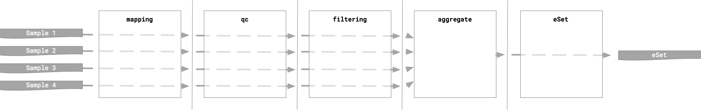
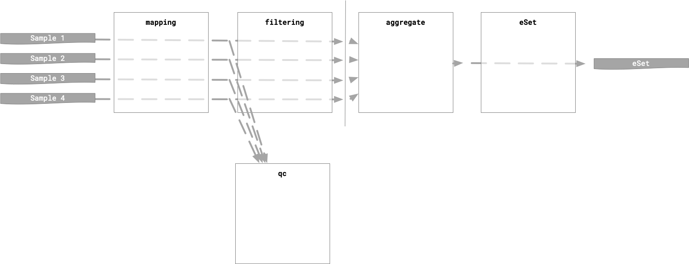
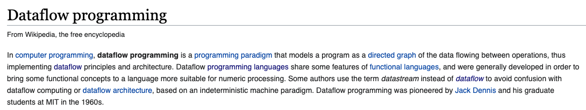
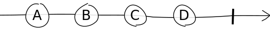
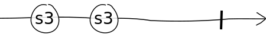
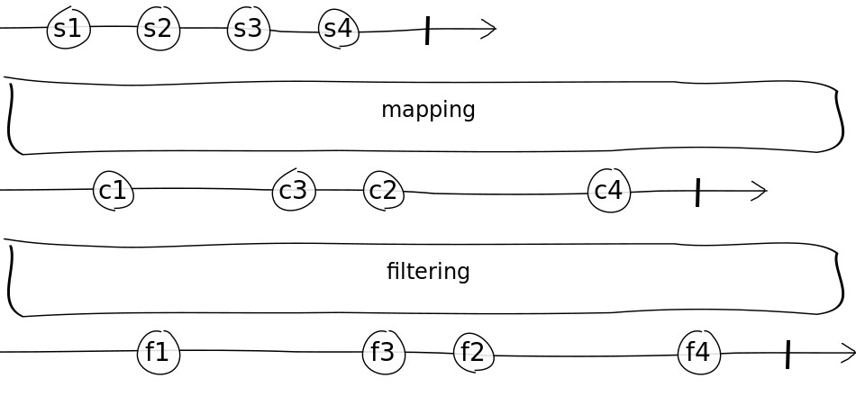
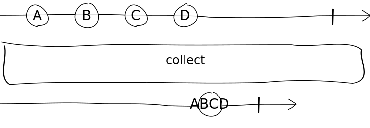
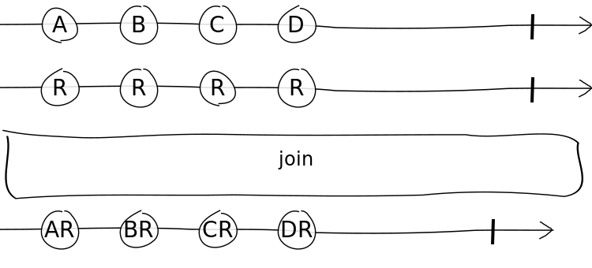

# TOC

1. Introduction

2. DiFlow

4. Step by step

5. Putting it all together

6. Extra

# Introduction

- - -

## Asynchronous processing

- - -

### Typical script-based or `Makefile`-based approach

```sh
run_step1 [--parallel]
run_step2 [--parallel]
...
```

- - -



- - -




## DataFlow Programming Model

- - -



> In computer programming, dataflow programming is a programming paradigm that models a program as a directed graph of the data flowing between operations...

- - -

### But ...

I invite you to take a look at

<https://github.com/nf-core/rnaseq/blob/master/rnaseq.nf>

And this already using DSL2 !

- - -

### We can do better

We want the _flow_ to be expressed explicitly and concisely:

```{groovy}
    input_ \
        | ... \
        | ( parse_header & parse_map ) \
        | join \
        | ... \
        | plot_map \
        | convert_plot \
        | rename \
        | toSortedList{ a,b -> a[0] <=> b[0] }  \
        | ... \
        | combine_plots

```

## Functional Reactive Programming

- - -

Think about `apply` in `R`, `map` in Python, Javascript, etc.


- - -

`map`

is a _function_ that _transforms_ one

`Set`, `List`, ...

into another

`Set`, `List`, ...

- - -

This can also be _events_ in time:

- - -

### A stream of events

{.light}

- - -

### ... or a stream of data files

{.light}

- - -

### Parallel operations on a stream

{.light}

- - -

### Gather the results into a new stream

{.light}

- - -

### Join two streams

{.light}

## We take ideas from FRP


# DiFlow

- - -

`D[SL2] I[mprovement] Flow`

is

- An abstraction layer for NextFlow DSL2

- A set of conventions

- Tooling

## General idea

- - -

### A pipeline is a combination of modules:

- A module contains one step in a larger process
- Each _module_ is independant
- A module can be tested
- A module runs in a dedicated and versioned container
- A module takes a _triplet_ as argument:

`[ ID, data, config ]`

